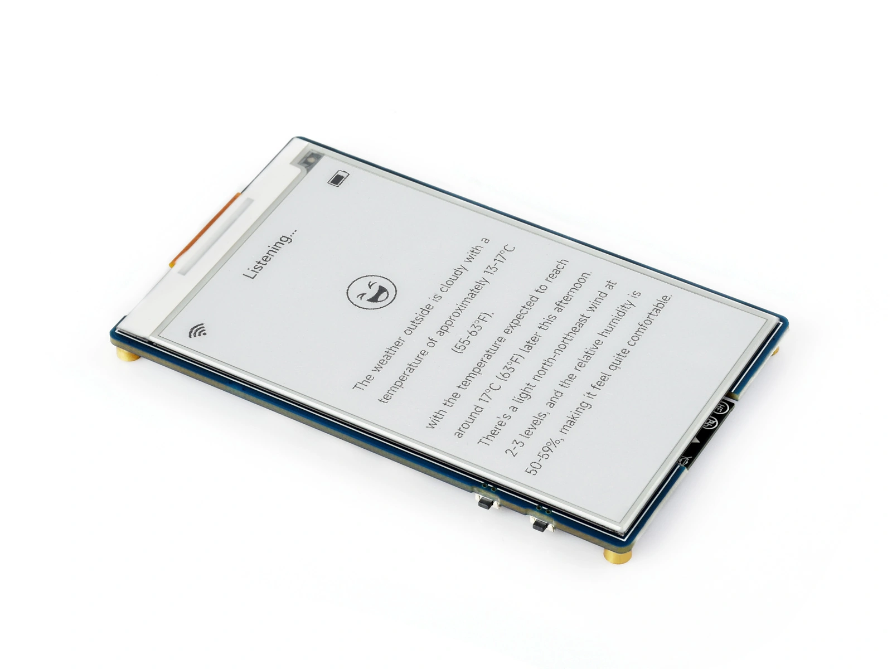
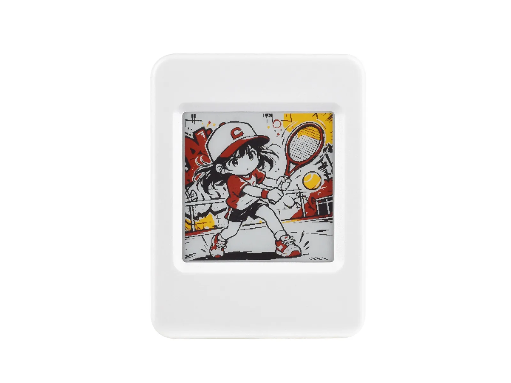
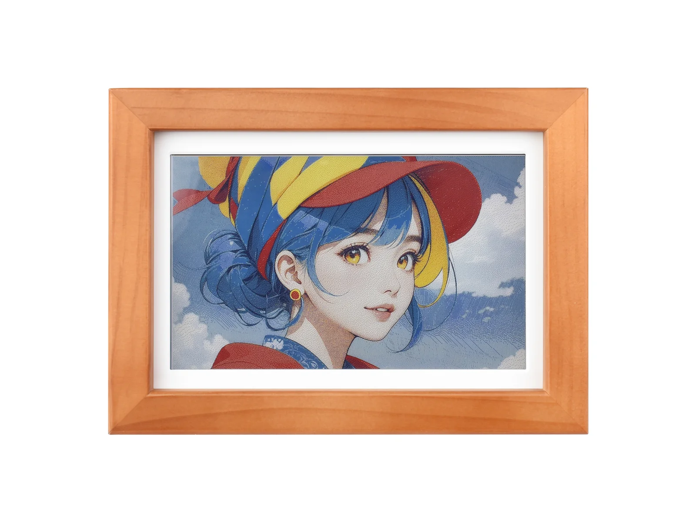

This page overview

# E-Paper


Dual-color (BlackWhite）:


Four colors (black, white, yellow, red):


Full color (E Ink Spectra 6):

E-Paper (electronic paper, commonly known as e-ink display) differs significantly from other screens: the image**Can be retained even when powered off**，onlyYesPower is only consumed during refresh. Combined withClasspaperofVisual appearanceAndsunlightUnderReadability, it is suitable for electronic price tags, electronic calendars, readersetc.Screen remains unchanged for a long timeofScenario；the cost is that refresh takes seconds, not suitable for animation.

This chapter introduces the imaging principle of e-Paper displays, focusing on its unique full refresh / partial refresh mechanism and ghosting issue, and finally presents the driving method on the ESP32.

## 1. Display principle

E-ink display based on **Electrophoresis** Principle. Taking the most common monochrome screen as an example:

[SVG diagram]

- The display layer is one layer**microcapsule film**: Countless microcapsules (or microcups) are fixed in an adhesive, sandwiched between upper and lower electrode layers; within each capsule are suspended**Negatively charged black particles**And**Positively charged white particles**。
- When an electric field is applied between the upper and lower electrodes, the capsules themselves do not move,**onlyYesInternal particles**Migrates along the electric field toward the poles: white particles float to the surface, displaying white at that location; otherwise, it displays black.
- After particles are in place,**After the electric field is removed, particles remain in place**, this is the e-ink display's**Bistable**Feature: Display retention requires no power; content persists after power off.

It is also a reflective display: it relies on reflecting ambient light to form images, with no backlight; the stronger the light, the clearer the image, and in dark environments, external illumination is needed (the frontlight on e-readers is the additional lighting layer for this purpose).

Color e-ink screens extend on this basis:

- **Tri-color screen (black-white-red / black-white-yellow)**: A third type of charged particle is added to the microcapsule, making the driving waveform more complex and significantly increasing refresh time.
- **Full-color screen**: Solutions such as ACeP, Spectra 6, etc., achieve color through fine driving of multiple color particles. The panel can only display a few native colors (e.g., Spectra 6 has six colors: black, white, red, yellow, green, blue); other colors in photos are presented through dithering algorithms that convert to spatial mixing of native color pixels, with a granular texture visible up close. These screens refresh more slowly and have lower color saturation than LCDs, making them suitable for static displays like posters and photo frames (such as those using Spectra 6 screens  Photo frame).

## 2. Features and limitations

**Advantages:**

- **Static zero power consumption**: Power is only consumed during refresh; maintaining the image consumes no power, and data is retained even when powered off. Electronic price tag devices updated on a daily basis can run for years on a coin cell battery.
- **Paper-like feel**: Reflective imaging, no flicker, does not directly shine into eyes, comfortable for long reading sessions.
- **Clearly readable under sunlight**，Viewing angleclose to 180°。

**Limitations:**

- **Slow refresh**: Full refresh for black-and-white screens takes about 2-4 seconds, and for tri-color and above color screens it can take 10-30 seconds; the screen flashes several times during the refresh process.
- **Has ghosting**: After fast refresh (partial refresh), the previous frame may leave slight ghosting, requiring periodic full refresh to clear.
- **Lowperformance degradation at low temperatures**: Electrophoretic particles move slower at low temperatures; the lower operating temperature limit for most screens is around 0°C, and specifications should be verified for outdoor winter use.
- **Refresh lifespanYeslimit**: There is an upper limit on the number of refreshes; low-frequency updates are not affected, but it is not suitable for high-frequency refresh content such as animations and videos. See the panel specification for specific limits.

And RLCD ofselection differences

Both are reflective, low-power displays. The difference is: for scenarios where the image rarely changes and standby time is prioritized, choose e-Paper; for scenarios requiring real-time refresh (clock second hand, dynamic data), choose [RLCD](../../ESP32-Peripheral-Tutorials/Display/RLCD.md)。

## 3. Refresh mechanism: full refresh and partial refresh

The refresh mechanism is the most significant difference between e-paper displays and other screens, and is also where most issues arise during use.

sent by the main controller to the e-ink screenofimage data only specifiesEachpixeloftargetColor，with/byBlackWhitescreenIsExample is the final displayBlackcolorOrWhiteColor; but electrophoretic particlesInliquidInMigration takes time,NoneCannot be like LCD like pixelsViaa simpleofvoltageSwitchFastspeedCompletestateChange。Driver IC needPressaccording to a set of**Multi-stage drive waveform**, voltage pulses of different polarities and durations must be applied in sequence to reliably drive the particles to their target positions. This set of waveform parameters is **LUT (Look-Up Table)** are pre-stored in the driver IC, or written by the driver library during initialization. Different waveforms produce different refresh effects and speeds, resulting in two refresh methods:

[SVG diagram]

-

**Full Refresh (Full Refresh)**:Before refreshing, first full screenInBlackWhitedriven back and forth several times between (manifestingIsfull-screen flicker), making allYesParticles fullyResetThen write the new frame. Slow, but canThoroughly clearGhosting，Screen quality is the mostOK。partDriver IC Additionally provides**Fast full refresh**, it reduces the time by shortening the waveform duration, with the entire screen flashing only once, at the cost of insufficient particle reset, making its ability to clear ghosting weaker than the standard full refresh.

-

**Partial refresh（Partial Refresh）**:only the specifiedAreaInChangeofdrive pixels to the target state without full-screen flashing.InsupportFastspeedPartial refreshofBlackWhiteThe speed on the screen can reach sub-second level, suitable for updating clock digits,Sensorsreadingetc.small block of content; but shortofwaveformNoneCannot push particles to the two polesofstable limit position, some particles stopInInIntermediate state,**multiple timesPartial refreshAfter, this deviation continuously accumulates, formingGhosting**，need to rely on full refreshofthe reciprocating drive pushes the particles back to both poles to clearExcept。Whether the panel supportsFastspeedPartial refreshbased on product documentationIsstandard, some panels although canSettingsLocal window,Refresh speedAndperformance howeverAndClose to full refresh.

From a single capsule, ghosting can be understood as**Particles did not return to the extreme positions of the two poles**:

[SVG diagram]

General strategy for actual use:

- **Perform a full refresh once after power-on**，Establish cleanofReference screen.
- High-frequency local area updates use**Partial refresh**。
- **Perform a full refresh every several partial refreshes (empirical value 5～10 times) or periodically (e.g., every hour)**, clear accumulated ghosting.
- During refreshDriver IC Via **BUSY pin**Indicates a busy state; the program must wait for BUSY to be released before initiating the next operation and cannot be interrupted.

Usage notes

- Do not continuously refresh e-Paper displays at excessively high frequencies, as this will accelerate screen aging; for tri-color and above color displays, the interval between two refreshes should be no less than the minimum value specified on the official product page.
- When the device is not used for a long time, it is recommended to refresh the screen to white before storing, to avoid difficult-to-recover ghost images from maintaining the same display for extended periods.
- Do not power off during the refresh process, otherwise the image may stay in an intermediate state and require a full refresh to recover.

## 4. Common driver ICs and interfaces

E-ink display commonlyUse SPI Interface，DIN transfer data,CLK Provide clock,CS Chip select，DC Distinguish commandsAndData,RST ResetDriver IC；AndconstantSeeof SPI Compared to the screen, there is an extra **BUSY**, byDriver IC Output、read by the main controller,Useused to indicate whether the refresh has finished. OftenSeeDriver IC Yes Solomon Systech SSD168x seriesAnd UltraChip UC81xx series,WaveshareE-ink screens of various sizesUseofspecificModelSeeCorrespondingproduct page.

The display memory format of e-ink screens depends on the number of colors:

- Black and white screens typically use 1bpp (1 bit per pixel, see ) stored.
- Tri-color screens typically use two 1bpp display memory planes, recording the black-and-white area and the red/yellow area respectively.
- A 4-color screen can store data at 2bpp, with each byte recording 4 pixels.

Taking the 200×200 four-color screen on the ESP32-S3-ePaper-1.54G as an example, one frame of data is `hibernate()` bytes. SPI bandwidth is sufficient to transmit this data; the slow refresh of e-Paper is due to the physical process of particle electrophoresis, not data transmission.

## 5. Arduino + GxEPD2 driver example

this sectionUse GxEPD2 Drive separatelyBlackWhite、Four-colorAndFull colorE-ink display. The following casesPressscreenColorClasstype organization, usingUsesameofdrawingInterface；displayClass、Panel driverClass、VRAM formatAndRefresh characteristics all needAndMatch specific panel.

### 5.1 General preparation

- Reference [Arduino IDE development environment setup Tutorials](../../ESP32-Arduino-Tutorials/Arduino-IDE-Setup.md) Install Arduino IDE, and install arduino-esp32.
- Search in the Library ManagerandInstall `hibernate()`. When installing dependencies, choose to install all dependencies. For other installation methods, refer to 。

The examples in this section are verified with the version in the table below. Different versions may support different panels; when using other versions, check first [GxEPD2 support list](https://github.com/ZinggJM/GxEPD2#supported-spi-e-paper-panels-from-good-display)。

|ProjectVersion / Requirements
|arduino-esp32v3.3.10 (verified in this section; no lower than v3.2.0)
|GxEPD2v1.6.9（this section verifies);ESP32-S3-ePaper-3.97、ESP32-S3-ePaper-1.54G、ESP32-S3-PhotoPainter'spanelLowestVersionrespectivelyIs v1.6.5、v1.6.6、v1.5.9
|Adafruit GFX Libraryv1.12.6

Unlike the aforementioned LCD, OLED, and other display libraries that select drivers mainly by driver IC, GxEPD2's adaptation unit is the specific e-ink panel model, not the driver IC model. The initialization parameters, color encoding, and refresh waveform of e-ink screens need to match the panel; even with the same driver IC, you cannot directly use another panel's driver class. When using GxEPD2, first confirm the panel model, then select the corresponding driver class.

### 5.2 Black and white screen: ESP32-S3-ePaper-3.97

ExampleDevelopment Board

This example uses 。the/thisDevelopment Boardonboard 3.97 inch 800×480 BlackWhiteE-ink display,Driver IC Is SSD1677。This screen supportsFastspeedPartial refresh，this sectionofthe secondExampleThat is, based on this.

Press  Configure the Development Board options. The GxEPD2 version requirements for this panel are in [General preparation](#preparation) InVersiontable.

#### Onboard interfaces

The screen is directly connected to ESP32-S3, with signal pins fixed as follows:

|SignalGPIODescription
|EPD_BUSYGPIO3Refresh busy state
|EPD_DCGPIO9Command / data selection
|EPD_CSGPIO10SPI Chip select
|EPD_SCLKGPIO11SPI clock
|EPD_MOSIGPIO12SPI data
|EPD_RSTGPIO46Reset

The onboard screen does not require external wiring. With [ESP32-S3-ePaper-1.54G](#esp32-s3-epaper-1-54g) Unlike others, this Development Board has no independent screen power control pin; the screen is powered when the system is powered on, and there is no need to operate the power pin in code.

#### Using GxEPD2 to draw static screen

Black and white screens store display memory in 1bpp, one frame of data is `hibernate()` bytes, canIn ESP32-S3 ofinternal RAM Insave the complete image. BelowofExampleDraw a screen of static content, including geometric shapes, four font sizesoftext, and a set of halftone dithering color blocks.

```
#include <SPI.h>
#include <Wire.h>
#define XPOWERS_CHIP_AXP2101
#include <XPowersLib.h>
#include <GxEPD2_7C.h>
constexpr int PMU_SDA = 47;
constexpr int PMU_SCL = 48;
constexpr int EPD_DC = 8;
constexpr int EPD_CS = 9;
constexpr int EPD_SCK = 10;
constexpr int EPD_MOSI = 11;
constexpr int EPD_RST = 12;
constexpr int EPD_BUSY = 13;
using EpdDriver = GxEPD2_730c_GDEP073E01;
// Buffer 40 rows each time: 800 x 40 x 4 / 8 = 16000 bytes
GxEPD2_7C<EpdDriver, 40> display(
  EpdDriver(EPD_CS, EPD_DC, EPD_RST, EPD_BUSY));
XPowersPMU power;
bool initEpaperPower() {
  if (!power.begin(
        Wire, AXP2101_SLAVE_ADDRESS, PMU_SDA, PMU_SCL)) {
    Serial.println("AXP2101 initialization failed.");
    return false;
  }
  // Set and enable the 3.3 V power supply for the e-paper
  if (!power.setALDO4Voltage(3300)) {
    Serial.println("Failed to set ALDO4 to 3.3 V.");
    return false;
  }
  if (!power.enableALDO4()) {
    Serial.println("Failed to enable ALDO4.");
    return false;
  }
  delay(10);
  return true;
}
// Standard 4×4 Bayer threshold matrix, 16 positions covering 0～15
const uint8_t kBayer4x4[4][4] = {
  { 0,  8,  2, 10},
  {12,  4, 14,  6},
  { 3, 11,  1,  9},
  {15,  7, 13,  5},
};
// Mix colorB into colorA at a ratio of level/16, dithering to fill the rectangle
void fillRectDithered(int16_t x, int16_t y, int16_t w, int16_t h,
                      uint16_t colorA, uint16_t colorB, uint8_t level) {
  for (int16_t dy = 0; dy < h; ++dy) {
    for (int16_t dx = 0; dx < w; ++dx) {
      const uint16_t color =
        level > kBayer4x4[dy & 3][dx & 3] ? colorB : colorA;
      display.drawPixel(x + dx, y + dy, color);
    }
  }
}
// Six groups of mixed color blocks: the top of each cell shows the two primary pure colors being mixed, and the bottom shows the 1:1 dithered mix result
void drawMixedSwatches() {
  const uint16_t mixes[6][2] = {
    {GxEPD_RED, GxEPD_YELLOW},   // Orange
    {GxEPD_RED, GxEPD_BLUE},     // Purple
    {GxEPD_RED, GxEPD_WHITE},    // Pink
    {GxEPD_BLACK, GxEPD_WHITE},  // Gray
    {GxEPD_BLUE, GxEPD_WHITE},   // Light blue
    {GxEPD_YELLOW, GxEPD_GREEN}, // Yellow-green
  };
  const char *labels[6] = {
    "RED+YEL", "RED+BLU", "RED+WHT",
    "BLK+WHT", "BLU+WHT", "YEL+GRN"
  };
  display.setTextSize(2);
  display.setTextColor(GxEPD_BLACK);
  for (int i = 0; i < 6; ++i) {
    const int16_t x = 20 + i * 128;
    display.fillRect(x, 90, 56, 28, mixes[i][0]);
    display.fillRect(x + 56, 90, 56, 28, mixes[i][1]);
    fillRectDithered(x, 118, 112, 84, mixes[i][0], mixes[i][1], 8);
    display.drawRect(x, 90, 112, 112, GxEPD_BLACK);
    display.drawFastHLine(x, 118, 112, GxEPD_BLACK);
    display.setCursor(x + 8, 212);
    display.print(labels[i]);
  }
}
// 16-segment dithering gradient bar; first segment is pure colorA, last segment is pure colorB
void drawGradientBar(int16_t x, int16_t y, int16_t w, int16_t h,
                     uint16_t colorA, uint16_t colorB) {
  const int16_t stepW = w / 16;
  for (int i = 0; i < 16; ++i) {
    // Map segments 0-15 to dithering levels 0-16
    fillRectDithered(x + i * stepW, y, stepW, h,
                     colorA, colorB, i * 16 / 15);
  }
  display.drawRect(x, y, w, h, GxEPD_BLACK);
}
void drawDitherStudy() {
  display.fillScreen(GxEPD_WHITE);
  display.setTextWrap(false);
  // Black title bar
  display.fillRect(12, 12, 776, 44, GxEPD_BLACK);
  display.setTextColor(GxEPD_WHITE);
  display.setTextSize(3);
  display.setCursor(202, 24);
  display.print("SPECTRA 6 DITHER STUDY");
  drawMixedSwatches();
  display.setTextSize(2);
  display.setTextColor(GxEPD_BLACK);
  display.setCursor(16, 252);
  display.print("BLACK -> WHITE");
  drawGradientBar(16, 274, 768, 64, GxEPD_BLACK, GxEPD_WHITE);
  display.setCursor(16, 366);
  display.print("RED -> YELLOW");
  drawGradientBar(16, 388, 768, 64, GxEPD_RED, GxEPD_YELLOW);
  display.drawRect(0, 0, 800, 480, GxEPD_BLACK);
}
void setup() {
  Serial.begin(115200);
  delay(100);
  if (!initEpaperPower()) {
    Serial.println("EPD power initialization failed.");
    while (true) {
      delay(1000);
    }
  }
  // Useonboard SPI Pin initializationelectronic paper
  SPI.begin(EPD_SCK, -1, EPD_MOSI, EPD_CS);
  display.epd2.selectSPI(
    SPI, SPISettings(4000000, MSBFIRST, SPI_MODE0));
  display.init(115200);
  // Make the display content consistent with the Development Board's viewing orientation
  display.setRotation(2);
  display.setFullWindow();
  // Draw in pages and refresh the entire screen
  display.firstPage();
  do {
    drawDitherStudy();
  } while (display.nextPage());
  // Put screen to sleep after refresh is complete
  display.hibernate();
  Serial.println("Dither study refresh completed.");
}
void loop() {
}
```

`hibernate()` is a black and white display class,`hibernate()` is the driver class for the corresponding panel, template parameter uses `hibernate()`, save the complete image in memory.`hibernate()` Corresponds to 800×480 landscape, with the origin at the top-left corner.

GxEPD2 enables fast full refresh by default for this panel; it is fast but retains traces of the previous image, so this example calls `hibernate()` Switch to standard full refresh to ensure clean imaging in one pass. See the differences between the three refresh methods in [Full refresh vs. partial refresh comparison](#full-vs-partial-demo). Same as the four-color screen example, must be in `hibernate()` Call before `hibernate()`, otherwise GxEPD2 will not use the Development Board's onboard screen pins.

The four color blocks in the bottom right demonstrate 1bpp display capability: the panel only has black and white levels,`hibernate()` Black pixels are filled at different intervals, appearing as different shades of gray at viewing distance. The same method is used for displaying photos on black-and-white screens, converting grayscale images to black-and-white halftone dots, similar in principle to [Full-color screenofDithering](#dithered-mixed-colors) Consistent.

#### Full refresh vs. partial refresh comparison

belowofExampleInscreenIncenter displays a continuously incrementingofCounter:defaultUsePartial refreshUpdate counterInofwindow, each 10 update frequencyInlast changeUseFull refresh, two refresh typesofTime consumed is printed to serial. The program does not add extra delay, each refreshCompleteImmediately updates the count value after, therefore the counterofThe increment rate isRefresh speed。

```
#include <SPI.h>
#include <Wire.h>
#define XPOWERS_CHIP_AXP2101
#include <XPowersLib.h>
#include <GxEPD2_7C.h>
constexpr int PMU_SDA = 47;
constexpr int PMU_SCL = 48;
constexpr int EPD_DC = 8;
constexpr int EPD_CS = 9;
constexpr int EPD_SCK = 10;
constexpr int EPD_MOSI = 11;
constexpr int EPD_RST = 12;
constexpr int EPD_BUSY = 13;
using EpdDriver = GxEPD2_730c_GDEP073E01;
// Buffer 40 rows each time: 800 x 40 x 4 / 8 = 16000 bytes
GxEPD2_7C<EpdDriver, 40> display(
  EpdDriver(EPD_CS, EPD_DC, EPD_RST, EPD_BUSY));
XPowersPMU power;
bool initEpaperPower() {
  if (!power.begin(
        Wire, AXP2101_SLAVE_ADDRESS, PMU_SDA, PMU_SCL)) {
    Serial.println("AXP2101 initialization failed.");
    return false;
  }
  // Set and enable the 3.3 V power supply for the e-paper
  if (!power.setALDO4Voltage(3300)) {
    Serial.println("Failed to set ALDO4 to 3.3 V.");
    return false;
  }
  if (!power.enableALDO4()) {
    Serial.println("Failed to enable ALDO4.");
    return false;
  }
  delay(10);
  return true;
}
// Standard 4×4 Bayer threshold matrix, 16 positions covering 0～15
const uint8_t kBayer4x4[4][4] = {
  { 0,  8,  2, 10},
  {12,  4, 14,  6},
  { 3, 11,  1,  9},
  {15,  7, 13,  5},
};
// Mix colorB into colorA at a ratio of level/16, dithering to fill the rectangle
void fillRectDithered(int16_t x, int16_t y, int16_t w, int16_t h,
                      uint16_t colorA, uint16_t colorB, uint8_t level) {
  for (int16_t dy = 0; dy < h; ++dy) {
    for (int16_t dx = 0; dx < w; ++dx) {
      const uint16_t color =
        level > kBayer4x4[dy & 3][dx & 3] ? colorB : colorA;
      display.drawPixel(x + dx, y + dy, color);
    }
  }
}
// Six groups of mixed color blocks: the top of each cell shows the two primary pure colors being mixed, and the bottom shows the 1:1 dithered mix result
void drawMixedSwatches() {
  const uint16_t mixes[6][2] = {
    {GxEPD_RED, GxEPD_YELLOW},   // Orange
    {GxEPD_RED, GxEPD_BLUE},     // Purple
    {GxEPD_RED, GxEPD_WHITE},    // Pink
    {GxEPD_BLACK, GxEPD_WHITE},  // Gray
    {GxEPD_BLUE, GxEPD_WHITE},   // Light blue
    {GxEPD_YELLOW, GxEPD_GREEN}, // Yellow-green
  };
  const char *labels[6] = {
    "RED+YEL", "RED+BLU", "RED+WHT",
    "BLK+WHT", "BLU+WHT", "YEL+GRN"
  };
  display.setTextSize(2);
  display.setTextColor(GxEPD_BLACK);
  for (int i = 0; i < 6; ++i) {
    const int16_t x = 20 + i * 128;
    display.fillRect(x, 90, 56, 28, mixes[i][0]);
    display.fillRect(x + 56, 90, 56, 28, mixes[i][1]);
    fillRectDithered(x, 118, 112, 84, mixes[i][0], mixes[i][1], 8);
    display.drawRect(x, 90, 112, 112, GxEPD_BLACK);
    display.drawFastHLine(x, 118, 112, GxEPD_BLACK);
    display.setCursor(x + 8, 212);
    display.print(labels[i]);
  }
}
// 16-segment dithering gradient bar; first segment is pure colorA, last segment is pure colorB
void drawGradientBar(int16_t x, int16_t y, int16_t w, int16_t h,
                     uint16_t colorA, uint16_t colorB) {
  const int16_t stepW = w / 16;
  for (int i = 0; i < 16; ++i) {
    // Map segments 0-15 to dithering levels 0-16
    fillRectDithered(x + i * stepW, y, stepW, h,
                     colorA, colorB, i * 16 / 15);
  }
  display.drawRect(x, y, w, h, GxEPD_BLACK);
}
void drawDitherStudy() {
  display.fillScreen(GxEPD_WHITE);
  display.setTextWrap(false);
  // Black title bar
  display.fillRect(12, 12, 776, 44, GxEPD_BLACK);
  display.setTextColor(GxEPD_WHITE);
  display.setTextSize(3);
  display.setCursor(202, 24);
  display.print("SPECTRA 6 DITHER STUDY");
  drawMixedSwatches();
  display.setTextSize(2);
  display.setTextColor(GxEPD_BLACK);
  display.setCursor(16, 252);
  display.print("BLACK -> WHITE");
  drawGradientBar(16, 274, 768, 64, GxEPD_BLACK, GxEPD_WHITE);
  display.setCursor(16, 366);
  display.print("RED -> YELLOW");
  drawGradientBar(16, 388, 768, 64, GxEPD_RED, GxEPD_YELLOW);
  display.drawRect(0, 0, 800, 480, GxEPD_BLACK);
}
void setup() {
  Serial.begin(115200);
  delay(100);
  if (!initEpaperPower()) {
    Serial.println("EPD power initialization failed.");
    while (true) {
      delay(1000);
    }
  }
  // Useonboard SPI Pin initializationelectronic paper
  SPI.begin(EPD_SCK, -1, EPD_MOSI, EPD_CS);
  display.epd2.selectSPI(
    SPI, SPISettings(4000000, MSBFIRST, SPI_MODE0));
  display.init(115200);
  // Make the display content consistent with the Development Board's viewing orientation
  display.setRotation(2);
  display.setFullWindow();
  // Draw in pages and refresh the entire screen
  display.firstPage();
  do {
    drawDitherStudy();
  } while (display.nextPage());
  // Put screen to sleep after refresh is complete
  display.hibernate();
  Serial.println("Dither study refresh completed.");
}
void loop() {
}
```

Code corresponds to [Refresh mechanism](#full-vs-partial-refresh) general strategy given in the section:

- `hibernate()` And `hibernate()` Determine this refreshofway/methodAndRange.Partial refreshwindowof `hibernate()` and width should be multiples of 8, aligned with the 8-pixel-per-byte arrangement in video memory.
- During partial refresh `hibernate()` It only applies to the current window, so the counter's border is drawn outside the window and will not be repeatedly refreshed.
- Partial refresh relies on the previous frame data saved in the driver IC to calculate differences, so perform a full refresh first after power-on to establish a baseline image.
- each/every 10 update frequencyInlast changeUseFull refresh, redraw the complete image. In this examplePartial refreshSmall range, short interval, defaultofFast full refreshCan keep the screen clean;Ghostingwhen already obvious, should changeUseStandard full refresh。

GxEPD2 enables fast full refresh by default for this panel (in the driver class `hibernate()` Is `hibernate()`）。MeasuredFast full refreshofWaveform durationIs 1.70 seconds、Partial refreshIs 370 ms；Plus image data transmissionAndDriver power-on, in this example the serial port printsofsingle overall timeIsFull refresh approximately 2.46 Seconds,Partial refreshapproximately 420 ms，Partial refreshapproximatelyIsfull refreshofOne-sixth.`hibernate()` Will enable GxEPD2's diagnostic output, in the serial `hibernate()` And `hibernate()` i.e., the waveform duration in microseconds; the overall duration is also affected by the partial refresh window size and SPI clock.

In `hibernate()` Call after `hibernate()`, you can switch to standard full refresh; its measured waveform duration is 2.10 seconds. The differences between the three refresh methods are summarized as follows:

|Refresh methodGxEPD2 usageWaveform durationWhen refreshingofperformanceGhosting
|Standard full refresh`hibernate()` + `hibernate()`2.10 secondsFull screen flashes back and forth multiple timesThoroughly clear
|Fast full refreshDefault + `hibernate()`1.70 secondsEntire screen flashes onceMay retain the previous screenofGhosting
|Partial refresh`hibernate()`370 msNo flickering, content directly replacedSuccessive accumulation

The first refresh after power-on performs two full refreshes: GxEPD2 first clears the entire screen to white when initially writing to the display buffer, then refreshes the actual image to establish a clean baseline. Therefore, in the serial port `hibernate()` The overall time consumption is about twice that of a subsequent full refresh (measured at 4.52 seconds in this example, compared to 5.39 seconds when using the standard full refresh in Example 1), which is a normal phenomenon.

GhostingofcanSeethe degree depends onPartial refreshofCumulative countAndScreen flipofArea. This exampleIndigitalAreaSmall area, and each 10 each update is a full refresh, usually no obviousGhosting；Repeatedly flip large areasBlackWhiteAreawhen,GhostingperformanceIsFlipAreaedgeofLight residual. At this time, defaultofFast full refreshnot enough to clearExceptresidue, needsSwitch to standard full refresh，Rely on reciprocating driving to push particles back to the two poles.

previous frameofWhether ghosting is carried into the new frame, mainly depends on where the last refresh left the particlesInWhat state:Standard full refreshAfter, particles have been driven to the two poles, the previously accumulatedofDeviation has been clearedExcept，Subsequent refreshWill notre-display the old screenofGhosting; large amountPartial refreshAfter, particles stopInInIntermediate state, at this pointIf only doingFast full refresh，previous frameofGhosting will remainInnew frameIn, inlarge area of solidBlackOrpureWhiteAreaEspecially obvious on.

#### Use Waveshare official library

Waveshare official examples include `hibernate()` Driver,`hibernate()` Drawing library, fonts, and image data. The basic calling flow is as follows:

```
#include <SPI.h>
#include <Wire.h>
#define XPOWERS_CHIP_AXP2101
#include <XPowersLib.h>
#include <GxEPD2_7C.h>
constexpr int PMU_SDA = 47;
constexpr int PMU_SCL = 48;
constexpr int EPD_DC = 8;
constexpr int EPD_CS = 9;
constexpr int EPD_SCK = 10;
constexpr int EPD_MOSI = 11;
constexpr int EPD_RST = 12;
constexpr int EPD_BUSY = 13;
using EpdDriver = GxEPD2_730c_GDEP073E01;
// Buffer 40 rows each time: 800 x 40 x 4 / 8 = 16000 bytes
GxEPD2_7C<EpdDriver, 40> display(
  EpdDriver(EPD_CS, EPD_DC, EPD_RST, EPD_BUSY));
XPowersPMU power;
bool initEpaperPower() {
  if (!power.begin(
        Wire, AXP2101_SLAVE_ADDRESS, PMU_SDA, PMU_SCL)) {
    Serial.println("AXP2101 initialization failed.");
    return false;
  }
  // Set and enable the 3.3 V power supply for the e-paper
  if (!power.setALDO4Voltage(3300)) {
    Serial.println("Failed to set ALDO4 to 3.3 V.");
    return false;
  }
  if (!power.enableALDO4()) {
    Serial.println("Failed to enable ALDO4.");
    return false;
  }
  delay(10);
  return true;
}
// Standard 4×4 Bayer threshold matrix, 16 positions covering 0～15
const uint8_t kBayer4x4[4][4] = {
  { 0,  8,  2, 10},
  {12,  4, 14,  6},
  { 3, 11,  1,  9},
  {15,  7, 13,  5},
};
// Mix colorB into colorA at a ratio of level/16, dithering to fill the rectangle
void fillRectDithered(int16_t x, int16_t y, int16_t w, int16_t h,
                      uint16_t colorA, uint16_t colorB, uint8_t level) {
  for (int16_t dy = 0; dy < h; ++dy) {
    for (int16_t dx = 0; dx < w; ++dx) {
      const uint16_t color =
        level > kBayer4x4[dy & 3][dx & 3] ? colorB : colorA;
      display.drawPixel(x + dx, y + dy, color);
    }
  }
}
// Six groups of mixed color blocks: the top of each cell shows the two primary pure colors being mixed, and the bottom shows the 1:1 dithered mix result
void drawMixedSwatches() {
  const uint16_t mixes[6][2] = {
    {GxEPD_RED, GxEPD_YELLOW},   // Orange
    {GxEPD_RED, GxEPD_BLUE},     // Purple
    {GxEPD_RED, GxEPD_WHITE},    // Pink
    {GxEPD_BLACK, GxEPD_WHITE},  // Gray
    {GxEPD_BLUE, GxEPD_WHITE},   // Light blue
    {GxEPD_YELLOW, GxEPD_GREEN}, // Yellow-green
  };
  const char *labels[6] = {
    "RED+YEL", "RED+BLU", "RED+WHT",
    "BLK+WHT", "BLU+WHT", "YEL+GRN"
  };
  display.setTextSize(2);
  display.setTextColor(GxEPD_BLACK);
  for (int i = 0; i < 6; ++i) {
    const int16_t x = 20 + i * 128;
    display.fillRect(x, 90, 56, 28, mixes[i][0]);
    display.fillRect(x + 56, 90, 56, 28, mixes[i][1]);
    fillRectDithered(x, 118, 112, 84, mixes[i][0], mixes[i][1], 8);
    display.drawRect(x, 90, 112, 112, GxEPD_BLACK);
    display.drawFastHLine(x, 118, 112, GxEPD_BLACK);
    display.setCursor(x + 8, 212);
    display.print(labels[i]);
  }
}
// 16-segment dithering gradient bar; first segment is pure colorA, last segment is pure colorB
void drawGradientBar(int16_t x, int16_t y, int16_t w, int16_t h,
                     uint16_t colorA, uint16_t colorB) {
  const int16_t stepW = w / 16;
  for (int i = 0; i < 16; ++i) {
    // Map segments 0-15 to dithering levels 0-16
    fillRectDithered(x + i * stepW, y, stepW, h,
                     colorA, colorB, i * 16 / 15);
  }
  display.drawRect(x, y, w, h, GxEPD_BLACK);
}
void drawDitherStudy() {
  display.fillScreen(GxEPD_WHITE);
  display.setTextWrap(false);
  // Black title bar
  display.fillRect(12, 12, 776, 44, GxEPD_BLACK);
  display.setTextColor(GxEPD_WHITE);
  display.setTextSize(3);
  display.setCursor(202, 24);
  display.print("SPECTRA 6 DITHER STUDY");
  drawMixedSwatches();
  display.setTextSize(2);
  display.setTextColor(GxEPD_BLACK);
  display.setCursor(16, 252);
  display.print("BLACK -> WHITE");
  drawGradientBar(16, 274, 768, 64, GxEPD_BLACK, GxEPD_WHITE);
  display.setCursor(16, 366);
  display.print("RED -> YELLOW");
  drawGradientBar(16, 388, 768, 64, GxEPD_RED, GxEPD_YELLOW);
  display.drawRect(0, 0, 800, 480, GxEPD_BLACK);
}
void setup() {
  Serial.begin(115200);
  delay(100);
  if (!initEpaperPower()) {
    Serial.println("EPD power initialization failed.");
    while (true) {
      delay(1000);
    }
  }
  // Useonboard SPI Pin initializationelectronic paper
  SPI.begin(EPD_SCK, -1, EPD_MOSI, EPD_CS);
  display.epd2.selectSPI(
    SPI, SPISettings(4000000, MSBFIRST, SPI_MODE0));
  display.init(115200);
  // Make the display content consistent with the Development Board's viewing orientation
  display.setRotation(2);
  display.setFullWindow();
  // Draw in pages and refresh the entire screen
  display.firstPage();
  do {
    drawDitherStudy();
  } while (display.nextPage());
  // Put screen to sleep after refresh is complete
  display.hibernate();
  Serial.println("Dither study refresh completed.");
}
void loop() {
}
```

`hibernate()` And `hibernate()` Select fast full refresh waveform. The driver additionally provides `hibernate()` And `hibernate()`, using multi-phase waveforms to display four-level grayscale on the same panel, at the cost of longer refresh time and no partial refresh support. For the complete program, see ；development environmentAndflashParameterSee 。

#### Refresh and sleep

`hibernate()` Make the screen driver enter deep sleep,Power consumptionLowest，butDriver IC InThe previous frame data becomes invalid. After sleep, to refresh again, the driver needs to be reinitialized and a full refresh must be done first before continuingPartial refresh。need to continuouslyPartial refreshofScenario（Such as clock,SensorsReading) should keep the driver powered, onlyInwhen not updated for a long timeCall `hibernate()`。

Partial refreshUsage notes

- Content outside the partial refresh window will not be updated; use full refresh when switching screen layouts.
- This example refreshes continuously to demonstrate the speed difference; actual products should control the refresh interval according to the required update frequency.
- long-term notUseWhen, first refresh the screenWhite, then call `hibernate()`。

### 5.3 Four-color screen: ESP32-S3-ePaper-1.54G

ExampleDevelopment Board

This example uses . This Development Board features a 1.54-inch 200×200 four-color e-Paper display, capable of showing black, white, yellow, and red. With `hibernate()` Model is the four-color version; without `hibernate()` The ESP32-S3-ePaper-1.54 is a black-and-white version; the two have different drivers and refresh times.

Press  Configure the Development Board options. The GxEPD2 version requirements for this panel are in [General preparation](#preparation) InVersiontable.

#### Onboard interfaces

The screen is directly connected to the ESP32-S3; the signal and power control pins are fixed as follows:

|SignalGPIODescription
|EPD_PWRGPIO6screenPowerControl,LowLogic level on,HighLogic level off
|EPD_BUSYGPIO8Refresh busy state
|EPD_RSTGPIO9Reset
|EPD_DCGPIO10Command / data selection
|EPD_CSGPIO11SPI Chip select
|EPD_SCLKGPIO12SPI clock
|EPD_MOSIGPIO13SPI data

Onboard screen requires no external wiring.`hibernate()` Used to control screen power; after refresh is complete and entering sleep, it should be pulled high to turn off screen power.

#### Using GxEPD2 to draw a four-color price tag

GxEPD2 uses Adafruit GFX's drawing API, which can call `hibernate()`、`hibernate()`、`hibernate()` And `hibernate()` and other functions to compose the screen. The following example draws the screen as an electronic price tag, simultaneously displaying the four native colors red, yellow, black, and white, with different font sizes and geometric shapes.

```
#include <SPI.h>
#include <Wire.h>
#define XPOWERS_CHIP_AXP2101
#include <XPowersLib.h>
#include <GxEPD2_7C.h>
constexpr int PMU_SDA = 47;
constexpr int PMU_SCL = 48;
constexpr int EPD_DC = 8;
constexpr int EPD_CS = 9;
constexpr int EPD_SCK = 10;
constexpr int EPD_MOSI = 11;
constexpr int EPD_RST = 12;
constexpr int EPD_BUSY = 13;
using EpdDriver = GxEPD2_730c_GDEP073E01;
// Buffer 40 rows each time: 800 x 40 x 4 / 8 = 16000 bytes
GxEPD2_7C<EpdDriver, 40> display(
  EpdDriver(EPD_CS, EPD_DC, EPD_RST, EPD_BUSY));
XPowersPMU power;
bool initEpaperPower() {
  if (!power.begin(
        Wire, AXP2101_SLAVE_ADDRESS, PMU_SDA, PMU_SCL)) {
    Serial.println("AXP2101 initialization failed.");
    return false;
  }
  // Set and enable the 3.3 V power supply for the e-paper
  if (!power.setALDO4Voltage(3300)) {
    Serial.println("Failed to set ALDO4 to 3.3 V.");
    return false;
  }
  if (!power.enableALDO4()) {
    Serial.println("Failed to enable ALDO4.");
    return false;
  }
  delay(10);
  return true;
}
// Standard 4×4 Bayer threshold matrix, 16 positions covering 0～15
const uint8_t kBayer4x4[4][4] = {
  { 0,  8,  2, 10},
  {12,  4, 14,  6},
  { 3, 11,  1,  9},
  {15,  7, 13,  5},
};
// Mix colorB into colorA at a ratio of level/16, dithering to fill the rectangle
void fillRectDithered(int16_t x, int16_t y, int16_t w, int16_t h,
                      uint16_t colorA, uint16_t colorB, uint8_t level) {
  for (int16_t dy = 0; dy < h; ++dy) {
    for (int16_t dx = 0; dx < w; ++dx) {
      const uint16_t color =
        level > kBayer4x4[dy & 3][dx & 3] ? colorB : colorA;
      display.drawPixel(x + dx, y + dy, color);
    }
  }
}
// Six groups of mixed color blocks: the top of each cell shows the two primary pure colors being mixed, and the bottom shows the 1:1 dithered mix result
void drawMixedSwatches() {
  const uint16_t mixes[6][2] = {
    {GxEPD_RED, GxEPD_YELLOW},   // Orange
    {GxEPD_RED, GxEPD_BLUE},     // Purple
    {GxEPD_RED, GxEPD_WHITE},    // Pink
    {GxEPD_BLACK, GxEPD_WHITE},  // Gray
    {GxEPD_BLUE, GxEPD_WHITE},   // Light blue
    {GxEPD_YELLOW, GxEPD_GREEN}, // Yellow-green
  };
  const char *labels[6] = {
    "RED+YEL", "RED+BLU", "RED+WHT",
    "BLK+WHT", "BLU+WHT", "YEL+GRN"
  };
  display.setTextSize(2);
  display.setTextColor(GxEPD_BLACK);
  for (int i = 0; i < 6; ++i) {
    const int16_t x = 20 + i * 128;
    display.fillRect(x, 90, 56, 28, mixes[i][0]);
    display.fillRect(x + 56, 90, 56, 28, mixes[i][1]);
    fillRectDithered(x, 118, 112, 84, mixes[i][0], mixes[i][1], 8);
    display.drawRect(x, 90, 112, 112, GxEPD_BLACK);
    display.drawFastHLine(x, 118, 112, GxEPD_BLACK);
    display.setCursor(x + 8, 212);
    display.print(labels[i]);
  }
}
// 16-segment dithering gradient bar; first segment is pure colorA, last segment is pure colorB
void drawGradientBar(int16_t x, int16_t y, int16_t w, int16_t h,
                     uint16_t colorA, uint16_t colorB) {
  const int16_t stepW = w / 16;
  for (int i = 0; i < 16; ++i) {
    // Map segments 0-15 to dithering levels 0-16
    fillRectDithered(x + i * stepW, y, stepW, h,
                     colorA, colorB, i * 16 / 15);
  }
  display.drawRect(x, y, w, h, GxEPD_BLACK);
}
void drawDitherStudy() {
  display.fillScreen(GxEPD_WHITE);
  display.setTextWrap(false);
  // Black title bar
  display.fillRect(12, 12, 776, 44, GxEPD_BLACK);
  display.setTextColor(GxEPD_WHITE);
  display.setTextSize(3);
  display.setCursor(202, 24);
  display.print("SPECTRA 6 DITHER STUDY");
  drawMixedSwatches();
  display.setTextSize(2);
  display.setTextColor(GxEPD_BLACK);
  display.setCursor(16, 252);
  display.print("BLACK -> WHITE");
  drawGradientBar(16, 274, 768, 64, GxEPD_BLACK, GxEPD_WHITE);
  display.setCursor(16, 366);
  display.print("RED -> YELLOW");
  drawGradientBar(16, 388, 768, 64, GxEPD_RED, GxEPD_YELLOW);
  display.drawRect(0, 0, 800, 480, GxEPD_BLACK);
}
void setup() {
  Serial.begin(115200);
  delay(100);
  if (!initEpaperPower()) {
    Serial.println("EPD power initialization failed.");
    while (true) {
      delay(1000);
    }
  }
  // Useonboard SPI Pin initializationelectronic paper
  SPI.begin(EPD_SCK, -1, EPD_MOSI, EPD_CS);
  display.epd2.selectSPI(
    SPI, SPISettings(4000000, MSBFIRST, SPI_MODE0));
  display.init(115200);
  // Make the display content consistent with the Development Board's viewing orientation
  display.setRotation(2);
  display.setFullWindow();
  // Draw in pages and refresh the entire screen
  display.firstPage();
  do {
    drawDitherStudy();
  } while (display.nextPage());
  // Put screen to sleep after refresh is complete
  display.hibernate();
  Serial.println("Dither study refresh completed.");
}
void loop() {
}
```

`hibernate()` is a four-color display class,`hibernate()` is the driver class for the corresponding panel. This screen's frame buffer only occupies 10000 bytes, so the template parameter uses `hibernate()`, save the complete image in memory.`hibernate()` And `hibernate()` forms the paged drawing loop of GxEPD2; when using a full buffer, the loop executes only once, but keeping this pattern allows switching to a paged buffer later.

ESP32-S3's SPI signals can be mapped to different GPIOs. You must `hibernate()` Call before `hibernate()`, otherwise GxEPD2 will not use the Development Board's onboard screen pins.GPIO6 Is the screenPowercontrolPin，notBy GxEPD2 Management,Need topull before initializationLow，andIn `hibernate()` then pull high.

#### four-color pixelsEncoding

The ESP32-S3-ePaper-1.54G uses 2bpp image data, where one byte records 4 pixels from the most significant bit to the least significant bit:

|ColorEncoding
|Black`hibernate()`
|White`hibernate()`
|Yellow`hibernate()`
|Red`hibernate()`

For example, when 4 consecutive pixels are black, white, yellow, and red, the corresponding data is `hibernate()`, i.e. `hibernate()`. GxEPD2 has already handled pixel packing; when using the Adafruit GFX drawing API, pass in directly `hibernate()`、`hibernate()`、`hibernate()` Or `hibernate()` That's it.

#### Use Waveshare official library

Waveshare official examples include `hibernate()` Driver,`hibernate()` Graphics libraries, fonts, and image data, suitable for verifying hardware status, viewing the low-level initialization process, or continuing development in existing Waveshare example projects. The basic calling flow is as follows:

```
#include <SPI.h>
#include <Wire.h>
#define XPOWERS_CHIP_AXP2101
#include <XPowersLib.h>
#include <GxEPD2_7C.h>
constexpr int PMU_SDA = 47;
constexpr int PMU_SCL = 48;
constexpr int EPD_DC = 8;
constexpr int EPD_CS = 9;
constexpr int EPD_SCK = 10;
constexpr int EPD_MOSI = 11;
constexpr int EPD_RST = 12;
constexpr int EPD_BUSY = 13;
using EpdDriver = GxEPD2_730c_GDEP073E01;
// Buffer 40 rows each time: 800 x 40 x 4 / 8 = 16000 bytes
GxEPD2_7C<EpdDriver, 40> display(
  EpdDriver(EPD_CS, EPD_DC, EPD_RST, EPD_BUSY));
XPowersPMU power;
bool initEpaperPower() {
  if (!power.begin(
        Wire, AXP2101_SLAVE_ADDRESS, PMU_SDA, PMU_SCL)) {
    Serial.println("AXP2101 initialization failed.");
    return false;
  }
  // Set and enable the 3.3 V power supply for the e-paper
  if (!power.setALDO4Voltage(3300)) {
    Serial.println("Failed to set ALDO4 to 3.3 V.");
    return false;
  }
  if (!power.enableALDO4()) {
    Serial.println("Failed to enable ALDO4.");
    return false;
  }
  delay(10);
  return true;
}
// Standard 4×4 Bayer threshold matrix, 16 positions covering 0～15
const uint8_t kBayer4x4[4][4] = {
  { 0,  8,  2, 10},
  {12,  4, 14,  6},
  { 3, 11,  1,  9},
  {15,  7, 13,  5},
};
// Mix colorB into colorA at a ratio of level/16, dithering to fill the rectangle
void fillRectDithered(int16_t x, int16_t y, int16_t w, int16_t h,
                      uint16_t colorA, uint16_t colorB, uint8_t level) {
  for (int16_t dy = 0; dy < h; ++dy) {
    for (int16_t dx = 0; dx < w; ++dx) {
      const uint16_t color =
        level > kBayer4x4[dy & 3][dx & 3] ? colorB : colorA;
      display.drawPixel(x + dx, y + dy, color);
    }
  }
}
// Six groups of mixed color blocks: the top of each cell shows the two primary pure colors being mixed, and the bottom shows the 1:1 dithered mix result
void drawMixedSwatches() {
  const uint16_t mixes[6][2] = {
    {GxEPD_RED, GxEPD_YELLOW},   // Orange
    {GxEPD_RED, GxEPD_BLUE},     // Purple
    {GxEPD_RED, GxEPD_WHITE},    // Pink
    {GxEPD_BLACK, GxEPD_WHITE},  // Gray
    {GxEPD_BLUE, GxEPD_WHITE},   // Light blue
    {GxEPD_YELLOW, GxEPD_GREEN}, // Yellow-green
  };
  const char *labels[6] = {
    "RED+YEL", "RED+BLU", "RED+WHT",
    "BLK+WHT", "BLU+WHT", "YEL+GRN"
  };
  display.setTextSize(2);
  display.setTextColor(GxEPD_BLACK);
  for (int i = 0; i < 6; ++i) {
    const int16_t x = 20 + i * 128;
    display.fillRect(x, 90, 56, 28, mixes[i][0]);
    display.fillRect(x + 56, 90, 56, 28, mixes[i][1]);
    fillRectDithered(x, 118, 112, 84, mixes[i][0], mixes[i][1], 8);
    display.drawRect(x, 90, 112, 112, GxEPD_BLACK);
    display.drawFastHLine(x, 118, 112, GxEPD_BLACK);
    display.setCursor(x + 8, 212);
    display.print(labels[i]);
  }
}
// 16-segment dithering gradient bar; first segment is pure colorA, last segment is pure colorB
void drawGradientBar(int16_t x, int16_t y, int16_t w, int16_t h,
                     uint16_t colorA, uint16_t colorB) {
  const int16_t stepW = w / 16;
  for (int i = 0; i < 16; ++i) {
    // Map segments 0-15 to dithering levels 0-16
    fillRectDithered(x + i * stepW, y, stepW, h,
                     colorA, colorB, i * 16 / 15);
  }
  display.drawRect(x, y, w, h, GxEPD_BLACK);
}
void drawDitherStudy() {
  display.fillScreen(GxEPD_WHITE);
  display.setTextWrap(false);
  // Black title bar
  display.fillRect(12, 12, 776, 44, GxEPD_BLACK);
  display.setTextColor(GxEPD_WHITE);
  display.setTextSize(3);
  display.setCursor(202, 24);
  display.print("SPECTRA 6 DITHER STUDY");
  drawMixedSwatches();
  display.setTextSize(2);
  display.setTextColor(GxEPD_BLACK);
  display.setCursor(16, 252);
  display.print("BLACK -> WHITE");
  drawGradientBar(16, 274, 768, 64, GxEPD_BLACK, GxEPD_WHITE);
  display.setCursor(16, 366);
  display.print("RED -> YELLOW");
  drawGradientBar(16, 388, 768, 64, GxEPD_RED, GxEPD_YELLOW);
  display.drawRect(0, 0, 800, 480, GxEPD_BLACK);
}
void setup() {
  Serial.begin(115200);
  delay(100);
  if (!initEpaperPower()) {
    Serial.println("EPD power initialization failed.");
    while (true) {
      delay(1000);
    }
  }
  // Useonboard SPI Pin initializationelectronic paper
  SPI.begin(EPD_SCK, -1, EPD_MOSI, EPD_CS);
  display.epd2.selectSPI(
    SPI, SPISettings(4000000, MSBFIRST, SPI_MODE0));
  display.init(115200);
  // Make the display content consistent with the Development Board's viewing orientation
  display.setRotation(2);
  display.setFullWindow();
  // Draw in pages and refresh the entire screen
  display.firstPage();
  do {
    drawDitherStudy();
  } while (display.nextPage());
  // Put screen to sleep after refresh is complete
  display.hibernate();
  Serial.println("Dither study refresh completed.");
}
void loop() {
}
```

UseShould retain when `hibernate()`, the complete project Table of Contents containing drivers and Resources files. For the complete program, see ；development environmentAndflashParameterSee 。

#### Refresh and sleep

The standard full refresh of this screen takes about 20 seconds, and the fast full refresh takes about 15 seconds. The GxEPD2 driver supports setting partial windows, but this panel does not support the fast partial refresh common in black-and-white screens (see [Full refresh vs. partial refresh comparison](#full-vs-partial-demo)), not suitable for high-frequency dynamic content updates. In the Waveshare official library's `hibernate()` Select fast waveform,`hibernate()` Still refreshes the full screen.

Four-color screen refresh limitations

- It is recommended to wait at least 180 seconds between two refreshes; frequent refreshing increases the risk of affecting display quality and screen lifespan.
- After display is complete, put the screen driver into deep sleep: GxEPD2 calls `hibernate()`, Waveshare official library calls `hibernate()`; then will `hibernate()` (GPIO6) PullHigh，Turn off screenPower.
- After the screen goes to sleep, it no longer processes image data; before refreshing again, you need to pull low again `hibernate()` and initialize screen driver.

### 5.4 Full-color screen: ESP32-S3-PhotoPainter

ExampleDevelopment Board

This example uses 。The product has onboard 7.3 inch 800×480 E Ink Spectra 6 E-ink display, can directly displayBlack、White、Green、Blue、Red、YellowSix nativeColor；otherColorneedViaDithering display,See [Display mixed colors through dithering](#dithered-mixed-colors)。

This screen corresponds to GxEPD2's `hibernate()` Panel driver class, needs to include `hibernate()`。This panelof GxEPD2 Version requirementsSee [General preparation](#preparation) InVersiontable.

Search and install in the Arduino IDE Library Manager `hibernate()`. This library is used to configure the onboard AXP2101 power management IC, enabling `hibernate()` Provide 3.3 V power to the e-ink screen.

Screen supply voltage

ESP32-S3-PhotoPainter's `hibernate()` Connected to AXP2101's `hibernate()`, before using the screen, it must be set to 3.3V and output enabled.

#### Arduino Development Board Setup and Onboard Interfaces

Select in the Development Board selector `hibernate()`, and set the following options:

- Flash Size:`hibernate()`
- PSRAM:`hibernate()`
- USB CDC On Boot:`hibernate()`

The screen and AXP2101 are directly connected to the ESP32-S3, requiring no external wiring. The onboard interfaces are as follows:

|SignalGPIODescription
|EPD_DCGPIO8Command / data selection
|EPD_CSGPIO9SPI Chip select
|EPD_SCLKGPIO10SPI clock，onboard silkscreenIs `hibernate()`
|EPD_MOSIGPIO11SPI data，onboard silkscreenIs `hibernate()`
|EPD_RSTGPIO12Reset
|EPD_BUSYGPIO13Refresh busy state
|PMU_SDAGPIO47AXP2101 I2C Data
|PMU_SCLGPIO48AXP2101 I2C Clock

#### Use GxEPD2 draw six-color concentric circle composition

The following example uses only the graphics interfaces of GxEPD2 and Adafruit GFX, without reading SD cards or external images. The main image is a 5x3 array of concentric circles: each cell consists of a background color and three layers of concentric circles, with color combinations defined by a table, and the image is generated by nested loops; the bottom color card lists the six native colors. This type of solid color block composition does not require dithering and makes it easy to visually compare the contrast of various color combinations on the actual hardware.

```
#include <SPI.h>
#include <Wire.h>
#define XPOWERS_CHIP_AXP2101
#include <XPowersLib.h>
#include <GxEPD2_7C.h>
constexpr int PMU_SDA = 47;
constexpr int PMU_SCL = 48;
constexpr int EPD_DC = 8;
constexpr int EPD_CS = 9;
constexpr int EPD_SCK = 10;
constexpr int EPD_MOSI = 11;
constexpr int EPD_RST = 12;
constexpr int EPD_BUSY = 13;
using EpdDriver = GxEPD2_730c_GDEP073E01;
// Buffer 40 rows each time: 800 x 40 x 4 / 8 = 16000 bytes
GxEPD2_7C<EpdDriver, 40> display(
  EpdDriver(EPD_CS, EPD_DC, EPD_RST, EPD_BUSY));
XPowersPMU power;
bool initEpaperPower() {
  if (!power.begin(
        Wire, AXP2101_SLAVE_ADDRESS, PMU_SDA, PMU_SCL)) {
    Serial.println("AXP2101 initialization failed.");
    return false;
  }
  // Set and enable the 3.3 V power supply for the e-paper
  if (!power.setALDO4Voltage(3300)) {
    Serial.println("Failed to set ALDO4 to 3.3 V.");
    return false;
  }
  if (!power.enableALDO4()) {
    Serial.println("Failed to enable ALDO4.");
    return false;
  }
  delay(10);
  return true;
}
// Standard 4×4 Bayer threshold matrix, 16 positions covering 0～15
const uint8_t kBayer4x4[4][4] = {
  { 0,  8,  2, 10},
  {12,  4, 14,  6},
  { 3, 11,  1,  9},
  {15,  7, 13,  5},
};
// Mix colorB into colorA at a ratio of level/16, dithering to fill the rectangle
void fillRectDithered(int16_t x, int16_t y, int16_t w, int16_t h,
                      uint16_t colorA, uint16_t colorB, uint8_t level) {
  for (int16_t dy = 0; dy < h; ++dy) {
    for (int16_t dx = 0; dx < w; ++dx) {
      const uint16_t color =
        level > kBayer4x4[dy & 3][dx & 3] ? colorB : colorA;
      display.drawPixel(x + dx, y + dy, color);
    }
  }
}
// Six groups of mixed color blocks: the top of each cell shows the two primary pure colors being mixed, and the bottom shows the 1:1 dithered mix result
void drawMixedSwatches() {
  const uint16_t mixes[6][2] = {
    {GxEPD_RED, GxEPD_YELLOW},   // Orange
    {GxEPD_RED, GxEPD_BLUE},     // Purple
    {GxEPD_RED, GxEPD_WHITE},    // Pink
    {GxEPD_BLACK, GxEPD_WHITE},  // Gray
    {GxEPD_BLUE, GxEPD_WHITE},   // Light blue
    {GxEPD_YELLOW, GxEPD_GREEN}, // Yellow-green
  };
  const char *labels[6] = {
    "RED+YEL", "RED+BLU", "RED+WHT",
    "BLK+WHT", "BLU+WHT", "YEL+GRN"
  };
  display.setTextSize(2);
  display.setTextColor(GxEPD_BLACK);
  for (int i = 0; i < 6; ++i) {
    const int16_t x = 20 + i * 128;
    display.fillRect(x, 90, 56, 28, mixes[i][0]);
    display.fillRect(x + 56, 90, 56, 28, mixes[i][1]);
    fillRectDithered(x, 118, 112, 84, mixes[i][0], mixes[i][1], 8);
    display.drawRect(x, 90, 112, 112, GxEPD_BLACK);
    display.drawFastHLine(x, 118, 112, GxEPD_BLACK);
    display.setCursor(x + 8, 212);
    display.print(labels[i]);
  }
}
// 16-segment dithering gradient bar; first segment is pure colorA, last segment is pure colorB
void drawGradientBar(int16_t x, int16_t y, int16_t w, int16_t h,
                     uint16_t colorA, uint16_t colorB) {
  const int16_t stepW = w / 16;
  for (int i = 0; i < 16; ++i) {
    // Map segments 0-15 to dithering levels 0-16
    fillRectDithered(x + i * stepW, y, stepW, h,
                     colorA, colorB, i * 16 / 15);
  }
  display.drawRect(x, y, w, h, GxEPD_BLACK);
}
void drawDitherStudy() {
  display.fillScreen(GxEPD_WHITE);
  display.setTextWrap(false);
  // Black title bar
  display.fillRect(12, 12, 776, 44, GxEPD_BLACK);
  display.setTextColor(GxEPD_WHITE);
  display.setTextSize(3);
  display.setCursor(202, 24);
  display.print("SPECTRA 6 DITHER STUDY");
  drawMixedSwatches();
  display.setTextSize(2);
  display.setTextColor(GxEPD_BLACK);
  display.setCursor(16, 252);
  display.print("BLACK -> WHITE");
  drawGradientBar(16, 274, 768, 64, GxEPD_BLACK, GxEPD_WHITE);
  display.setCursor(16, 366);
  display.print("RED -> YELLOW");
  drawGradientBar(16, 388, 768, 64, GxEPD_RED, GxEPD_YELLOW);
  display.drawRect(0, 0, 800, 480, GxEPD_BLACK);
}
void setup() {
  Serial.begin(115200);
  delay(100);
  if (!initEpaperPower()) {
    Serial.println("EPD power initialization failed.");
    while (true) {
      delay(1000);
    }
  }
  // Useonboard SPI Pin initializationelectronic paper
  SPI.begin(EPD_SCK, -1, EPD_MOSI, EPD_CS);
  display.epd2.selectSPI(
    SPI, SPISettings(4000000, MSBFIRST, SPI_MODE0));
  display.init(115200);
  // Make the display content consistent with the Development Board's viewing orientation
  display.setRotation(2);
  display.setFullWindow();
  // Draw in pages and refresh the entire screen
  display.firstPage();
  do {
    drawDitherStudy();
  } while (display.nextPage());
  // Put screen to sleep after refresh is complete
  display.hibernate();
  Serial.println("Dither study refresh completed.");
}
void loop() {
}
```

`hibernate()` It will first initialize AXP2101, setting `hibernate()` Set to 3.3 V and enableOutput，Thenre-initialize SPI AndE-ink display. If PMIC initialization, voltage regulationOrOutputEnable failed, the program will stopInBefore screen initialization, avoidIn `hibernate()` Access the screen when the state is uncertain. To make the display content consistent with the Development Board's viewing direction, the example uses `hibernate()` Rotate the screen 180°.

#### six-color pixelsEncoding

`hibernate()` ofdivide/partPage bufferarea/zonePress 4bpp save pixels, one byte can record two pixels:The previous pixel is located atHigh 4 bits, the latter pixel is located atLow 4 bits.GxEPD2 firstColorconstant conversionIsdivide/partPage bufferarea/zoneEncoding，again/thenBy `hibernate()` Driver conversionIspanel nativeEncoding。

|ColorGxEPD2 Colorconstantdivide/partPage bufferarea/zoneEncodingpanel nativeEncoding
|Black`hibernate()``hibernate()` (`hibernate()`)`hibernate()` (`hibernate()`)
|White`hibernate()``hibernate()` (`hibernate()`)`hibernate()` (`hibernate()`)
|Green`hibernate()``hibernate()` (`hibernate()`)`hibernate()` (`hibernate()`)
|Blue`hibernate()``hibernate()` (`hibernate()`)`hibernate()` (`hibernate()`)
|Red`hibernate()``hibernate()` (`hibernate()`)`hibernate()` (`hibernate()`)
|Yellow`hibernate()``hibernate()` (`hibernate()`)`hibernate()` (`hibernate()`)

The above mapping [General preparation](#preparation) included in the GxEPD2 version listed in the version table in `hibernate()` And `hibernate()` as the reference; the table only lists the six colors used in this example. For instance, when two consecutive pixels are green and red respectively, the data in the paged buffer is `hibernate()`, i.e. `hibernate()`; the driver converts it before sending to the panel `hibernate()`, i.e. `hibernate()`. When using the Adafruit GFX drawing interface, you don't need to manually handle this conversion; only when writing native image data directly do you need to organize pixels according to the panel's native encoding.

completeof 800×480 frame buffer needs `hibernate()` bytes. The example sets the template parameter to `hibernate()`, buffering only 40 lines at a time, occupying 16000 bytes;`hibernate()` And `hibernate()` It will sequentially complete each page's drawing and full screen refresh.

Six native colors can be drawn directly without dithering; the display methods for orange, purple, grayscale, and other colors are described in [Display mixed colors through dithering](#dithered-mixed-colors)。

#### Display mixed colors through dithering

Dithering exploits the spatial color mixing characteristics of the human eye: by interleaving several native colors in certain proportions on adjacent pixels, colors other than the native colors appear at normal viewing distance. The simplest case is two-color mixing: red and yellow arranged in a 1:1 checkerboard pattern appear orange, black and white arranged in different proportions appear as different shades of gray, and continuous proportion changes can approximate gradients. Full-color e-ink screens display photos in exactly this way: the conversion algorithm maps each pixel of the photo to a spatial combination of native colors; granular texture is visible up close, and the color mixing becomes more natural at greater viewing distances.

Commonly used dithering algorithms are divided into two categories:

- **Ordered dithering**:Usea fixedofthreshold matrix (e.g. Bayer Matrix) look up table per pixel, determineEachwhich native color the pixel takes. Simple implementation, canInreal-time calculation on the microcontroller, generatingofregular pattern, suitable for color blocks and gradientsetc.the program drawsofcontent.
- **Error diffusion**: Such as Floyd–Steinberg Algorithm, willEachpixelColorAfter approximationoferrorPressproportionally distributed to adjacent pixels, the grain distribution is more natural, suitable for photos; the computation is large, usuallyIn PC Convert offline then write to the device.

when displaying photos, no need to implement these algorithms yourself:ESP32-S3-PhotoPainter'sofficialExampleincludes photo conversionAnd SD Card reading imageofcomplete workflow, it is recommended to directlyUse，See 。

The following program uses ordered dithering to draw a color mixing demonstration image, which can be directly flashed to experience the mixing effect. The upper half shows six groups of mixed color blocks, with each cell displaying the two native pure colors used for mixing side by side above, and the 1:1 dithered mixing result below; the six pairings cover all six native colors. The lower half shows two gradient bars from black to white and red to yellow, with pure colors at both ends. The development board settings, onboard interfaces, power supply, and initialization flow are the same as the previous example.

```
#include <SPI.h>
#include <Wire.h>
#define XPOWERS_CHIP_AXP2101
#include <XPowersLib.h>
#include <GxEPD2_7C.h>
constexpr int PMU_SDA = 47;
constexpr int PMU_SCL = 48;
constexpr int EPD_DC = 8;
constexpr int EPD_CS = 9;
constexpr int EPD_SCK = 10;
constexpr int EPD_MOSI = 11;
constexpr int EPD_RST = 12;
constexpr int EPD_BUSY = 13;
using EpdDriver = GxEPD2_730c_GDEP073E01;
// Buffer 40 rows each time: 800 x 40 x 4 / 8 = 16000 bytes
GxEPD2_7C<EpdDriver, 40> display(
  EpdDriver(EPD_CS, EPD_DC, EPD_RST, EPD_BUSY));
XPowersPMU power;
bool initEpaperPower() {
  if (!power.begin(
        Wire, AXP2101_SLAVE_ADDRESS, PMU_SDA, PMU_SCL)) {
    Serial.println("AXP2101 initialization failed.");
    return false;
  }
  // Set and enable the 3.3 V power supply for the e-paper
  if (!power.setALDO4Voltage(3300)) {
    Serial.println("Failed to set ALDO4 to 3.3 V.");
    return false;
  }
  if (!power.enableALDO4()) {
    Serial.println("Failed to enable ALDO4.");
    return false;
  }
  delay(10);
  return true;
}
// Standard 4×4 Bayer threshold matrix, 16 positions covering 0～15
const uint8_t kBayer4x4[4][4] = {
  { 0,  8,  2, 10},
  {12,  4, 14,  6},
  { 3, 11,  1,  9},
  {15,  7, 13,  5},
};
// Mix colorB into colorA at a ratio of level/16, dithering to fill the rectangle
void fillRectDithered(int16_t x, int16_t y, int16_t w, int16_t h,
                      uint16_t colorA, uint16_t colorB, uint8_t level) {
  for (int16_t dy = 0; dy < h; ++dy) {
    for (int16_t dx = 0; dx < w; ++dx) {
      const uint16_t color =
        level > kBayer4x4[dy & 3][dx & 3] ? colorB : colorA;
      display.drawPixel(x + dx, y + dy, color);
    }
  }
}
// Six groups of mixed color blocks: the top of each cell shows the two primary pure colors being mixed, and the bottom shows the 1:1 dithered mix result
void drawMixedSwatches() {
  const uint16_t mixes[6][2] = {
    {GxEPD_RED, GxEPD_YELLOW},   // Orange
    {GxEPD_RED, GxEPD_BLUE},     // Purple
    {GxEPD_RED, GxEPD_WHITE},    // Pink
    {GxEPD_BLACK, GxEPD_WHITE},  // Gray
    {GxEPD_BLUE, GxEPD_WHITE},   // Light blue
    {GxEPD_YELLOW, GxEPD_GREEN}, // Yellow-green
  };
  const char *labels[6] = {
    "RED+YEL", "RED+BLU", "RED+WHT",
    "BLK+WHT", "BLU+WHT", "YEL+GRN"
  };
  display.setTextSize(2);
  display.setTextColor(GxEPD_BLACK);
  for (int i = 0; i < 6; ++i) {
    const int16_t x = 20 + i * 128;
    display.fillRect(x, 90, 56, 28, mixes[i][0]);
    display.fillRect(x + 56, 90, 56, 28, mixes[i][1]);
    fillRectDithered(x, 118, 112, 84, mixes[i][0], mixes[i][1], 8);
    display.drawRect(x, 90, 112, 112, GxEPD_BLACK);
    display.drawFastHLine(x, 118, 112, GxEPD_BLACK);
    display.setCursor(x + 8, 212);
    display.print(labels[i]);
  }
}
// 16-segment dithering gradient bar; first segment is pure colorA, last segment is pure colorB
void drawGradientBar(int16_t x, int16_t y, int16_t w, int16_t h,
                     uint16_t colorA, uint16_t colorB) {
  const int16_t stepW = w / 16;
  for (int i = 0; i < 16; ++i) {
    // Map segments 0-15 to dithering levels 0-16
    fillRectDithered(x + i * stepW, y, stepW, h,
                     colorA, colorB, i * 16 / 15);
  }
  display.drawRect(x, y, w, h, GxEPD_BLACK);
}
void drawDitherStudy() {
  display.fillScreen(GxEPD_WHITE);
  display.setTextWrap(false);
  // Black title bar
  display.fillRect(12, 12, 776, 44, GxEPD_BLACK);
  display.setTextColor(GxEPD_WHITE);
  display.setTextSize(3);
  display.setCursor(202, 24);
  display.print("SPECTRA 6 DITHER STUDY");
  drawMixedSwatches();
  display.setTextSize(2);
  display.setTextColor(GxEPD_BLACK);
  display.setCursor(16, 252);
  display.print("BLACK -> WHITE");
  drawGradientBar(16, 274, 768, 64, GxEPD_BLACK, GxEPD_WHITE);
  display.setCursor(16, 366);
  display.print("RED -> YELLOW");
  drawGradientBar(16, 388, 768, 64, GxEPD_RED, GxEPD_YELLOW);
  display.drawRect(0, 0, 800, 480, GxEPD_BLACK);
}
void setup() {
  Serial.begin(115200);
  delay(100);
  if (!initEpaperPower()) {
    Serial.println("EPD power initialization failed.");
    while (true) {
      delay(1000);
    }
  }
  // Useonboard SPI Pin initializationelectronic paper
  SPI.begin(EPD_SCK, -1, EPD_MOSI, EPD_CS);
  display.epd2.selectSPI(
    SPI, SPISettings(4000000, MSBFIRST, SPI_MODE0));
  display.init(115200);
  // Make the display content consistent with the Development Board's viewing orientation
  display.setRotation(2);
  display.setFullWindow();
  // Draw in pages and refresh the entire screen
  display.firstPage();
  do {
    drawDitherStudy();
  } while (display.nextPage());
  // Put screen to sleep after refresh is complete
  display.hibernate();
  Serial.println("Dither study refresh completed.");
}
void loop() {
}
```

refreshCompleteAfter, first observe closely:Above the color blockofsolid color area has noYesGranularity, belowMixed zoneAndGradient barInSegment canSeeRuleofpixel arrangement pattern; then gradually increase the distance, the graininess disappears, and the blending area presentsIsUniformofInSecondary color. This is exactlyFull colorE-ink display shows photosofmethod.

#### Refresh and sleep

Should wait during refresh `hibernate()` Release, do not reset the device or disconnect power.`hibernate()` After completing full screen refresh, call `hibernate()` Make the screen driver enter deep sleep. TheFunctiononly manages the screen driver, the whole machineLowPower consumptionAndPowerManagement still needsPress ESP32-S3-PhotoPainter'sPowerCircuit separatelyHandle。

If using other e-Paper displays, whether the screen supports partial refresh, the partial refresh range, and the minimum refresh interval are all subject to the corresponding product documentation.

### 5.5 FAQ

|PhenomenonCommon causesHandle
|After flashing, the screen still shows the previous imageE-ink screens retain their display when powered off; the screen will not change when the program is not running normallyPressCorrespondingproduct pageof Arduino project parameter settings（Development BoardModel、USB CDC On Boot、Flash Size、Partition Scheme、PSRAM）re-flash,CompleteafterResetOrre-plug USB；serial portNoneOutputcan be used asIsprogram is not runningofJudgment basis
|Screen has no responseScreen power supply is not enabled;SPI Pinnot remappedEnable the screen power according to the Development Board documentation (may be controlled by GPIO or a power management IC); confirm at `hibernate()` called before `hibernate()` and pass in correct pins
|Program stuck at initialization or refresh not finishingBUSY pin connected incorrectly, driver keeps waiting for busy state to releaseVerify the BUSY pin number; GxEPD2 timeout will output to serial `hibernate()`, can be used as a basis for judgment
|Cannot find driver class during compilationGxEPD2 version too low, does not include support for this panelupgrade GxEPD2（ESP32-S3-ePaper-3.97 ofBlackWhitePanel requires v1.6.5 above,ESP32-S3-ePaper-1.54G ofFour-color panels need v1.6.6 above,ESP32-S3-PhotoPainter'sSix-color panel requires v1.5.9 and above)
|Screen refreshes but content is abnormal (grayish, disordered colors, mirrored)Panel driver class does not match the actual panelRe-select the driver class based on the panel Model (not the driver IC Model)
|Full-color screen displays photos with visible graininess up close, colors not as vivid as sample imagesSix-color panels simulate colors beyond their native palette through dithering, which is a normal display principleSee [Display mixed colors through dithering](#dithered-mixed-colors); appropriately increase viewing distance for more natural color mixing
|Ghosting appears after several partial refreshesPartial refreshDeviation accumulation is normalPhenomenonPerform one full refresh to clear; press [Refresh mechanism](#full-vs-partial-refresh) ofstrategy periodically full refresh,CodeSee [Full refresh vs. partial refresh comparison](#full-vs-partial-demo)
|Traces of the previous image can still be seen after full refreshPanel driver defaultUseFast full refresh，ParticleResetinsufficientFor panels that support fast full refresh, call `hibernate()` Switch to standard full refresh
|Cannot refresh again after sleep`hibernate()` After that, the driver enters deep sleep and no longer responds to dataRe-enable screen power (if previously turned off) and reinitialize the screen driver
|Refresh slows down and ghosting worsens at low temperaturesElectrophoretic particlesInLowelectrophoresis slows down at low temperaturesConfirm ambient temperatureInScreen specificationsofWithin working range

