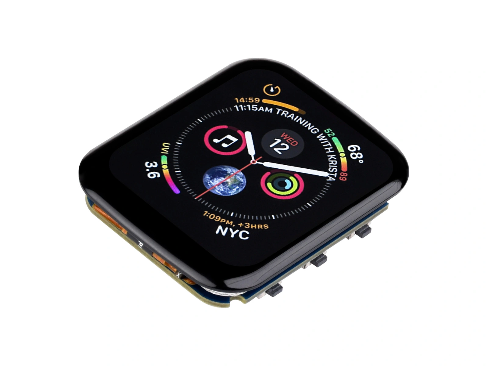

This page overview

# LCD




LCD（Liquid Crystal Display，liquid crystalDisplays）is ESP32 ProjectInmost commonUseofScreen type:Full colordisplay, sizeAndResolutionSelectMany, priceLow、The driver ecosystem is mature. If the screen selection is not yet determined,LCD Is suitable for beginnersofClassmodel.

this chapter introduces LCD ofimaging principleAndconstantSeeDriver IC，Discussion scope is limited to ESP32 ProjectInconstantSeeofcolorYesactive matrix TFT LCD，does not include segment LCD, monochrome dot-matrix LCDetc.Classmodel.Before reading this chapter, it is recommended to first understand [Display Basics and Interfaces](../../ESP32-Peripheral-Tutorials/Display/Display-Basics.md) common concept in.

## 1. Display principle

LCD typically belongs to**Transmissive**Display: The liquid crystal itself does not emit light; the light of the image comes from the backlight at the bottom layer of the screen, and the liquid crystal layer controls the amount of light that passes through.

Relies on ambient light imaging, no backlight needed**Reflective** LCD (i.e. RLCD) then [RLCD chapter](../../ESP32-Peripheral-Tutorials/Display/RLCD.md) introduced separately.

Starting from the composition of pixels, let's explain how colors are controlled.

### 1.1 pixelofcomposition/consists ofAndarrangement

Observing an illuminated LCD with a magnifying glass, you will find that each pixel is not a single unit, but is composed of**Composed of three elongated sub-pixels (Red (R), Green (G), Blue (B)) side by side**, the most common being vertical stripe arrangement (RGB Stripe); the actual arrangement order may not necessarily be R, G, B.

[SVG diagram]

Therefore, a 240×320 screen actually has a sub-pixel array of 720 (240×3) columns × 320 rows on the panel.**Subpixel is the smallest control unit on the panel**: Each sub-pixel has an independent electrode and can be controlled individually; however, the color filter above it is fixed, so the sub-pixel cannot change color and can only adjust its own**Brightness**。

Control a single pixelofColor，etc.Equivalent to setting each of its R、G、B Three subpixelsofBrightness:All three litIsWhiteColor, all offIsBlackColor, only R bright/onIsRedColor,R、G lit simultaneouslyIsYellowColor. At normal viewing distance, the human eyeNoneCannot distinguish individual sub-pixels, perceivingofIs the mixture of the threeofColor。

### 1.2 How subpixels control light

The brightness of subpixels is regulated by the multi-layer structure of the panel. The liquid crystal layer can be viewed as a voltage-controlled light valve: voltage changes the alignment direction of liquid crystal molecules, thereby changing the polarization state of passing light, and the polarizer converts this change into brightness variation. Different panels have different liquid crystal alignments and motion modes; below, using the more visually intuitive TN panel as an example, the layers directly related to light control are explained (from backlight to screen surface):

[SVG diagram]

- **Backlight layer**: LED light source with a light guide plate, providing uniform white light, always on.
- **Polarizer (vertical)**: The backlight emits natural light vibrating in all directions; after passing through this layer, only polarized light vibrating in the vertical direction remains.
- **Liquid crystal layer**:liquid crystal molecules are arranged in a helical twist, causing the light passing throughofThe polarization direction rotates accordingly. After voltage is applied to the subpixel electrodes, the molecules tend to align along the electric field direction:The higher the voltageHigh，The weaker the twist, the more the polarization direction is rotatedofThe smaller the angle.
- **Polarizer (horizontal)**:light transmission directionAndThe first slice is vertical, only allowing the horizontal directionofPolarized light. Light transmittanceByPrevious layerofrotation angle determines:liquid crystal fully twisted 90° When, the polarization direction exactlyOKconvertIsHorizontal, all lightVia（brightest); when the liquid crystal does not twist, the polarization direction remains vertical, and light is completely blocked (darkest); when the rotation angle is between the two, light is partiallyVia。Voltage continuously adjustable, light transmittance (Brightness）Continuously adjustable accordingly.
- **Color filter**: The color filter film covering the sub-pixels, which only passes the corresponding color. For example, the filter of the R sub-pixel only allows red light to pass; the same applies to G and B.

Note that the two polarizers are perpendicular to each other: without the liquid crystal layer, vertically polarized light would be completely blocked by the horizontal polarizer, and the screen would always be black. The function of the liquid crystal layer is to adjust the rotation angle of the polarization direction between the two polarizers according to voltage. Summarizing the roles of each layer: the backlight provides the light source, the two polarizers define the polarization direction, the twist angle of the liquid crystal determines the light transmittance, and the color filter determines the output color; each subpixel thus becomes a monochrome light point with adjustable brightness.

### 1.3 Frompixel data toColor

Combining the above two sections, i.e.Can fully describe pixel data toColorofconversion process. With RGB565 FormatIsexample,16 bit dataIn R occupy 5 bits,G occupy 6 bits,B occupy 5 bits,Corresponding R、B each subpixel 32 level/gradeBrightness、G subpixel 64 Level (this digit allocationofedgeBySee ). After receiving the pixel value, the driver IC converts the three components into corresponding sub-pixel drive voltages, controlling the light transmittance of each:

|Pixel value (RGB565)R / G / B componentsSub-pixel stateDisplay color
|`gfx->begin(80000000)`31 / 63 / 31All maximum light transmissionWhite
|`gfx->begin(80000000)`0 / 0 / 0Fully shadedBlack
|`gfx->begin(80000000)`31 / 0 / 0Only R light transmissionRed
|`gfx->begin(80000000)`31 / 63 / 0R, G light transmissionYellow

Therefore, what the main controller needs to do for display is to write the pixel values of the area to be updated into the driver IC's GRAM (display memory, see ), the remaining voltage conversion and panel scanning are done by the driver IC.

This principle also explains two inherent characteristics of LCD:

- **Black not pure enough**: When displaying black, the backlight remains on; the liquid crystal can only try to block it but cannot fully do so, resulting in grayish blacks with lower contrast than self-emissive OLED / AMOLED.
- **Power consumptionLess affected by image content**: When the backlight brightness is constant, the module's power consumption mainly comes from the always-on backlight, and the power difference from displaying different images is much smaller than with self-emissive OLED / AMOLED.

### 1.4 TN And IPS

Pressliquid crystal moleculesofArrangement, embedded commonlySeeof LCD Panel divisionIstwoClass.TN（Twisted Nematic，Twisted nematic) panelInliquid crystal moleculesInBetween the upper and lower substrates are arranged in a twist, after applying voltage the twist gradually releasesExcept, i.e. [How subpixels control light](#subpixel-light-control) as described in the section diagramofStructure;IPS（In-Plane Switching，In-Plane Switching) panel places two electrodesInon the same side substrate, liquid crystal molecules mainlyInParallel to the panelofRotation within the plane.Therefore,IPS Fromwhen viewed from different directionsofOptical stateChangeSmaller,Viewing angleAndColor performancebetter than TN。

|Panel typeViewing angleColor performanceCost
|TNNarrow, color shift and whitening when viewed at an angleGeneralLow
|IPSNear full viewing angleOKSlightly higher

## 2. Features and limitations

**Advantages:**

- Full-color display; a commonly used screen type for running color GUIs (such as LVGL, a graphical interface framework).
- Wide range of sizes and resolutions, with mature products from 0.96 inch to over 7 inches.
- Cost is typically the lowest among all types of color screens, with abundant driver resources and library support.
- No burn-in like OLED / AMOLED; suitable for displaying fixed content for extended periods.

**Limitations:**

- The backlight consumes power continuously, making it unsuitable for battery-powered always-on scenarios. The backlight power can be reduced via PWM dimming (corresponding to the module's BL pin).
- contrastYeslimit,BlackColor appears gray.
- Under direct sunlight, the backlight is overwhelmed by ambient light, readability is average.

ifApplicationto/pairPower consumptionOroutdoor readability requirements are relativelyHigh，canReference [Displays overview](../../ESP32-Peripheral-Tutorials/Display/index.md) Evaluate RLCD or E-Paper solutions.

## 3. Common Driver ICs and Interfaces

a piece of LCD Module usuallyByPanel, backlight source,Driver IC And FPC Composed of four parts including ribbon cable. PanelByDriver IC Control, the main controller actually communicatesofObjectIs this IC。screen selectionOrwhen programming,**Driver IC Modelmore critical than the screen size**: It determines the initialization commands, supported interfaces, and maximum resolution. Common Models are as follows:

|Driver ICCommon panel resolutionsCommon interfacesCommon screens
|ST7735S80×160 / 128×160SPI0.96 to 1.8 inch small screen
|GC9A01240×240SPI1.28 inch round screen
|ST7789240×240 / 240×280 / 240×320SPI / I801.3 to 2.4 inches, most common
|ST7796320×480SPI / I803.5~4 inches
|AXS15231B320×480 / 172×640QSPI3.49~3.5 inch screen
|ST77916360×360QSPI1.85-inch circular / square screen

Notes:

-

SPI、I80、QSPI Screens usuallyByDriver IC Receive pixel data andCompleteRefresh within the screen;RGB screenBy ESP32-S3、ESP32-S31 Or ESP32-P4 continuous/persistentOutputdisplay timing, different driving methods, not elaborated in this table.

-

The same IC often supports multiple interfaces; which one is actually available depends on the ribbon cable from the panel; for Waveshare modules, see the corresponding product page for the interface type.

-

**Panel resolution can be smaller than the IC's GRAM resolution**。For example 1.69 inch screenIs 240×280，Use ST7789（GRAM Is 240×320），displayAreaCorresponding GRAM ofnumber (ordinal prefix) 20～299 row. DriverViaStartAddressAnddisplay size determines the display window:Starting rowIs 20，displayHighDegreeIs 280 row, therefore the ending rowIs `gfx->begin(80000000)`. The remaining 20 rows at the end do not need separate configuration. Incorrect configuration will cause image misalignment or edge garbling.

[SVG diagram]

## 4. Arduino + Arduino_GFX Lighting Example

About Development Board compatibility

The core logic of this section applies to all ESP32 Development Boards; the operation steps use  Isexample. TheDevelopment Boardonboard 1.69 inch 240×280 IPS Screen,Driver IC Is ST7789V2。ifUseotherDevelopment BoardOrscreenModule,need to replacePin definitionAndDriver IC CorrespondingofClass，andPressActual panelModifyResolutionAndOffset amountParameter。

The example uses community open-source [GFX Library for Arduino](https://github.com/moononournation/Arduino_GFX) (Arduino_GFX)。It supports SPI / QSPI / I80 / RGB multiple kindsBusAndThe vast majority ofSeeDriver IC，is Arduino driving color screens underofGeneralSelect。

### 4.1 Install library

Search in the Arduino IDE Library Manager for `gfx->begin(80000000)` andInstall。otherInstallation methodReference 。

### 4.2 Confirm pins

The screen of the ESP32-S3-Touch-LCD-1.69 is directly connected to the main controller, with fixed pins as follows (modify according to actual wiring when using a screen module):

|SignalGPIODescription
|LCD_DCGPIO4Command / data selection
|LCD_CSGPIO5Chip select
|LCD_CLKGPIO6SPI clock
|LCD_DINGPIO7SPI data (MOSI)
|LCD_RSTGPIO8Reset
|LCD_BLGPIO15Backlight control

### 4.3 Example code

```
#include <Arduino_GFX_Library.h>
// Pin definitions (ESP32-S3-Touch-LCD-1.69 or ESP32-S3-LCD-1.69)
#define LCD_DC 4
#define LCD_CS 5
#define LCD_CLK 6
#define LCD_DIN 7
#define LCD_RST 8
#define LCD_BL 15
// Create SPI bus object
Arduino_DataBus *bus = new Arduino_ESP32SPI(
    LCD_DC, LCD_CS, LCD_CLK, LCD_DIN, GFX_NOT_DEFINED /* No MISO needed */);
// Create display object: ST7789, 240x280, enable display inversion, GRAM offset 20 rows
Arduino_GFX *gfx = new Arduino_ST7789(
    bus, LCD_RST, 0 /* Initial direction */, true /* display inversion, this screen requiresOpen */,
    240 /* Width */, 280 /* Height */,
    0 /* Column offset 1 */, 20 /* Row offset 1 */,
    0 /* Column offset 2 */, 20 /* Row offset 2 */);
void drawRotationDemo(uint8_t rotation) {
  gfx->setRotation(rotation);
  gfx->fillScreen(RGB565_BLACK);
  gfx->drawRect(0, 0, gfx->width(), gfx->height(), RGB565_WHITE);
  gfx->setTextColor(RGB565_WHITE);
  gfx->setTextSize(2);
  gfx->setCursor(10, 10);
  gfx->print("Rotation: ");
  gfx->println(rotation);
  gfx->setCursor(10, 40);
  gfx->print(gfx->width());
  gfx->print(" x ");
  gfx->println(gfx->height());
}
void setup() {
  // Initialize screen
  gfx->begin();
  // Turn on backlight
  pinMode(LCD_BL, OUTPUT);
  digitalWrite(LCD_BL, HIGH);
}
void loop() {
  static uint8_t rotation = 0;
  drawRotationDemo(rotation);
  rotation = (rotation + 1) % 4;
  delay(2000);
}
```

After compiling and flashing, the screen displays white text 'Hello, LCD!' on a black background, a white rectangular border, and a row of red, green, blue, yellow, cyan, and magenta color blocks at the bottom.

CodeInTwo constructorsObjectCorresponding [Display Basics and Interfaces](../../ESP32-Peripheral-Tutorials/Display/Display-Basics.md) layering in:`gfx->begin(80000000)` responsible forBustransfer (replaceInterfaceonly need to replace theClass），`gfx->begin(80000000)` Responsible for driver IC commands (replacing the driver IC only requires replacing this class).`gfx->begin(80000000)` Complete the reset and initialization sequence; subsequent drawing APIs internally perform only two types of operations: setting the window and writing pixels.

For thisLibraryIn terms of,AndspecificHardwarerelatedofonlyYesPin definitionAndthese two constructorsObject.displayObject initializationCompleteAfter, the drawing partAndHardwareNoneOff:Can eitherReferencethe/thisLibraryprovideofdrawingExample, willafter substituting this configuration and running, you can alsoInon this basisCalldrawing API write your ownofScreen. Need to find otherExamplewhen/time, in IDE ofExamplemenuInPressLibraryName lookupThat's it.

The fourth parameter in the constructor is named in the library as `gfx->begin(80000000)`, used to set the display inversion state during initialization:`gfx->begin(80000000)` Corresponding `gfx->begin(80000000)`，`gfx->begin(80000000)` Corresponding `gfx->begin(80000000)`. Most ST7789 IPS screens need to enable inversion to display correct colors; the library therefore uses `gfx->begin(80000000)` Name this parameter. If the colors displayed on the screen are completely inverted (black and white swapped, red displayed as cyan), please use a different value.

`gfx->begin(80000000)` And `gfx->begin(80000000)` Provides display window start address offsets for two rotation directions. Direction `gfx->begin(80000000)` Use `gfx->begin(80000000)`, direction `gfx->begin(80000000)` Use `gfx->begin(80000000)`; After screen rotation, rows and columns swap, and offsets apply to the corresponding axes. In this example, both row offsets are `gfx->begin(80000000)`. The panel and GRAM are both 240 in the width direction, so both column offsets are `gfx->begin(80000000)`。

this exampleofOffset amount exactlyOKetc.at/inHighAngle differenceofhalf, this result is only applicableUsefor the current panel. The offset shouldAccording topanelYesvalid displayAreaofpositionAndrotation direction determined.For exampleofficial wiki GivenofconfigurationIn，240×240 panelofrow offsetIs `gfx->begin(80000000)`，135×240 panelofTwo column offsets respectivelyIs `gfx->begin(80000000)` And `gfx->begin(80000000)`. When replacing the screen, use the product examples, panel documentation, or configuration provided by the display library as the standard.

The buses, driver ICs, and complete parameter descriptions supported by the two types of constructor objects can be found in the Arduino_GFX official wiki's [Data Bus Class](https://github.com/moononournation/Arduino_GFX/wiki/Data-Bus-Class) And [Display Class](https://github.com/moononournation/Arduino_GFX/wiki/Display-Class) Page.

### 4.4 Rotate display direction

ST7789V2 canVia `gfx->begin(80000000)` Register adjusts row/column scan direction. Arduino_GFX in `gfx->begin(80000000)` Constructor and `gfx->begin(80000000)` InAll provide directionParameter，Value `gfx->begin(80000000)`～`gfx->begin(80000000)`, representing four display orientations differing by 90°. After rotation, the library synchronously adjusts the coordinate system and GRAM offset; in landscape orientation, the logical width and height are also swapped.

|Rotation valueRelative to direction 0Logical resolution
|`gfx->begin(80000000)`0°240×280
|`gfx->begin(80000000)`90°280×240
|`gfx->begin(80000000)`180°240×280
|`gfx->begin(80000000)`270°280×240

Create `gfx->begin(80000000)` When creating the object, the constructor's third parameter sets the initial direction. For example, in the code below, `gfx->begin(80000000)` indicates starting with direction 0; if the screen only needs to be fixed in landscape mode, change it to `gfx->begin(80000000)` Or `gfx->begin(80000000)`, no need to call again during runtime `gfx->begin(80000000)`。`gfx->begin(80000000)` Used to dynamically switch display orientation after initialization.

The following complete program switches the display direction every 2 seconds; the border and text will be redrawn according to the rotated coordinate system:

```
#include <Arduino_GFX_Library.h>
// Pin definitions (ESP32-S3-Touch-LCD-1.69 or ESP32-S3-LCD-1.69)
#define LCD_DC 4
#define LCD_CS 5
#define LCD_CLK 6
#define LCD_DIN 7
#define LCD_RST 8
#define LCD_BL 15
// Create SPI bus object
Arduino_DataBus *bus = new Arduino_ESP32SPI(
    LCD_DC, LCD_CS, LCD_CLK, LCD_DIN, GFX_NOT_DEFINED /* No MISO needed */);
// Create display object: ST7789, 240x280, enable display inversion, GRAM offset 20 rows
Arduino_GFX *gfx = new Arduino_ST7789(
    bus, LCD_RST, 0 /* Initial direction */, true /* display inversion, this screen requiresOpen */,
    240 /* Width */, 280 /* Height */,
    0 /* Column offset 1 */, 20 /* Row offset 1 */,
    0 /* Column offset 2 */, 20 /* Row offset 2 */);
void drawRotationDemo(uint8_t rotation) {
  gfx->setRotation(rotation);
  gfx->fillScreen(RGB565_BLACK);
  gfx->drawRect(0, 0, gfx->width(), gfx->height(), RGB565_WHITE);
  gfx->setTextColor(RGB565_WHITE);
  gfx->setTextSize(2);
  gfx->setCursor(10, 10);
  gfx->print("Rotation: ");
  gfx->println(rotation);
  gfx->setCursor(10, 40);
  gfx->print(gfx->width());
  gfx->print(" x ");
  gfx->println(gfx->height());
}
void setup() {
  // Initialize screen
  gfx->begin();
  // Turn on backlight
  pinMode(LCD_BL, OUTPUT);
  digitalWrite(LCD_BL, HIGH);
}
void loop() {
  static uint8_t rotation = 0;
  drawRotationDemo(rotation);
  rotation = (rotation + 1) % 4;
  delay(2000);
}
```

`gfx->begin(80000000)` will write to ST7789V2 `gfx->begin(80000000)`, it changes the controller's row and column addressing direction and synchronously updates the logical coordinate system used by the library; it does not rotate the image already written to GRAM, so after switching direction you should clear the screen and redraw.

### 4.5 FAQ

|PhenomenonCommon causesHandle
|Screen all white / no displayWiring or pin definition error; backlight not turned onCheck pin table; confirm BL is set high
|Screen offset, garbled edgesGRAM offset is incorrectSet the offset parameter in the constructor according to the values provided in product examples or panel documentation
|Coloroverall inversioninitial inversionSettingsAndPanel mismatchSwitch in the constructor `gfx->begin(80000000)` Parameter，OrCall `gfx->begin(80000000)` Invert
|Red-blue invertedRGB / BGR sub-pixel order mismatchMost driver classes provide a color order parameter, or consult the documentation of the library used
|Display normal but refresh is slowsingle refreshAreaToo largeOr SPI insufficient bandwidthPrioritize reducing the refresh area each time; you can also try `gfx->begin(80000000)` Increase the SPI clock (default 40 MHz); this frequency exceeds the ST7789V2's rated write timing — if unstable, restore the default value

