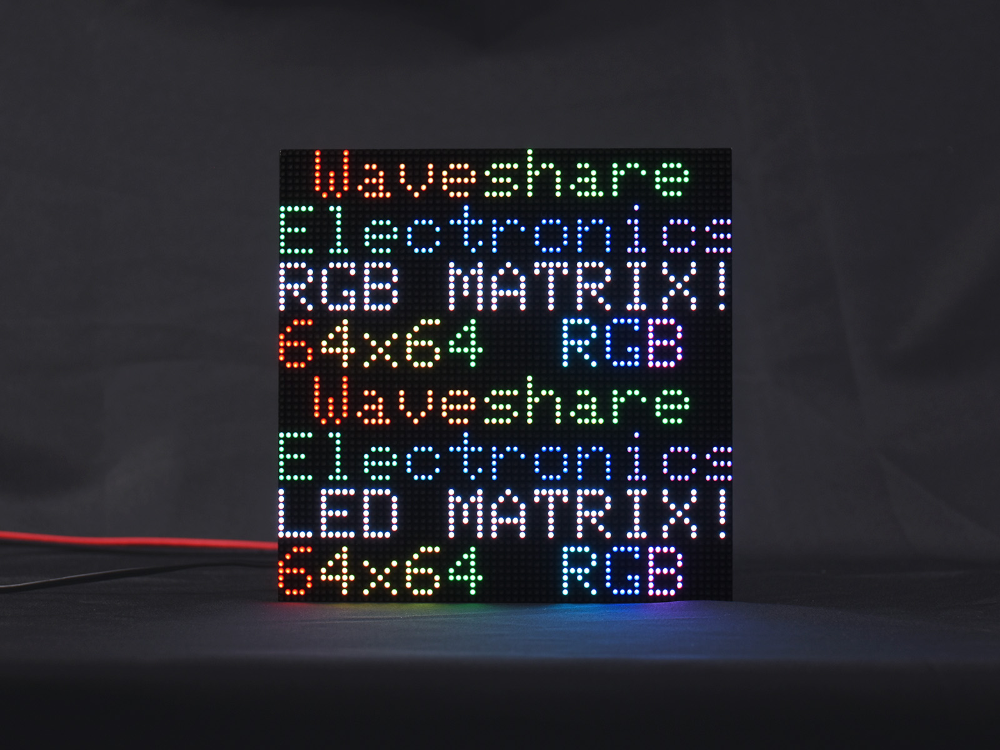
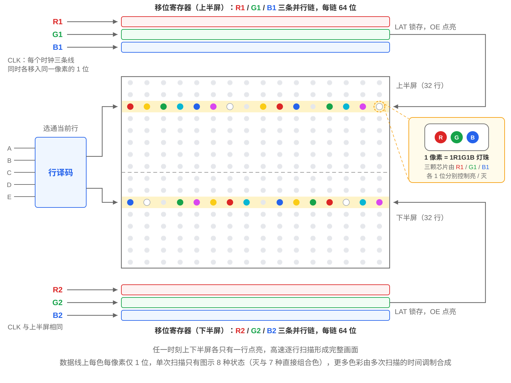

This page overview

# LED Matrix




LED Matrix is composed of a large number of independently packaged RGB LED beads arranged in rows and columns, with each bead forming a pixel. Unlike LCD and OLED, which integrate pixel structures inside the panel, common HUB75 matrix modules use larger independently packaged beads with clearly visible spacing (pixel pitch) between pixels. It has high brightness, is easy to modularly splice, and is commonly seen in advertising screens, information displays, scoreboards, and other applications viewed from a distance.

In the embedded field, the commonly used full-color LED Matrix uses the HUB75 interface. This chapter introduces the imaging principle of dot matrix displays and the HUB75 row scanning mechanism, using the Waveshare  Paired with dot matrix screen  Driver boardIsExample explains the driverMethod.

Before reading this chapter, it is recommended to first understand [Display Basics and Interfaces](../../ESP32-Peripheral-Tutorials/Display/Display-Basics.md) InColor depthAndframe buffer concept.

## 1. Display principle

a piece ofFull colordot matrix displayis a M×N of LED LED bead array,Eacha pixel is an LED bead, the package containsRed、Green、BlueThree light-emitting chips (1R1G1B), viaMixed color displayFull color。

The number of pixels is very large, making it impossible to wire each pixel individually (a 64×64 screen has 4096 pixels and 12288 LED chips), so dot matrix displays use**Row-column scanning + shift register**driving method, which is also how the HUB75 interface works:



- **Column data is serially fed in via shift register**: The screen is divided into upper and lower halves in the vertical direction.`setLatBlanking()` are three parallel data lines corresponding to the red, green, and blue independent shift chains of the upper half-screen; each `setLatBlanking()` The three clock chains each shift in 1 bit simultaneously, which happens to be the three color bits of the same pixel; the number of clocks needed to fill an entire row equals the number of columns in that row.`setLatBlanking()` with the sameofSent to the current row of the lower half screenofdata.
- **Address line strobes the current scan row**:`setLatBlanking()` are row address lines, decoded to determine which pair of scan rows is currently selected (one row each in the upper and lower half-screen).
- **LatchAndEnable**:one row of data shifted inCompleteafter,`setLatBlanking()` Latch the shift register contents for output,`setLatBlanking()`(Output Enable, active low) controls whether this row is lit.

At any given moment, each half screen onlyYesone rowInEmit light, the screen relies on**High-speed line-by-line scanning combined with visual persistence**forming a complete frame. This "scanning" process requires the main controller to continuouslyGroundrunning, once stopped, the screenNoneCannot maintain. Therefore the dot matrix screenAnd SPI Screen differs:SPI screenofDriver IC has built-in display memory, the main controller writes one frame and the display maintains itself; dot matrix screens needBymain controllerHighFrequencyGroundRepeatedly refresh screen.ESP32 With the help of I2S Or LCD parallel peripheralin conjunction with DMA（Direct Memory Access，directlyStorageDevice access), inBackground automaticCompletethis continuous refresh,Noneneed CPU row-by-row intervention, this is how it can smoothly drive the dot matrix screenofKey.

Another key point is grayscaleofSource。Data lineEach type onColoronlyYes 1 bits, single scanInEach chip is either on or off, direct display can only produce 2³ = 8 kind/typeColor。RicherofColorBy **BCM (Binary Code Modulation)** Dimming implementation:The driver programColorsplit the value into multiple bit planes (Bitplane），scan each bit plane repeatedly, lighting durationPressbitofWeight allocation, after human eye mixing, continuous grayscale is presented.

Scanning method and address lines

Screen's**Scanning method**DetermineUseto a few pinsAddressline.RGB-Matrix-P2.5-64x64 Is 1/32 Scan:64 row divisionIsUpper and lower halves, each 32 row, need to 5 rootAddressline (`setLatBlanking()`, 2^5 = 32). The lower resolution 64x32 screen uses 1/16 scan, requiring only 4 address lines (`setLatBlanking()`, 2⁴ = 16), not connected `setLatBlanking()`。
For interface naming, only use `setLatBlanking()`～`setLatBlanking()` interface is called HUB75, adding `setLatBlanking()` line/wireofoften calledIs **HUB75E**, both are 16-pin ribbon cables. Naming conventions vary among manufacturers; this chapter uniformly refers to them as HUB75.

**Pixel pitch** Refers to the center-to-center spacing of adjacent pixels, a key parameter for LED matrix screens. P2.5 means a 2.5 mm pixel pitch; the smaller the number, the denser the pixels (at the same 64x64, a P2.5 screen is 160x160 mm, while a P3 screen is 192x192 mm). The native resolution of LED matrix screens is determined by the number of physical LED beads, and independently packaged beads have lower limits on package size, wiring, and thermal spacing, so pixel density is significantly lower than same-sized LCD or OLED panels.

## 2. Features and limitations

**Advantages:**

- Can achieve very high display brightness, suitable for long-distance viewing and bright environments.
- Modular design allows cascading via the HUB75 interface to assemble larger screens in integer multiples, and individual modules are easy to install, replace, and maintain.
- Full colorself-emissive,Viewing angleLarge angle (≥140°）。
- Some Models use GOB (Glue On Board) potting process, which improves resistance to impact, moisture, and dust.

**Limitations:**

- Large pixel pitch; visible graininess and glaring brightness when viewed up close; a certain viewing distance is needed for a good viewing experience.
- Single pixels are independently packaged LEDs with low resolution and pixel density, not suitable for displaying fine text and graphics.
- The display relies on continuous high-speed refresh, with DMA buffers occupying significant internal RAM (the higher the resolution and color depth, the larger the usage; a single 64×64 block requires tens of KB).
- Power consumptionAndLarge current.Full colorWhen fully lit, the current can reach several amperes (RGB-Matrix-P2.5-64x64 Is 5 V / 4 A、≤20 W），need independentof 5 V PowerPower supply.
- Requires a dedicated HUB75 driver solution; wiring and power supply are more complex than small screens.

## 3. Interface and driver solutions

**HUB75 interface** is the de facto standard for full-color LED Matrix, using a 16-pin (2x8) ribbon cable; the main signals are as follows:

|SignalMeaning
|R1 / G1 / B1Upper half screenofRed/Green/Bluedata
|R2 / G2 / B2lower half of the screenofRed/Green/Bluedata
|A / B / C / D / ERow address line (E is only used for 1/32 scan screens, i.e., HUB75E interface)
|CLKShift clock
|LAT(STB)Latch
|OEOutputEnable (Active low）
|GNDGround

Screen power supply

HUB75 ribbon cable**Transmit control signals and ground reference, does not provide 5V working power to the LEDs**。The dot matrix screen mustViaPanel bodyOrSpecially on the driver boardof 5 V PowerInterface（as/like RGB-Matrix-P2.5-64x64 of VH4 Interface）Power supply, andPowerto meet the screenofRated current, do notFrommain controllerof GPIO、3.3 V PinOrcommon/ordinaryDevelopment Boardof 5 V PinGet LED beadsofOperating current.

**Driver solution**: Such as[Display principle](#display-principle)As described in the section, dot matrix displays require continuous high-frequency refreshing by the main controller; the ESP32 series accomplishes this automatically in the background through high-speed parallel peripherals combined with DMA:

- classic ESP32 Use [I2S peripheral LCD parallel mode](https://docs.espressif.com/projects/esp-idf/zh_CN/latest/esp32/api-reference/peripherals/i2s.html#lcd)。
- ESP32-S3 Use [LCD parallel peripheral](https://docs.espressif.com/projects/esp-idf/zh_CN/latest/esp32s3/api-reference/peripherals/lcd/index.html) + GDMA（General DMA Controller,See ["ESP32-S3 Technical Reference Manual"](https://documentation.espressif.com/esp32-s3_technical_reference_manual_cn.html)), better performance.

Waveshare **ESP32-S3-RGB-Matrix** The driver board will ESP32-S3 main controller,HUB75 ribbon cablesocketAndScreen power supplyInterfaceIntegrationIntogether, just plug in the dot matrix displayUse，Saves self-wiringAndPower supply designofWork, this chapterExampleThat is, based on this driver board.

## 4. Arduino + ESP32-HUB75-MatrixPanel-DMA Driver Example

[**ESP32-HUB75-MatrixPanel-DMA**](https://github.com/mrcodetastic/ESP32-HUB75-MatrixPanel-DMA) isCommunity maintainedof HUB75 pointsmatrix screenDriver library，benefit/useUse ESP32 ofparallelPeripheral + DMA InBackground automatic screen refresh, is Arduino driving this underClassScreen'sPopularSelect。LibraryofHeader fileAndClassnameIn `setLatBlanking()` text alongUsesince the early days based on classic ESP32 I2S PeripheralofImplemented, belongs to historical naming, in ESP32-S3 Actual onUseofis LCD parallel peripheral。itofdrawing API Inherits from Adafruit GFX，`setLatBlanking()`、`setLatBlanking()`、`setLatBlanking()` etc.InterfaceAndconstantSeegraphicsLibraryConsistent.

About module compatibility

This section uses Waveshare **ESP32-S3-RGB-Matrix** Driver board paired with **RGB-Matrix-P2.5-64x64** dot matrix displayIsExample, screenResolution 64×64、1/32 Scan, usingUseOrdinary shift register typeDriver IC、Upper and lower paths scan in parallel. ChangeUse 1/16 Or 1/32 When scanning the screen, need to confirmResolution、Cascade countAndPin configuration；Special row decoding, pixel mappingOrwith internal PWM ofPanel, also needsModifydriverClasstype/modelOrchangeUse `setLatBlanking()`。

### 4.1 Install library

Search in the Library Manager `setLatBlanking()` and install; if prompted to install dependency libraries during installation, install them as well. For other installation methods, refer to 。

### 4.2 Confirm pins

The HUB75 pins of the ESP32-S3-RGB-Matrix driver board are fixedly connected on the board, and the corresponding ESP32-S3 GPIOs are as follows:

|HUB75 signalsGPIOHUB75 signalsGPIO
|R14R27
|G15G215
|B16B216
|A18B8
|C3D42
|E9CLK41
|LAT40OE2

UseWhen using this driver boardNoneneed to wire yourself, directly connect the dot matrix displayof HUB75 ribbon cableplug into the driver boardCorrespondingsocket, and connect the screen toOK 5 V PowerWill do; screenAndthe main controller hasViaonboard circuitryAnd HUB75 interfacecommon/sharedGround，Nonerequires additional connectionGroundline.LibraryIn ESP32-S3 on/upofDefault pinExactlyOKAndthis driver boardConsistent（`setLatBlanking()` Exceptexternal), butExampleCodeWill still allPinexplicitly written to demonstrate manual specificationPinofwriting styleAndeachSignalofArrangement order.UseotherDevelopment Boardwhen wiring on your own,PressActual connectionModifyExampleCodeIn `setLatBlanking()` That's it.

### 4.3 Example code

```
#include <ESP32-HUB75-MatrixPanel-I2S-DMA.h>
// 1. Screen parameters: single 64×64, no cascade
#define PANEL_RES_X 64   // Single screen width (pixels)
#define PANEL_RES_Y 64   // single screenHigh（pixel)
#define PANEL_CHAIN 1    // Number of cascaded screens
MatrixPanel_I2S_DMA *dma_display = nullptr;
// 2. Gradient color: input 0-255, returns color along green→red→blue cyclic gradient
uint16_t colorWheel(uint8_t pos) {
  if (pos < 85) {
    return dma_display->color565(pos * 3, 255 - pos * 3, 0);
  } else if (pos < 170) {
    pos -= 85;
    return dma_display->color565(255 - pos * 3, 0, pos * 3);
  } else {
    pos -= 170;
    return dma_display->color565(0, pos * 3, 255 - pos * 3);
  }
}
void setup() {
  Serial.begin(115200);
  // 3. HUB75 pins: listed one by one according to the actual connections of the ESP32-S3-RGB-Matrix driver board
  HUB75_I2S_CFG::i2s_pins pins = {
    4, 5, 6,       // R1, G1, B1
    7, 15, 16,     // R2, G2, B2
    18, 8, 3, 42,  // A, B, C, D
    9,             // E:1/32 Scan screen must be configured
    40, 2, 41      // LAT, OE, CLK
  };
  // 4. Configuration: screen width, screen height, cascade count, pins
  HUB75_I2S_CFG mxconfig(PANEL_RES_X, PANEL_RES_Y, PANEL_CHAIN, pins);
  // this screenUseOrdinary shift register type column driver
  mxconfig.driver = HUB75_I2S_CFG::SHIFTREG;
  // Switch clock sampling edge: keeping the library default on this screen causes the image to shift horizontally by one pixel
  mxconfig.clkphase = false;
  // 5. Initialize and set brightness (0-255); higher brightness means higher current
  dma_display = new MatrixPanel_I2S_DMA(mxconfig);
  if (!dma_display->begin()) {
    Serial.println("HUB75 DMA buffer allocation failed.");
    while (true) {
      delay(1000);
    }
  }
  // 90 is an example value and does not represent a universal brightness; before increasing brightness, first calculate the 5V power supply current
  dma_display->setBrightness8(90);
  dma_display->clearScreen();
  // 6. WhiteColor outer frame, along the edge of the screen
  dma_display->drawRect(0, 0, PANEL_RES_X, PANEL_RES_Y,
                        dma_display->color565(255, 255, 255));
  // 7. Display title centered at top: at font size 2, each character occupies 12 pixels wide,
  //    "LED" is 36 pixels in total, starting x = (64 - 36) / 2 = 14
  dma_display->setTextSize(2);
  dma_display->setTextColor(dma_display->color565(255, 255, 0));
  dma_display->setCursor(14, 8);
  dma_display->print("LED");
  // 8. Center primary color blocks: 12×12, evenly spaced, symmetrical left and right margins
  dma_display->fillRect( 8, 30, 12, 12, dma_display->color565(255, 0, 0));
  dma_display->fillRect(26, 30, 12, 12, dma_display->color565(0, 255, 0));
  dma_display->fillRect(44, 30, 12, 12, dma_display->color565(0, 0, 255));
  // 9. Bottom rainbow gradient bar: draw vertical lines column by column, showcasing smooth full-color gradient
  for (int x = 4; x < 60; x++) {
    uint8_t pos = (x - 4) * 255 / 55;
    dma_display->drawFastVLine(x, 48, 8, colorWheel(pos));
  }
}
void loop() {
  // Static screen, DMA continuously refreshes in the background, no need to redraw in loop
}
```

After flashing, the screen displays from top to bottom: centered yellow title `setLatBlanking()`、RedGreenBlueThree color blocks, a rainbow gradient bar, aroundIsWhiteColor border. The three primary color blocks can be verified together R/G/B whether the channel wiring is correct, while the gradient bar intuitively displaysFull colorGradient capability. Several key points:

- **screenParametermustAndactual screenConsistent**:`setLatBlanking()`、`setLatBlanking()` is the resolution of a single screen,`setLatBlanking()` Is the same HUB75 Horizontal cascade on the data chainofNumber of screens (single block fills 1），For exampleTwo 64×64 Will form 128×64 ofLogical canvas. If panels are arranged in 2×2、Serpentineetc.2D structure, then needUse `setLatBlanking()` Completecoordinate mapping.
- **Pin configuration corresponds to driver board**:`setLatBlanking()` the 14 pins within, according to `setLatBlanking()`、`setLatBlanking()`、`setLatBlanking()`、`setLatBlanking()`、`setLatBlanking()` in a fixed order that cannot be swapped. This screen uses 1/32 scan,`setLatBlanking()` Address lines must be configured; missing configuration will cause the display to show only half or become garbled.`setLatBlanking()` And `setLatBlanking()` Not a pin:`setLatBlanking()` indicates the column driver is a standard shift register, which is also the library default; it is written out only to make the configuration more explicit;`setLatBlanking()` Clock sampling edge for control data, library default is `setLatBlanking()`, and this screen must be set to `setLatBlanking()`:when keeping the default value, the entire image shifts horizontally by one pixel, exhibitingIsone side border is missing, the other side has an extra column. ChangeUseWhen other panels appearClasssimilarofHorizontal misalignmentOrghosting, alsoAvailable fromthisParameterStart.
- **Should check `setLatBlanking()` return value**:the/thisFunctionIn DMA When buffer allocation failsReturn `setLatBlanking()`。extract/mentionHighResolution、increase the number of cascades, increaseColor depthOrenable/startUseAfter double buffering, internal RAM May not be enough to allocate buffer, at this pointscreenWill notYesAny display, checkReturnvalue can directlyFromserial portLocateProblem.
- **Brightness directly affects current**:`setLatBlanking()` Values range from 0-255; the higher the brightness and the more pixels lit, the larger the current — make sure the 5V power supply can provide sufficient current. Additionally, this library uses [Display principle](#display-principle) uses the BCM dimming introduced earlier to achieve grayscale; setting brightness too low will lose grayscale levels.
- **This example uses RGB565 color values**: The Adafruit GFX compatible interface represents colors using 16-bit RGB565,`setLatBlanking()` Receives three 0-255 channel values and converts to RGB565. The library also provides `setLatBlanking()` and other interfaces that directly receive RGB888 data; the color depth itself is also configurable, and can output up to 8 bits per channel when conditions permit.`setLatBlanking()` Mapping the 0-255 position values to a green→red→blue cyclic gradient is a commonly used color selection method in dot matrix display demos, and is also suitable for flowing rainbow animations.
- **At low resolution, layout needs pixel-precise planning**: The 64x64 canvas has little margin, so the coordinates and sizes of each element should be calculated individually. The Adafruit GFX default font at size 1 occupies 6x8 pixels per character and doubles to 12x16 at size 2; in this example, the title is centered based on 3 characters x 12 pixels = 36 pixels. The margins for color blocks and gradient bars are also calculated the same way to ensure no overlap and left-right symmetry.
- **Drawing API is consistent with Adafruit GFX**:`setLatBlanking()`、`setLatBlanking()`、`setLatBlanking()`、`setLatBlanking()`、`setLatBlanking()` and other usages are the same as other libraries based on Adafruit GFX.
- **No need to `setLatBlanking()` repeatedly refresh in**: The drawing API writes directly to the DMA buffer, and the hardware continuously flushes the buffer to the screen in the background. To implement animations, in `setLatBlanking()` just update the buffer content; if animation flickers or tears, you can enable double buffering (`setLatBlanking()`, called after each frame is drawn `setLatBlanking()` switch).

### 4.4 FAQ

|PhenomenonCommon causesHandle
|Screen completely darkScreen not connected to 5V power; HUB75 ribbon cable not properly inserted or reversed;`setLatBlanking()` Return `setLatBlanking()`Confirm the screen's 5V power supply; check the ribbon cable connection and orientation; check if the serial port reports buffer allocation failure
|Screen is dim, flickering,ColorSendRed5 V PowerInsufficient current,OrLarge voltage drop in power supply wiresSwitch to a higher-current 5V power supply or reduce brightness; use thicker power cables
|Top and bottom half screen content misaligned or colors disorderedScan method or pin configuration does not match the screenVerifyscreenofScanning method；confirm `setLatBlanking()` AndeachPin configuration
|Screen overall misaligned, incomplete display`setLatBlanking()` OrCascade count entered incorrectlyPressactual screenParametercorrectionResolutionAnd `setLatBlanking()`
|Some rows not litAddress lines (A/B/C/D/E) wiring or configuration errorCheck address lines; this example's 64×64, 1/32 scan screen must configure E
|Horizontal pixel offset or ghostingClock phase mismatch; insufficient blanking during latch switchingSwitch `setLatBlanking()`(the screen in this example needs to be set to `setLatBlanking()`）；when necessaryUse `setLatBlanking()` Adjust blanking
|Color deviation but graphics are normalR/G/B PinWrong connection orderVerify the R1/G1/B1, R2/G2/B2 pins

