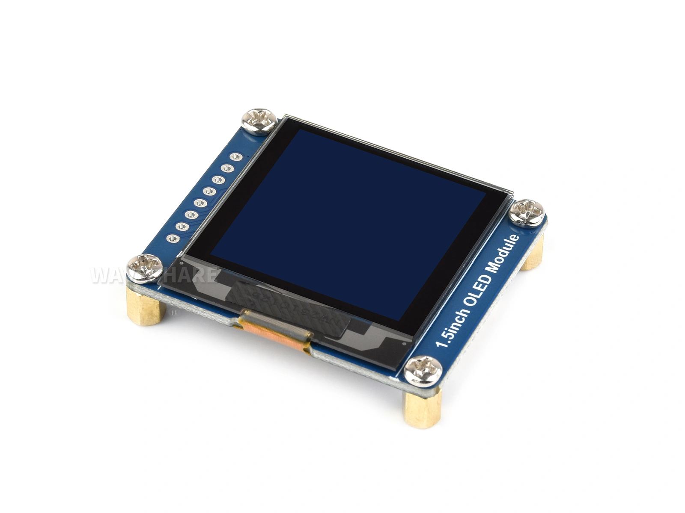

This page overview

# OLED




Each pixel of an OLED (Organic Light-Emitting Diode) screen emits light on its own and does not require a backlight.

embeddedProjectInconstantUseofis 0.96～1.5 inchofsmall monochromeModule:Simple wiring (I2C InterfaceOnly requires two wiresSignal line），Power consumptionLow、contrastHigh，suitable for displaying statusInformation，is also a common beginnerUseofScreen.

This chapter introduces the imaging principles of OLED and common driver ICs, with a focus on the de facto standard graphics library for monochrome screens **u8g2**。

## 1. Display principle

OLED ofEacha pixel is a tinyofYesOrganic LED, lights up when powered,BrightnessWith currentChange。thisAnd LCD of“backlight + "Light valve" structureYesessential difference:

[SVG diagram]

- **Non-emitting pixels are pure black**. When an LCD displays black, the backlight is still working and light leakage occurs; OLED's black pixels are simply unpowered, resulting in high contrast and pure blacks.
- **Power consumption depends on display content**. The more pixels lit and the brighter they are, the higher the power consumption; dark screens are very power-efficient.

By driving method, OLED is divided into two categories:

- **PMOLED (Passive-Matrix OLED)**:pixelPressrow and column totalUseElectrode,**Only one row is lit at any time**，Rely on line-by-lineFastFast scanning combined with visual persistence forms a complete image. The more rows, each row getsofThe shorter the lighting time, to maintainBrightnessHave to pullHighInstantaneous current, therefore sizeAndResolutionLimited, product setInIn 3 inch and aboveUndersmall screen. Simple structure,CostLow，**this chapter discussesofconstantSee OLED moduleAll belong to thisClass.**
- **AMOLED (Active-Matrix OLED)**:Eachpixel configurationYesindependentof TFT（Thin Film Transistor，thin-film transistor) drive circuit, which can continuously maintain the light-emitting state, supporting large-size,HighResolutionAndFull colordisplay, see detailsSee [AMOLED chapter](../../ESP32-Peripheral-Tutorials/Display/AMOLED.md)。

PMOLED Is small-sizedScreen'sDefault scheme, manufacturers usuallyWill notspecially marked;AMOLED Is a selling point, product pageGeneralWill be explicitly written, also canFromDriver IC ModelJudgment.

## 2. Features and limitations

**Advantages:**

- High contrast, pure black, clear small text.
- Self-emissive with no backlight, viewing angle is nearly omnidirectional.
- Fast response, almost no ghosting.
- Low power consumption when displaying dark content (black pixels emit no light, consuming almost no power).
- Simple module interface; can be driven with just two I2C wires, suitable for situations with limited pins.

**Limitations:**

- Small size; common modules range from 0.42 to 2.42 inches, with 0.96 to 1.5 inches being mainstream; low resolution, mostly around 128×64.
- Mainly monochrome (white, blue, yellow), some are dual-color or grayscale screens; full-color Models are less common.
- **Risk of screen burn-in**:YesDisplay material degrades with cumulative lighting time, and displaying fixed content for a long time will leave ghosting. Long-term operationofDevices should avoid being completely stationaryofScreen (such as periodically moving content, reducingLowBrightnessOrscreen off).
- readability under direct sunlightGeneral。

## 3. Common Driver ICs and Interfaces

|Driver ICResolutionFeatureCommon screens
|SSD1306128×64Most common, most documentation0.91 / 0.96 inch
|SH1106128×64Similar to SSD1306, but the display RAM is 132 columns wide, 4 columns more than the visible area; mistakenly using the SSD1306 constructor will cause image offset1.3 inch
|SSD1309128×64Specifications similar to SSD1306, mostly used for larger monochrome screens2.42 inches
|SSD1327128×12816-level grayscale1.5 inch

InterfaceIn terms of, the aboveDriver IC All simultaneously support I2C And SPI，ModuleActually leads out which kindInterfaceDepends on product design. SomeModule（as/likeWaveshare OLED module）canViaonboardofResistor solder padSwitch，factory defaultInterfacepleaseSeeCorrespondingproduct page; alsoYesnot a few/manyModuleInfixed at factoryIsAmong themone type, cannot be changed. Two typesInterfaceofTrade-offs are as follows:

- **I2C**: Only requires two wires, SDA and SCL, and can share the bus with other I2C devices; it is the most common connection method for small screens. The disadvantage is low bandwidth, limiting the full-screen refresh rate.
- **SPI**: More pins (DIN, CLK, CS, DC, RST), but significantly faster, suitable for applications requiring smooth animations.

SSD1306, SH1106, and other 1bpp (1 bit per pixel, see ）Driver IC ofvideo memory/GRAMPress**Page addressing**Organization: each page is 8 rows of pixels, with one byte corresponding to 8 vertically arranged dots in a column. Grayscale screens like SSD1327 are different, with 4bpp display memory (4 bits per pixel), where one byte stores the grayscale values of two adjacent pixels. Regardless of the layout, directly manipulating display memory requires organizing bytes according to the corresponding format, which is cumbersome. This is why graphics libraries like u8g2 are used: the library maintains its own drawing buffer in memory and organizes data according to each controller's display memory format when sending, so application code does not need to worry about display memory details.

[SVG diagram]

## 4. Arduino + u8g2 driver example

[u8g2](https://github.com/olikraus/u8g2) Is open sourceCommunity maintainedofMonochrome screen graphicsLibrary，support SSD1306、SH1106、SSD1327 etc.Almost allYesconstantSeemonochromeDriver IC，Built-in hundreds of font sets, is Arduino driving under OLED ofPreferred.[RLCD chapter](../../ESP32-Peripheral-Tutorials/Display/RLCD.md) The official Waveshare examples are also based on u8g2.

About module compatibility

This section uses  IsExample, thisModuleDriver IC Is SSD1327，Resolution 128×128，support 16-level grayscale（u8g2 onlyPressBlackWhiteScreen driver,SeebelowDescription), via I2C Wiring, can be paired with any ESP32 Development BoardsUse。ifUseother OLED module，just replacePin definitionAndCorrespondingofconstructorThat's it.

### 4.1 Constructor and Buffer Mode

u8g2 through**Constructor class name**Select the driver IC, screen Model, buffer mode, and interface; the naming convention is:

```
#include <U8g2lib.h>
#define SDA_PIN 1
#define SCL_PIN 2
// 1. Constructor: SSD1327, Waveshare 128x128 screen, full buffer, hardware I2C
//    U8G2_R0 means no rotation; ESP32 can specify I2C pins directly in the constructor
U8G2_SSD1327_WS_128X128_F_HW_I2C u8g2(U8G2_R0, /* reset= */ U8X8_PIN_NONE,
                                      /* clock= */ SCL_PIN, /* data= */ SDA_PIN);
void setup() {
  // 2. The module's default I2C address is 0x3D; u8g2 uses the 8-bit address after left-shifting by one bit
  u8g2.setI2CAddress(0x3D << 1);
  u8g2.begin();
  // 3. Clear buffer
  u8g2.clearBuffer();
  // 4. Display the title centered at the top: use a narrower font, center based on actual text width to avoid exceeding screen width
  u8g2.setFont(u8g2_font_7x14B_tr);
  const char *title = "Hello, OLED!";
  int titleW = u8g2.getStrWidth(title);
  u8g2.drawStr((128 - titleW) / 2, 13, title);
  // 5. Below the title, draw a hollow rectangle and a hollow circle side by side; both are top-aligned and non-overlapping
  u8g2.drawFrame(8, 24, 50, 50);
  u8g2.drawCircle(94, 49, 25);
  // 6. Draw solid rectangle at the bottom
  u8g2.drawBox(28, 90, 72, 24);
  // 7. Refresh buffer content to the screen
  u8g2.sendBuffer();
}
void loop() {
  // Static image, no need to repeat refresh
}
```

For example `getStrWidth()` represents: SSD1327 driver IC, Waveshare (WS) 128×128 screen, full buffer (F), hardware I2C.**The constructor should correspond exactly to the module Model**，this is u8g2 UseInmost criticalofone step:sameDriver IC ofdifferentModule,initializationParameter、VRAM offsetAndScan direction may differ, onlyDriver IC the same may not display correctly; withoutYescompletelyCorrespondingofModelWhen, can first try the sameDriver IC、sameResolutionofConstructor, thenAccording toActual display effectAdjust。complete listSee [u8g2 official documentation](https://github.com/olikraus/u8g2/wiki/u8g2setupcpp)。

Buffer mode determines memory usage and drawing method:

|ModeCode nameMemory usage (128×64 as example)Drawing method
|Full bufferFFull frame 1 KBDraw freely,`getStrWidth()` Single refresh, simple and intuitive
|Page buffer1 / 2128 / 256 bytesIn `getStrWidth()` Repeated drawing in a loop, saves memory but code is constrained

Page buffering is designed for microcontrollers with very limited memory (such as AVR); ESP32 has sufficient memory,**Just use full buffer (F)**。

u8g2 does not support per-pixel grayscale

u8g2 is essentially a 1bpp (monochrome) graphics library,`getStrWidth()`、`getStrWidth()` etc.drawing API only distinguishes "on"And“Off", does not provide per-pixelSettingsGrayscale valueofInterface。SSD1327 Although it supports 16-level grayscale（4bpp VRAM), but u8g2 InIt still maps "lit" pixels fixedly on itIsmaximum grayscale, so the screen will only show full brightnessOrall/fullBlack，Will notYesInShade variation. What really needs to be utilizedUse SSD1327 of 16-level grayscale（Grayscale gradient, anti-aliased fontetc.）When, need to bypass u8g2 ofDrawing layer directly operates 4bpp VRAM,OrchangeUsesupports grayscale bufferofotherLibrary。

### 4.2 InstallLibrary

Search in the Library Manager `getStrWidth()` and install, for other installation methods refer to 。

### 4.3 Confirm pins

First confirm the module's interface configuration

Waveshare 1.5-inch OLED module**Factory default is 4-wire SPI**(BS1, BS2 connected to GND). Before using the I2C wiring and code in this section, you need to  put/takeModuleback sideof BS1、BS2 resistor solder pad reconnected to VCC。Switchafter DIN that is SDA、CLK that is SCL，CS And DC Noneneeds connection, default I2C AddressIs 0x3D（By BS3 Determine, connect GND when/timeIs 0x3C）。

This section wiring uses  as an example, with [Arduino Tutorials Section 7: I2C Communication](../../ESP32-Arduino-Tutorials/I2C-Communication.md) Same:

|Development BoardPinOLED moduleDescription
|GPIO 1DIN(SDA)I2C Data line
|GPIO 2CLK(SCL)I2C Clock line
|3.3VVCCPower positive terminal
|GNDGNDPower negative terminal

When using other ESP32 Development Boards, please select the I2C pins available on that board and synchronously modify the code's `getStrWidth()` / `getStrWidth()`; Note to avoid GPIOs connected to Flash/PSRAM, boot configuration, or onboard peripherals; occupying the UART default pins will also affect log output.

When using other OLED modules, only the corresponding constructor needs to be changed; the rest of the code remains unchanged.

### 4.4 Example code

```
#include <U8g2lib.h>
#define SDA_PIN 1
#define SCL_PIN 2
// 1. Constructor: SSD1327, Waveshare 128x128 screen, full buffer, hardware I2C
//    U8G2_R0 means no rotation; ESP32 can specify I2C pins directly in the constructor
U8G2_SSD1327_WS_128X128_F_HW_I2C u8g2(U8G2_R0, /* reset= */ U8X8_PIN_NONE,
                                      /* clock= */ SCL_PIN, /* data= */ SDA_PIN);
void setup() {
  // 2. The module's default I2C address is 0x3D; u8g2 uses the 8-bit address after left-shifting by one bit
  u8g2.setI2CAddress(0x3D << 1);
  u8g2.begin();
  // 3. Clear buffer
  u8g2.clearBuffer();
  // 4. Display the title centered at the top: use a narrower font, center based on actual text width to avoid exceeding screen width
  u8g2.setFont(u8g2_font_7x14B_tr);
  const char *title = "Hello, OLED!";
  int titleW = u8g2.getStrWidth(title);
  u8g2.drawStr((128 - titleW) / 2, 13, title);
  // 5. Below the title, draw a hollow rectangle and a hollow circle side by side; both are top-aligned and non-overlapping
  u8g2.drawFrame(8, 24, 50, 50);
  u8g2.drawCircle(94, 49, 25);
  // 6. Draw solid rectangle at the bottom
  u8g2.drawBox(28, 90, 72, 24);
  // 7. Refresh buffer content to the screen
  u8g2.sendBuffer();
}
void loop() {
  // Static image, no need to repeat refresh
}
```

After flashing, the screen displays from top to bottom: a centered title, a row of hollow rectangles and hollow circles, and a filled rectangle at the bottom, with spacing between them. Key points:

- **draw first, then `getStrWidth()`**: All drawing APIs only modify the memory buffer, calling `getStrWidth()` before actually sending to the screen VRAM via I2C. The fixed procedure for updating the display is `getStrWidth()` -> Draw -> `getStrWidth()`。
- **font determines text size, andWill notautomatic line wrappingOrScale**:`getStrWidth()` In `getStrWidth()` i.e., character width,Highofnumber of pixels,Selectwhen using fonts, you need to estimate whether the total width of the text exceeds the screen,For examplethis exampleIn 128 pixel wideofThe screen can accommodate at most 128÷7≈18 of this fontofcharacter.MorefontSee [Official font list](https://github.com/olikraus/u8g2/wiki/fntlistall)。
- **Use `getStrWidth()` Calculate actual width then center**: Different characters may have different widths (especially noticeable with non-monospace fonts); call before drawing `getStrWidth()` Get the pixel width, then calculate the starting coordinate accordingly to ensure precise centering without exceeding screen boundaries.
- **I2C Address**: The WaveShare 1.5-inch module default address is 0x3D. If there is no display after initialization, you can first use [I2C scanner program](../../ESP32-Arduino-Tutorials/I2C-Communication.md) confirm deviceAddress。

### 4.5 FAQ

|PhenomenonCommon causesHandle
|screenNonedisplayI2C address mismatch; wiring errorUse an I2C scanner to confirm the address; verify SDA/SCL
|Overall image offset by 2 pixels, noise at edges1.3-inch screen mistakenly using SSD1306 constructorSH1106 screens must use the SH1106 constructor
|Only part of the content is displayedIn page buffer mode, the firstPage/nextPage loop is not usedchangeUseFull buffer（F）constructor
|Text not displayedAfter drawing, notCall `getStrWidth()`；font notSettingsConfirm called `getStrWidth()`; check the clearBuffer -> draw -> sendBuffer workflow
|text exceeds the screenOrAndgraphics overlapnot yetPressactual font widthHighCalculate coordinatesUse `getStrWidth()` Take the width centeredIn，and calculate the boundaries of each element to leave spacing
|Ghosting after long-term useBurn-inAvoid displaying completely static content for long periods

