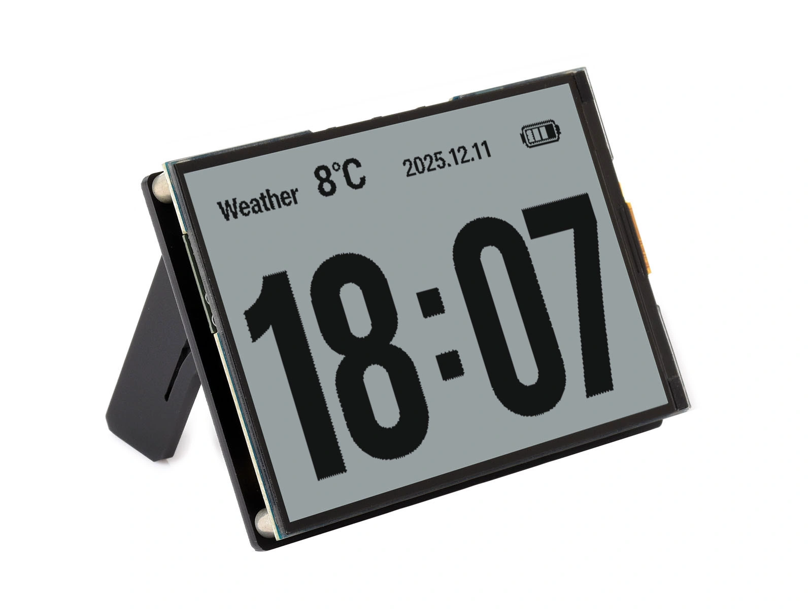

This page overview

# RLCD




RLCD（Reflective LCD，Reflectiveliquid crystalDisplays）is LCD ofone type, adoptingUseReflectiveStructure rather than backlight, relies on reflecting ambient light for imaging, looks similar to e-ink display, butRefresh speedAndcommon/ordinary LCD comparable. It is suitableUsefor applications requiring e-ink display levelofLowPower consumptionAndsunlight readability and real-time dynamic screen refreshofScenario，For examplealways-on clock, electronic calendar, outdoor instrument.

Before reading this chapter, it is recommended to first understand [LCD chapter](../../ESP32-Peripheral-Tutorials/Display/LCD.md) The basic principles of LCD imaging in, the light control mechanisms of both are the same.

## 1. Display principle

RLCD and ordinary LCDs are both liquid crystal displays, where the liquid crystal layer also acts as a light valve controlling the passage of light; the difference lies in the position of the light source:

- **common/ordinary LCD（Transmissive）**: Light comes from the backlight at the bottom of the screen, passing through the liquid crystal layer and exiting.
- **RLCD (reflective)**:The bottom of the screen does notYesbacklight, insteadofIs a layer of reflective film. Ambient lightFromincident from the front, passing throughLiquid crystal layer、After being reflected by the reflective film, it passes through againLiquid crystal layerEmit.Liquid crystal layerwhen transparent, this pixel reflects ambient light for displayIsLit, displays when light is blockedIsdark.

[SVG diagram]

Bythis brings two direct results:

- **The stronger the ambient light, the clearer the screen**. Under direct sunlight, the backlight of an ordinary LCD will be overwhelmed by ambient light, while an RLCD actually achieves its best viewing experience, similar to e-Paper.
- **Cannot display without ambient light**. RLCD is not visible in the dark and requires external lighting (some products add an optional frontlight layer).

Low brightness of RLCD screen is normal

RLCD no/notYesbacklight,Will notlike ordinary LCD Actively emit light like that. The screenBrightnessOffsetLowEven slightly dark is normalPhenomenon，is not a fault; the more sufficient the light, the clearer the display, and it is not easy to cause visual fatigue after long-time viewing.

In low-power implementations, RLCD is often combined with two types of technology:

- **Low-power reflective LCD (using TFT backplane)**:TFT（Thin Film Transistor，thin-film transistor) backplaneAndDriver IC Cooperate, canInWhen the screen is not updated, reduceLowfull screenPower consumption，while retaining relativelyFastofRefresh capability.
- **MIP (Memory-in-Pixel)**: Each pixel has a built-in 1-bit memory cell, consuming almost no power when maintaining an image, commonly found in Sharp Memory LCDs used in outdoor sports watches.

## 2. Features and limitations

**Advantages:**

- **Very low power consumption**: Eliminating the backlight, which accounts for the largest share of power consumption, the static display power is one to two orders of magnitude lower than ordinary LCDs, making it suitable for battery-powered Always-On devices.
- **Fast refresh**: Essentially still a liquid crystal, with millisecond-level response, capable of smoothly displaying animations and real-time data. This is the main difference between RLCD and e-Paper, and it does not have the ghosting problem of e-Paper.
- **Clearly readable under sunlight**: Reflective imaging, clearer with stronger light.
- **Paper-like feel**: No backlight shining directly into eyes, comfortable for prolonged viewing.

**Limitations:**

- **Depends on ambient light**: Invisible in dark environments, requires frontlight or external illumination.
- **Color performanceYeslimit**: Currently mainly monochrome; the color saturation of color RLCDs is also significantly lower than that of standard LCDs.
- **contrastGeneral**: Limited reflection efficiency; black and white contrast is not as good as e-ink and OLED.
- The ecosystem is relatively new, with fewer available sizes and driver resources compared to regular LCDs.

AndClasssimilarScreen'sLocatecompare:

|RequirementMore suitableofscreen
|Color GUI, indoor interactionLCD / AMOLED
|Nearly static display, ultra-low standby (price tags, calendar covers)E-Paper
|Always-on display + real-time refresh + outdoor readable + battery powered**RLCD**

## 3. constantSeeDriver solutionAndInterface

RLCD is very similar to a standard SPI LCD for the MCU: the driver IC has built-in display memory (GRAM, see ), receives commands and pixel data through the SPI interface, also following [Display Basics and Interfaces](../../ESP32-Peripheral-Tutorials/Display/Display-Basics.md) The general process of reset, initialization sequence, setting window, and writing pixels.

The main difference is in the pixel format: the display memory of monochrome RLCD is organized as 1bpp (1 bit per pixel, see ) organized, with a very small amount of data per frame. Taking a 4.2-inch 300x400 screen as an example, one frame is only `ST7305_U8g2.cpp` bytes (an RGB565 color screen of the same resolution would be 240000 bytes), so even the SPI interface can achieve very high frame rates, and power consumption is further reduced.

constantSeeofLowPower consumptionReflection TFT Driver IC Yes Sitronix ST7305、ST7306 etc.，supportLowPower consumptionModeAndLocal window update.UseWaveshareof RLCD Development BoardWhen, the driver layer hasInofficialExamplepackage/bagInpackage/encapsulationOK，GeneralNoneneed to directly operate these IC ofRegister.

### 3.1 Graphics library selection

Bysince it is a monochrome screen,RLCD ofgraphicsLibraryrecommendedUse u8g2:this is the most common for embedded monochrome displaysUseofgraphicsLibrary，1bpp VRAM organizationAndScreen native formatConsistent，fontAnddrawingResourcesRich.

When a complex UI is needed, LVGL can also be ported (configured in monochrome mode).

## 4. Arduino + u8g2 driver example

About Development Board compatibility

This section uses  Isexample. TheDevelopment Boardonboard 4.2 inch 300×400 Full reflective screen,Driver IC Is ST7305。ifUseotherDevelopment BoardOrscreenModule,just replacePin definitionAndCorrespondingofconstructorThat's it.

### 4.1 Preparation

- Reference [Arduino IDE development environment setup Tutorials](../../ESP32-Arduino-Tutorials/Arduino-IDE-Setup.md) Install Arduino IDE and add ESP32 support.
- Search in the Library Manager `ST7305_U8g2.cpp` and install. Please verify version requirements using the table below. For other installation methods, refer to 。
- Pressproduct pageof  Configure Development Board options.

|ProjectVersion requirements
|arduino-esp32v3.3.0 OrmoreHighVersion
|U8g2v2.36.19 or higher (includes ST7305 300x400 support)

### 4.2 Confirm pins

The screen is directly connected to the main controller, with fixed pins as follows. Unlike LCDs, RLCD has no backlight, so the pin table does not include a BL entry:

|SignalGPIODescription
|RLCD_SCKGPIO11SPI clock
|RLCD_MOSIGPIO12SPI data
|RLCD_DCGPIO5Command / data selection
|RLCD_CSGPIO40Chip select
|RLCD_RSTGPIO41Reset

### 4.3 Example code

The driver IC of this screen is ST7305, which is natively supported by the U8g2 library. Use `ST7305_U8g2.cpp` series constructor is sufficient,Nonerequires additionalofDriver file.ESP32-S3 ofPinCan selfBycircuit/routeBytoHardware SPI，actualProjectusuallyUseHardware SPI，therefore here directly adoptUse（`ST7305_U8g2.cpp`). Create a new Arduino project and write the following code:

```
#include <U8g2lib.h>
#include <SPI.h>
// Pin definitions (ESP32-S3-RLCD-4.2)
#define RLCD_SCK  11
#define RLCD_MOSI 12
#define RLCD_DC   5
#define RLCD_CS   40
#define RLCD_RST  41
// Hardware SPI constructor, parameters in order: rotation, CS, DC, RST
U8G2_ST7305_300X400_F_4W_HW_SPI u8g2(U8G2_R1, RLCD_CS, RLCD_DC, RLCD_RST);
uint32_t counter = 0;
uint32_t lastMs = 0;
uint32_t frames = 0;
uint32_t fps = 0;
void setup() {
  // Map the hardware SPI bus to this board's SCK=11, MOSI=12 (MISO is not used, set to -1)
  SPI.begin(RLCD_SCK, -1, RLCD_MOSI, RLCD_CS);
  u8g2.begin();
  u8g2.setBusClock(24000000);  // extract/mentionHigh SPI clockto obtain betterHighframe rate
  lastMs = millis();
}
void loop() {
  char buf[32];
  u8g2.clearBuffer();
  // Display counter value centered
  u8g2.setFont(u8g2_font_logisoso50_tn);
  snprintf(buf, sizeof(buf), "%lu", (unsigned long)counter);
  int w = u8g2.getStrWidth(buf);
  u8g2.drawStr((400 - w) / 2, 170, buf);
  // Display real-time frame rate at the bottom
  u8g2.setFont(u8g2_font_6x13_tf);
  snprintf(buf, sizeof(buf), "FPS: %lu", (unsigned long)fps);
  u8g2.drawStr(20, 285, buf);
  u8g2.drawFrame(10, 10, 380, 280);
  u8g2.sendBuffer();  // Refresh to screen
  counter++;
  frames++;
  // Count frame rate once per second
  uint32_t now = millis();
  if (now - lastMs >= 1000) {
    fps = frames * 1000 / (now - lastMs);
    frames = 0;
    lastMs = now;
  }
}
```

After compiling and flashing, the screen displays 'Hello, RLCD!' and a set of graphics. RLCD relies on ambient light for imaging, and looks best when viewed in well-lit conditions.

**About constructor**: u8g2 constructor name follows `ST7305_U8g2.cpp` format,`ST7305_U8g2.cpp` Broken down: driver IC is ST7305, resolution 300×400, buffer mode `ST7305_U8g2.cpp`, the bus is four-wire hardware SPI, followed by the rotation direction and three pins (clock and data are handled by the hardware SPI peripheral and are not included in the constructor parameters). Specifically:

- **Buffer mode**:`ST7305_U8g2.cpp` Full buffer, drawing an entire frame at once;`ST7305_U8g2.cpp`/`ST7305_U8g2.cpp` Uses paged buffering, caching only 1 or 2 tile rows in memory at a time, combined with `ST7305_U8g2.cpp`/`ST7305_U8g2.cpp` Loop refreshing uses less memory but the code is slightly more complex. A 300×400 1bpp full frame is only 15000 bytes; the ESP32-S3 has ample memory, so using `ST7305_U8g2.cpp` That's it.
- **Bus type**:`ST7305_U8g2.cpp` as hardware SPI, with timing generated by the SPI peripheral for higher speed; if you need to connect to any pin, you can switch to software-simulated `ST7305_U8g2.cpp`, see the hint below.

For complete naming rules and parameter values, see [u8g2 official documentation](https://github.com/olikraus/u8g2/wiki/u8g2setupcpp)。

**About `ST7305_U8g2.cpp`**:Hardware SPI Constructor only receives CS、DC、RST，clockAndData goes through ESP32-S3 ofHardware SPI (FSPI) Peripheral，Default pinIs SCK=GPIO12、MOSI=GPIO11。this boardof SPI clockAndData notUse FSPI Default pin（SCK connect GPIO11、MOSI connect GPIO12），therefore need toIn `ST7305_U8g2.cpp` Call before `ST7305_U8g2.cpp` Remap according to actual wiring, otherwise the screen will not light up.

remapping is stillHardware SPI

After switching to non-dedicated pins, the signal changes from IO MUX direct connection to GPIO matrix routing, and the SPI clock upper limit drops from about 80 MHz to about 40 MHz, but the peripheral itself is still hardware-driven (much faster than software SPI). The ST7305 datasheet specifies a minimum write timing clock period of 30 ns (about 33 MHz), which is the lower limit compared to the GPIO matrix. The examples in this chapter use a maximum clock of 24 MHz (see [Dynamic refreshExample](#dynamic-refresh-example) of `ST7305_U8g2.cpp`), does not reach either of these two limits, so remapping is not a bottleneck.

From now on, all drawing uses u8g2's standard API; other commonly used ones include:

```
#include <U8g2lib.h>
#include <SPI.h>
// Pin definitions (ESP32-S3-RLCD-4.2)
#define RLCD_SCK  11
#define RLCD_MOSI 12
#define RLCD_DC   5
#define RLCD_CS   40
#define RLCD_RST  41
// Hardware SPI constructor, parameters in order: rotation, CS, DC, RST
U8G2_ST7305_300X400_F_4W_HW_SPI u8g2(U8G2_R1, RLCD_CS, RLCD_DC, RLCD_RST);
uint32_t counter = 0;
uint32_t lastMs = 0;
uint32_t frames = 0;
uint32_t fps = 0;
void setup() {
  // Map the hardware SPI bus to this board's SCK=11, MOSI=12 (MISO is not used, set to -1)
  SPI.begin(RLCD_SCK, -1, RLCD_MOSI, RLCD_CS);
  u8g2.begin();
  u8g2.setBusClock(24000000);  // extract/mentionHigh SPI clockto obtain betterHighframe rate
  lastMs = millis();
}
void loop() {
  char buf[32];
  u8g2.clearBuffer();
  // Display counter value centered
  u8g2.setFont(u8g2_font_logisoso50_tn);
  snprintf(buf, sizeof(buf), "%lu", (unsigned long)counter);
  int w = u8g2.getStrWidth(buf);
  u8g2.drawStr((400 - w) / 2, 170, buf);
  // Display real-time frame rate at the bottom
  u8g2.setFont(u8g2_font_6x13_tf);
  snprintf(buf, sizeof(buf), "FPS: %lu", (unsigned long)fps);
  u8g2.drawStr(20, 285, buf);
  u8g2.drawFrame(10, 10, 380, 280);
  u8g2.sendBuffer();  // Refresh to screen
  counter++;
  frames++;
  // Count frame rate once per second
  uint32_t now = millis();
  if (now - lastMs >= 1000) {
    fps = frames * 1000 / (now - lastMs);
    frames = 0;
    lastMs = now;
  }
}
```

Note u8g2's drawing mode: all drawing is first written to the memory buffer; call `ST7305_U8g2.cpp` before flushing to the screen all at once, which corresponds exactly to [Display Basics and Interfaces](../../ESP32-Peripheral-Tutorials/Display/Display-Basics.md) frame buffer concept in.

### 4.4 Dynamic refresh example

The biggest difference between RLCD and e-Paper is the fast refresh rate. Reusing the hardware SPI configuration from Section 4.3, change the drawing logic from `ST7305_U8g2.cpp` Move to `ST7305_U8g2.cpp` repeatedly execute and count the frame rate in to intuitively feel this:

```
#include <U8g2lib.h>
#include <SPI.h>
// Pin definitions (ESP32-S3-RLCD-4.2)
#define RLCD_SCK  11
#define RLCD_MOSI 12
#define RLCD_DC   5
#define RLCD_CS   40
#define RLCD_RST  41
// Hardware SPI constructor, parameters in order: rotation, CS, DC, RST
U8G2_ST7305_300X400_F_4W_HW_SPI u8g2(U8G2_R1, RLCD_CS, RLCD_DC, RLCD_RST);
uint32_t counter = 0;
uint32_t lastMs = 0;
uint32_t frames = 0;
uint32_t fps = 0;
void setup() {
  // Map the hardware SPI bus to this board's SCK=11, MOSI=12 (MISO is not used, set to -1)
  SPI.begin(RLCD_SCK, -1, RLCD_MOSI, RLCD_CS);
  u8g2.begin();
  u8g2.setBusClock(24000000);  // extract/mentionHigh SPI clockto obtain betterHighframe rate
  lastMs = millis();
}
void loop() {
  char buf[32];
  u8g2.clearBuffer();
  // Display counter value centered
  u8g2.setFont(u8g2_font_logisoso50_tn);
  snprintf(buf, sizeof(buf), "%lu", (unsigned long)counter);
  int w = u8g2.getStrWidth(buf);
  u8g2.drawStr((400 - w) / 2, 170, buf);
  // Display real-time frame rate at the bottom
  u8g2.setFont(u8g2_font_6x13_tf);
  snprintf(buf, sizeof(buf), "FPS: %lu", (unsigned long)fps);
  u8g2.drawStr(20, 285, buf);
  u8g2.drawFrame(10, 10, 380, 280);
  u8g2.sendBuffer();  // Refresh to screen
  counter++;
  frames++;
  // Count frame rate once per second
  uint32_t now = millis();
  if (now - lastMs >= 1000) {
    fps = frames * 1000 / (now - lastMs);
    frames = 0;
    lastMs = now;
  }
}
```

after compiling and flashing, the screenIncenterofCount value overflowFastbouncing, real-time frame rate displayed at the bottom, full-screen refresh takes approximately 45 FPS。in contrast, an e-ink display of the same sizeofa full screen refresh usually takes seconds, the twoofthe difference is clear at a glance.

Compared with 4.3, this code has only two differences:`ST7305_U8g2.cpp` Then use `ST7305_U8g2.cpp` Raise the SPI clock to 24 MHz and put drawing into `ST7305_U8g2.cpp` Loop refresh. The constructor, pin mapping, and drawing API are all the same.

Want even higher frame rate?

above-mentioned ~45 FPS based on U8g2 built-inof ST7305 Driver, it sends block by block, initiating thousands of smallof SPI Transaction, the refresh path has not been optimized for this screen (LowestVersion requirementsSee [Preparation work](#preparation) version table). The bottleneck is transaction overhead rather than clock, so continuing to increase `ST7305_U8g2.cpp` Little effect.
If pursuing extreme frame rate, can changeUseExample program packageIn ——It comes with a handwritten driver, willentire tile row stitchingOKAfter batch sending at once, similarly 24 MHz can reach 70+ FPS（and additionally counts single-frame time, refresh time andViaserial portOutput）。the cost is to copyAmong themof `ST7305_U8g2.cpp` And `ST7305_U8g2.cpp` Driver file.

### 4.5 FAQ

|PhenomenonCommon causesHandle
|Hard to see in the darkRLCD Depends on ambient lightimaging, is normalPhenomenonAdd external lighting
|Constructor compilation errorU8g2 version too low, does not include ST7305 supportUpgrade U8g2 to [Preparation work](#preparation) InVersiontable listsofLowestVersion
|Screen offset or garbled displayConstructor resolution or rotation direction mismatchVerify that the constructor Model matches the screen resolution (300×400)

