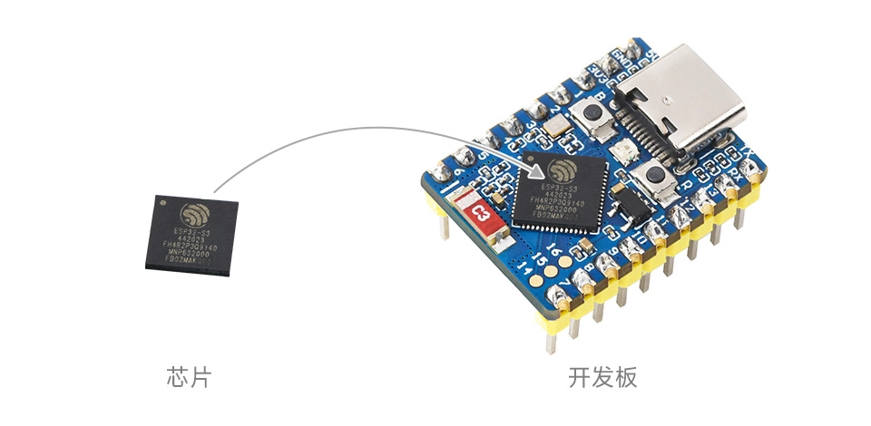
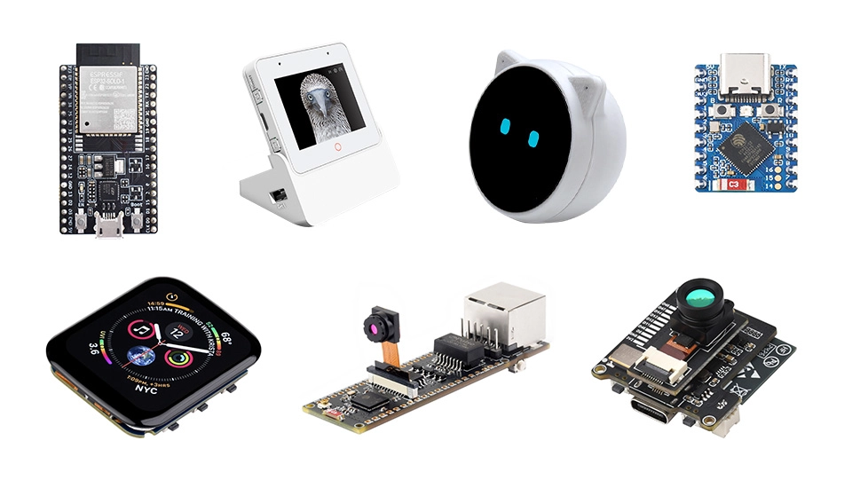
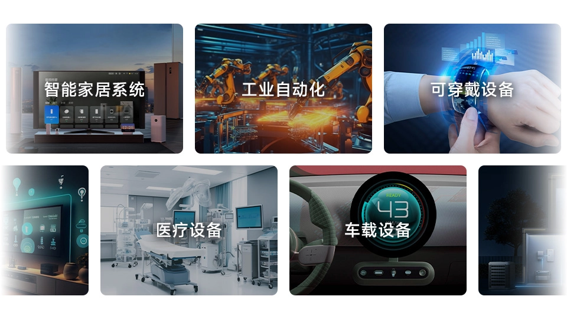

On this page

# Getting to Know ESP32

ESP32 is a series of system-on-chip (SoC) microcontrollers developed by Espressif Systems. This series of chips integrates Wi-Fi and Bluetooth capabilities, featuring high cost-effectiveness, low power consumption, and stable performance, and has been widely used in the Internet of Things (IoT) and smart home domains.

Espressif continues to release multiple ESP32 chips, forming a complete product line. Although **[various models](https://products.espressif.com/api/user/file/Espressif_SoC_Product_Portfolio.pdf)** differ in processor cores, specific features, and pin configurations, they can all be developed using Espressif's official unified Software Development Kit (SDK), ensuring good code compatibility and consistent development experience.

The following is a comparison of selected models:

|ModelProcessorWi-FiBluetoothKey FeaturesUse Cases
|ESP32Single/Dual-core✓Classic + BLE 4.2Comprehensive features, powerful performanceGeneral development, complex applications
|ESP32-C3Single-core RISC-V✓BLE 5.0Low cost, RISC-V architectureCost-sensitive projects
|ESP32-C6Single-core RISC-V✓BLE 5.3Supports Wi-Fi 6, Zigbee/MatterNext-gen smart home
|ESP32-S2Single-core✓✗Enhanced security features, USB supportSecurity-critical applications
|ESP32-S3Dual-core✓BLE 5.0AI acceleration, camera supportAI/ML applications, image processing
|ESP32-P4Dual-core RISC-V✗✗High-performance processor (360MHz), MIPI display supportIndustrial HMI, edge AI computing

## 1. ESP32 Development Boards

ESP32 chips are powerful, but developing directly with the chip requires designing complex peripheral circuits, including power management, clock circuits, RF matching, etc., which presents a high barrier for beginners. Development boards solve this problem well.

ESP32 development boards integrate the core chip with necessary peripheral circuits on a single printed circuit board (PCB), allowing developers to focus on software-level functionality without investing too much effort in hardware design. During learning, testing, and prototyping phases, development boards are a more practical and efficient choice.

The following are key features provided by development boards:

- Built-in power module: Ensures stable power supply.
- USB interface: Used for data transfer and powering the board.
- Programming interface: Supports convenient software flashing and debugging.
- Peripheral interface: Extensive GPIO pins for connecting sensors and other external devices.
- Status LED and Wi-Fi antenna: Used to indicate power status and ensure wireless communication performance.

There are various ESP32 Development Boards on the market. They share similar core functionality, but for specific project requirements, different models of Development Boards differ in size, pin layout, onboard Resources, etc. Some Development Boards are also equipped with additional components such as Sensors, cameras, and Displays.

## 2. ESP32 Development Platforms

ESP32 supports multiple development approaches. You can use Espressif's official ESP-IDF framework for professional development, or choose Arduino IDE or MicroPython for rapid prototyping.

Main development platforms include:

-

**ESP-IDF**:Espressif's official development framework, built specifically for the ESP32 chip series, providing a complete development toolchain, code libraries, and documentation. It can fully leverage all the performance and features of ESP32, making it the preferred choice for professional development and commercial products. See:。

-

**Arduino**:A well-known open-source hardware and software platform that provides a simple and standard C++ interface, supporting numerous microcontrollers including ESP32. Arduino has rich libraries and example code, widely used in prototyping and education, and is a popular platform for beginners. See:。

-

**MicroPython**:A streamlined version of Python 3, containing core features and optimized for microcontroller environments, supporting immediate execution without repeated compilation and flashing. It provides an effective way for developers familiar with Python to quickly get started with ESP32.

-

**Other Development Methods**:The ESP32 development ecosystem is very rich. In addition to the above platforms, it also supports development through PlatformIO, Mongoose OS, Espruino (JavaScript), ESPHome, and other platforms, meeting the needs of developers with different technical backgrounds.

## 3. What Can ESP32 Do?

The powerful features and flexibility of ESP32 make it the foundation for numerous innovative applications. In fields such as smart home, wearable devices, wireless sensor networks, robotics, as well as industrial automation and countless creative projects, ESP32 has broad application prospects.

## 4. Conclusion

With its high cost-effectiveness, rich feature set, and mature development ecosystem, ESP32 has become one of the world's mainstream IoT development platforms. It is suitable not only for professional developers building commercial products but also provides a friendly introduction for beginners.

Whether used for:

- Learning embedded development and IoT technology
- Quickly validating creative ideas and making prototypes
- Developing smart hardware products
- Or just enjoying the fun of hands-on creation

ESP32 provides strong support.

