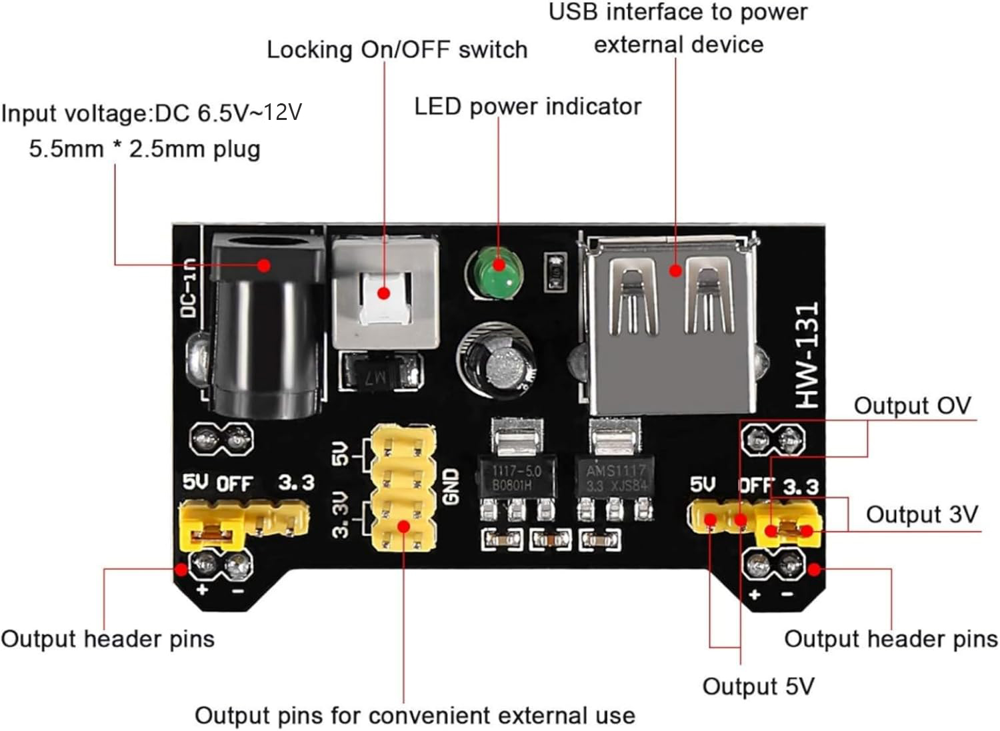

# Breadboard Power Supply Module User Manual

## Product Overview

The HW-131 (also known as MB102) Breadboard Power Supply Module is a power supply designed specifically for breadboard prototyping. It provides stable 3.3V and 5V outputs, making it widely suitable for powering Arduino, ESP8266, and other microcontrollers, as well as various electronic modules and smart car projects.

The module uses AMS1117 voltage regulator chips and supports two independent output channels, allowing flexible voltage configuration for different components.

---

## Specifications

| Parameter | Specification |
|-----------|---------------|
| Input Voltage (DC Jack) | DC 6.5V ~ 12V (recommended) |
| Input Voltage (USB Port) | 5V (USB power supply) |
| Output Voltage | 3.3V / 5V (jumper selectable) |
| Max Output Current | < 700mA |
| Compatible Breadboard | MB102 standard breadboard |
| DC Jack Specification | 5.5mm × 2.5mm (center positive) |
| Voltage Regulator IC | AMS1117-5.0 / AMS1117-3.3 |

---

## Module Layout (Top View)
┌──────────────────────────────────────────────────────────────┐  
│ HW-131 Module │  
│ │  
│ ┌─────────┐ ┌─────────┐ ┌────────────────┐ │  
│ │ USB-A │ │ Power │ │ DC Jack │ │  
│ │ Input │ │ Switch │ │ 5.5×2.5mm │ │  
│ │ (5V) │ │(Locking)│ │ DC 6.5~12V │ │  
│ └─────────┘ └─────────┘ └────────────────┘ │  
│ │    
│ ● LED Power Indicator │  
│ │  
│ ┌──────────────┐ ┌──────────────┐ │  
│ │ Left Jumper │ │ Right Jumper│ │  
│ │ ┌───┐ │ │ ┌───┐ │ │  
│ │ │5V │ │ │ │5V │ │ │  
│ │ ├───┤ │ │ ├───┤ │ │  
│ │ │OFF│ │ │ │OFF│ │ │  
│ │ ├───┤ │ │ ├───┤ │ │  
│ │ │3.3V │ │ │3.3V │ │   
│ │ └───┘ │ │ └───┘ │ │  
│ └──────────────┘ └──────────────┘ │  
│ Output: 5V/OFF/3.3V Output: 5V/OFF/3.3V │  
│ │  
│ ┌────┬────┬────┬────┐ ┌────┬────┬────┬────┐ │  
│ │3.3V│5V │GND │GND │ │GND │GND │5V │3.3V│ │  
│ ├────┼────┼────┼────┤ ├────┼────┼────┼────┤ │  
│ │ ● │ ● │ ● │ ● │ │ ● │ ● │ ● │ ● │ │  
│ └────┴────┴────┴────┘ └────┴────┴────┴────┘ │  
│ Output Pin Headers Output Pin Headers │  
│ (3.3V / 5V / GND) (3.3V / 5V / GND) │  
│ For convenient external device connection │  
│ │  
│ ████████████████████████████████████████████████████████ │  
│ ██ Bottom Pins (Insert into breadboard power rails) ██ │  
│ ████████████████████████████████████████████████████████ │  
└──────────────────────────────────────────────────────────────┘  

text

---

## Component Description

| No. | Component | Function |
|-----|-----------|----------|
| 1 | DC Jack | DC 6.5V~12V input, 5.5×2.5mm plug (center positive) |
| 2 | USB-A Port | 5V USB power input (power bank or PC USB port) |
| 3 | Power Switch | Locking ON/OFF switch, controls module power |
| 4 | LED Indicator | Lights up when powered on |
| 5 | Left Jumper | Selects left channel voltage: 5V / OFF / 3.3V |
| 6 | Right Jumper | Selects right channel voltage: 5V / OFF / 3.3V |
| 7 | Pin Headers | Provides 3.3V, 5V, and GND output pins for external devices |

---

## Power Input Options (Choose One)

### Option 1: DC Jack Power (Recommended)
┌─────────────┐ ┌─────────────────────────────┐  
│ Power Adapter│──────│ DC Jack │  
│ 6.5~12V │ │ 5.5×2.5mm (center positive)│  
└─────────────┘ └─────────────────────────────┘  

### Option 2: USB Power
┌─────────────┐ ┌─────────────────┐  
│ Power Bank /│──────│ USB-A Port │  
│ PC 5V Out │ │ (module front) │  
└─────────────┘ └─────────────────┘  

---

## Jumper Configuration

The jumper position determines the output voltage for each channel:
Left Jumper Position Output Voltage Right Jumper Position  
┌───────────────┐ ┌─────┐ ┌───────────────┐  
│ [■■]───[ ] │ │ 5V │ │ [■■]───[ ] │  
│ 5V OFF │ └─────┘ │ 5V OFF │  
├───────────────┤ ├───────────────┤  
│ [ ]───[■■] │ ┌─────┐ │ [ ]───[■■] │  
│ 5V OFF │ │ OFF │ │ 5V OFF │  
├───────────────┤ (No Output) ├───────────────┤  
│ [ ]───[■■] │ ┌─────┐ │ [ ]───[■■] │  
│ 3.3V │ │3.3V │ │ 3.3V │  
└───────────────┘ └─────┘ └───────────────┘  

text

**Configuration Rules:**
- **Jumper on left (5V position)** → Output is 5V
- **Jumper on right (3.3V position)** → Output is 3.3V
- **Jumper removed or placed on OFF** → No output (0V)
- The left and right channels are completely independent — you can set one to 5V and the other to 3.3V simultaneously

---

## Installation and Wiring

### 1. Insert into Breadboard  
┌─────────────────────────────────────────────────────┐  
│ Breadboard (Top View) │  
│ │  
│ ┌──┬──┬──┬──┬──┬──┬──┬──┬──┬──┬──┬──┬──┬──┬──┐ │  
│ │ │ │ │ │ │ │ │ │ │ │ │ │ │ │ │ │ ← Left Power Rail  
│ ├──┴──┴──┴──┴──┴──┴──┴──┴──┴──┴──┴──┴──┴──┴──┤ │ (Powered by left channel)  
│ │ │ │ │ │  
│ │ ┌──────────────────────────────┐ │ │ │ │  
│ │ │ HW-131 Module │ │ │ │ │  
│ │ │ │ │ │ │ │  
│ │ │ Bottom pins inserted here │ │ │ │ │  
│ │ │ │ │ │ │ │  
│ │ └──────────────────────────────┘ │ │ │ │  
│ │ │ │ │ │  
│ ├──┬──┬──┬──┬──┬──┬──┬──┬──┬──┬──┬──┬──┬──┬──┤ │  
│ │ │ │ │ │ │ │ │ │ │ │ │ │ │ │ │ │ ← Right Power Rail  
│ └──┴──┴──┴──┴──┴──┴──┴──┴──┴──┴──┴──┴──┴──┴──┘ │ (Powered by right channel)  
│ │
│ Middle area for components (MCUs, sensors, etc.) │  
└─────────────────────────────────────────────────────┘  

> The bottom pins of the module align with the `+` (positive) and `-` (negative) power rails on the breadboard, powering the entire rail.

### 2. Connect Power Source

Plug a DC power adapter (6.5V~12V) or USB cable (5V) into the corresponding port on the module.

### 3. Set Output Voltage

Adjust the left and right jumpers according to your voltage requirements.

### 4. Turn On Power

Flip the power switch to the ON position. The LED indicator will light up when the module is powered.

### 5. Connect Loads

- **Breadboard Power**: The module automatically powers the breadboard's power rails through its bottom pins
- **External Devices**: Use jumper wires from the onboard pin headers to supply 3.3V/5V to external circuits

---

## Typical Wiring Example
Scenario: Powering with a power bank via USB, supplying 5V to Arduino and 3.3V to a sensor module

Power Bank (5V USB Output)  
│  
▼  
┌─────────┐  
│ USB Cable│  
└────┬────┘  
│  
▼  
┌────────────────────┐  
│ HW-131 Module │  
│ │  
│ Left Jumper = 5V │ ──── 5V ────→ Arduino (Vin)  
│ Right Jumper=3.3V │ ──── 3.3V ───→ Sensor Module  
│ Power Switch=ON │ ──── GND ───→ Common Ground  
└────────────────────┘  
│  
▼  
Breadboard Rails  
(Powering all components)

---

## Pin Header Reference

| Pin | Description |
|-----|-------------|
| Left Jumper | Selects left channel voltage: 5V / OFF / 3.3V |
| Right Jumper | Selects right channel voltage: 5V / OFF / 3.3V |
| 3.3V Pins | Two 3.3V output pins |
| 5V Pins | Two 5V output pins |
| GND Pins | Four GND pins |
| DC Jack | 5.5×2.5mm, center positive, 6.5V~12V input |
| USB Port | 5V input |

---

## Application Scenarios

- **Standalone MCU Power**: Power Arduino or similar boards independently using a power bank via USB
- **Electronics Prototyping**: Provide stable power for various sensor modules
- **Smart Car / Robot Prototyping**: As a power expansion solution for mobile platforms

---

## Important Notes

1. **Input Voltage Requirement**: To get stable 5V output, DC input should be 6.5V~12V. For 3.3V output only, 5V USB input is sufficient.
2. **Current Limit**: Maximum output current is < 700mA. Do not connect high-power loads (e.g., large motors) to avoid overheating.
3. **USB Power Limitation**: When using 5V USB input, the 5V output will not regulate properly (actual output will be below 5V), but the 3.3V output will still work.
4. **DC Plug Polarity**: Use a 5.5mm × 2.5mm plug (center positive). Reverse polarity may damage the module.
5. **Breadboard Not Included**: This product is the power module only — a breadboard is sold separately.

---