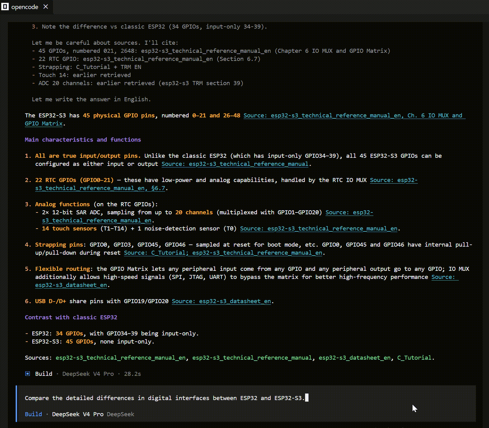

# ESP32 RAG Skill — Index Building and Retrieval Engine

> **Note**: AI retrieval is sourced from the `source` and `source_code` materials folder. To ensure answer accuracy, it strictly follows the original descriptions in the source documents and cites the content sources, with no AI speculation!

> **IMPORTANT:** Because the esp-rag RAG data is very large, you need to download `esp-rag.7z.00*` from https://github.com/yezeganghelei/ESP32/releases/tag/ESP32-AI-Agent-RAG-v1.1.0. After extracting, import `skill.md` into opencode or another AI environment, and it can be used directly.

> **Usage:** 
        1. Download *.7z files
        2. Extract those files
        3. Import skill.md to LLM
        4. Start a conversation

<table>
  <tr>
    <td align="center"></td>
  </tr>
</table>

## 1. Overview

This skill is a retrieval-augmented generation (RAG) system for an ESP32 documentation knowledge base. It lets an AI assistant perform semantic search and question answering across a large collection of ESP32 datasheets, technical reference manuals (TRMs), hardware design guidelines, chip errata, and other technical documents.

Skill directory structure:

```
<skill_dir>/
├── SKILL.md                                       # Skill definition (including Workflow instructions)
├── readme.md                                      # This document
├── config.yaml                                    # Document classification, weights, models, SoC→Datasheet mapping, etc.
├── opencode.json                                  # Skill registration (skills.paths points at this repo)
├── requirements.txt                               # Python dependency list
├── scripts/
│   ├── main.py                                    # ChromaDB RAG engine (core implementation)
│   ├── agent.py                                   # One-shot query entry point (single Bash call, avoids repeated permission prompts)
│   ├── pre-build.sh.bak                           # Legacy build script backup
│   ├── __init__.py
│   └── build/
│       ├── run.py                                 # Index build entry script (supports the --model parameter)
│       └── __init__.py
├── models/                                        # Self-contained model files (usable offline)
│   ├── dense/
│   │   ├── bge-base-en-v1.5/                      # ~1.2GB, 768-dim, default embedding model
│   │   ├── all-MiniLM-L6-v2/                      # ~0.9GB, 384-dim, lightweight alternative
│   │   ├── gte-base-en-v1.5/                      # ~2.0GB, GTE base 768-dim
│   │   └── embeddinggemma-300m-npu/               # ~0.9GB, Google Gemma 300M NPU-optimized
│   └── cross-encoder/
│       └── cross-encoder-ms-marco-MiniLM-L-6-v2/  # ~0.85GB, reranking model
├── source/                                        # Raw source documents (PDF, ZIP, XLSX, DOCX, MD)
│   └── (empty by default; corpus pointed to via RAG_DOCS_DIR / code.docs_dir)
├── .chroma_esp32_all/                             # ChromaDB persisted vector database (documentation)
│   ├── chroma.sqlite3                             # ChromaDB metadata store
│   ├── _bm25_cache.pkl                            # BM25 index persistence cache
│   └── <uuid>/                                    # ChromaDB segment directory
└── .chroma_esp32_code/                            # ChromaDB persisted vector database (source code, see §6.5)
    ├── chroma.sqlite3                             # ChromaDB metadata store
    ├── _bm25_cache.pkl                            # BM25 index persistence cache
    └── <uuid>/                                    # ChromaDB segment directory
```

## 2. Retrieval Architecture

This skill uses a three-stage retrieval path of **ChromaDB dense vector retrieval + BM25 hybrid fusion + cross-encoder reranking**:

**Pipeline**:
1. **Document extraction**: read raw PDF/ZIP/XLSX/DOCX/Markdown source files from `source/` (or an external directory specified by `RAG_DOCS_DIR`)
2. **Format conversion**: PDF→Markdown (PyMuPDF + font-size heading detection + table-aware extraction), HTML→Markdown (BeautifulSoup + Markdownify), XLSX→Markdown (openpyxl pipe tables, with blank-row and decoration-row filtering), DOCX→Markdown, native Markdown read directly (image references stripped automatically, code blocks preserved)
3. **Text cleaning**: remove footer noise, page numbers, "CONFIDENTIAL" markers, and orphan character fragments
4. **Semantic chunking**: semantic chunking based on the Markdown heading hierarchy (H1/H2 boundary segments), with smart paragraph merging/splitting and table integrity protection
5. **Vectorization**: generate 768-dim embedding vectors using the `bge-base-en-v1.5` model (switchable via config.yaml or the build-time `--model` option)
6. **Index storage**: persisted in ChromaDB, supporting cosine similarity search

## 3. Index System Design

### 3.1 ChromaDB Multi-layer Index — Collection Architecture

There are two independent ChromaDB databases (see §6.0): the **documentation DB** (`.chroma_esp32_all/`, the default) and the **code DB** (`.chroma_esp32_code/`, built with `RAG_INDEX_CODE=1`). Both share the same collection schema (defined by `collection_map` in `config.yaml` plus the internal `chunks` / `docs` / `spec_summary` collections), but each database is populated with its own corpus.

```
Documentation DB (.chroma_esp32_all/)
├── chunks                   # Unified chunk index (primary index, backwards compatible)
├── docs                     # Document metadata index (summary, chunk list, file_hash per document)
├── spec_summary             # Structured spec index (for cross-document comparison)
├── datasheet_chunks         # Datasheet chunks
├── trm_chunks               # Technical reference manual chunks
├── guide_chunks             # Developer guide chunks
├── api_chunks               # API reference chunks
├── safety_chunks            # Safety document chunks
├── release_chunks           # Release note chunks
├── spec_chunks              # Specification document chunks
├── code_chunks              # Source code chunks (unused in the docs DB)
└── docs_chunks              # General document chunks

Code DB (.chroma_esp32_code/)       # opt-in, see §6.5
├── chunks                   # Unified chunk index (source code chunks)
├── docs                     # Document metadata index (file_hash per source file)
├── code_chunks              # Source code chunks (doc type `code`)
└── (other per-type collections exist but are unused)
```

### 3.2 Classification by Document Type

Documents are classified automatically by path (based on `doc_type_rules` in `config.yaml`), with first-match priority:

| Path keyword | Document type | Index collection |
|-----------|---------|---------|
| `api_reference` | api_reference | api_chunks |
| `datasheet` | datasheet | datasheet_chunks |
| `guide` | guide | guide_chunks |
| `trm` / `technical_reference` | trm | trm_chunks |
| `safety` | safety | safety_chunks |
| `release` | release_notes | release_chunks |
| `license` / `reference` | docs | docs_chunks |
| `spec` | specification | spec_chunks |
| *(fallback)* | docs | docs_chunks |

Search weights are assigned independently by path (based on `weight_rules` in `config.yaml`), also first-match:

| Path keyword | Search weight |
|-----------|---------|
| `api_reference` | 3.0 |
| `guide` | 3.0 |
| `docs` | 2.0 |
| `trm` / `technical_reference` | 2.0 |
| `datasheet` | 1.0 |
| *(fallback)* | 1.0 |

### 3.3 Semantic Chunking Strategy

The chunking algorithm (`chunk_text()`) follows a hierarchical design:

1. **Table protection**: first protect table blocks with `<!-- TABLE -->` / `<!-- /TABLE -->` markers to prevent them from being split
2. **Heading hierarchy parsing**: extract the H1-H6 heading structure of the Markdown
3. **Parent chunks**: split the document into "parent segments" at H1/H2 boundaries
4. **Child chunks**: merge/split paragraphs within each parent segment, targeting 1200 characters with a 300-character minimum
5. **Metadata injection**: prefix each chunk with `Doc: <title> | Type: <type> | Section: <path>` so the embedding is context-aware
6. **Low-value filtering**: discard register dumps, hex-dense lines, bare "Table N" headings, and other low-information content
7. **Standalone table chunks**: feature tables in datasheets are extracted as standalone chunks with a 1.2x weight boost

### 3.4 Query Expansion

A domain-specific synonym table is defined (`query_expansions` in `config.yaml`), e.g.:
- `flash` → `['bind', 'flash', 'flashing']`
- `boot` → `['boot', 'bootloader', 'startup']`
- `errcode` → `['errcode', 'err_code', 'error_code', 'error code', 'error id']`
- `errata` → `['errata', 'known_issues', 'bugs']`

Queries are expanded automatically to improve recall.

### 3.5 Multi-collection Retrieval and RRF Fusion

When no document type is specified, all collections are searched and the results are merged using **Reciprocal Rank Fusion (RRF)**:

```
RRF_score(d) = Σ 1/(60 + rank(d, collection_i))
```

### 3.6 Cross-document Spec Comparison

Structured spec extraction is implemented for datasheets:

- Automatically detect the "SoC Features" table
- Extract key-value pairs for CPU, memory, peripheral interfaces, and other key specs
- Store them in a separate `spec_summary` collection
- Support queries in the form "esp32 vs esp32-s3", generating a Markdown comparison table automatically

The SoC name to datasheet number mapping is configured under `soc_to_datasheet` in `config.yaml`.

### 3.7 Three-stage Retrieval Pipeline

**Phase 1 — Dense Retrieval**: vectorize the query with `bge-base-en-v1.5` (configurable via `models.dense.default` in config.yaml or switched at build time with `--model`), search across the ChromaDB collections, fuse multi-collection results with RRF, and expand the candidate set to `n_results × 3~4`.

**Phase 2 — BM25 Hybrid Fusion**: run BM25 keyword retrieval in parallel, adding score to matching dense results; BM25-specific high-score segments are injected to avoid missing exact matches. BM25 excels at exact keyword matching and complements the semantic understanding of dense vectors; it is especially important for pattern queries that dense vectors cannot handle well, such as hexadecimal error codes, register addresses, and part numbers.
- The BM25 index is lazily rebuilt when `ChromaIndex` initializes (reading all document text from the chunks collection) and, once built, persisted to the `_bm25_cache.pkl` cache file (~50MB). With a cache, loading takes about 1 second; without a cache, the first search requires a full rebuild from ChromaDB (~12 seconds for 48k chunks), and it is persisted automatically afterward for later use.
- **Not incremental**: when the index is updated (`add_chunks()`), BM25 performs a full rebuild using an accumulated token cache (`_BM25(token_cache + new_tokens)`) rather than modifying in place. The cache file is persisted after each rebuild.
- **Cache integrity check**: on load, the number of cached IDs is compared against the actual chunk count in ChromaDB. If they differ, the cache is rebuilt automatically, avoiding retrieval gaps caused by a stale cache.
- **Upper limit protection**: when the total number of chunks exceeds `bm25_max_chunks` (config.yaml, default 300,000), BM25 retrieval is skipped (to avoid memory exhaustion); hybrid retrieval then degrades to pure dense vector retrieval.

**Phase 3 — Cross-Encoder Reranking**: use `cross-encoder-ms-marco-MiniLM-L-6-v2` (located in `models/cross-encoder/`, switchable via `models.cross_encoder.default` in config.yaml) to score the candidate set pairwise, re-rank by relevance score, and take the Top `n_results`.

All models are cached locally with no network dependency.

### 3.8 Table-to-Text Serialization

Convert each table row into a natural-language declarative sentence for embedding, improving short-window model comprehension of dense tables:

```
Input: pipe table          →  Output: In <SoC>, CPU: 240 MHz, 2 Cores.
| CPU | 240 MHz...|   →         In <SoC>, SRAM: 512 KB.
| SRAM | 512 KB...|
```

Pure hex/register tables are skipped automatically to avoid introducing noise.

### 3.9 XLSX Blank-row and Decoration-row Filtering

`xlsx_to_markdown()` automatically filters the following noise rows when processing Excel worksheets:

- **All-empty rows**: every cell is empty or None
- **Pure decoration rows**: cells contain only `-`, `|`, spaces, or combinations thereof (e.g. `---|---|---`)

These rows are common as group separators in XLSX error-code reference tables; filtering them reduces meaningless chunks and improves retrieval precision.

## 4. Incremental Build Mechanism

### 4.1 Design Goals

There are many source documents and a full rebuild takes a long time (about 12-13 hours). Incremental builds process only added, changed, or deleted documents, avoiding unnecessary repeated work.

### 4.2 Build Pipeline (three stages)

```
Phase 1: File inventory scan (pure os.walk, <1 second)
  → list all .pdf/.zip/.xlsx/.docx/.md files
  → record path, doc_id (hash of the file path), mtime

Phase 2: Compare against the old index to determine the to-do list
  → load the existing ChromaDB and get old metadata from the docs collection
  → for each file:
    - relative path not in the old index → new (to index)
    - relative path in the index, but the MD5 content hash changed → changed (to re-index)
    - relative path in the index, MD5 identical → unchanged (skip)
  → entries present in the old index but no longer on the filesystem → delete from the index

Phase 3: Stream-process documents to index (one document at a time)
  for each pending document:
    → extract (PDF→Markdown / ZIP→Markdown / XLSX→Markdown)
    → clean text
    → semantic chunking (chunk_text)
    → embedding computation (default bge-base-en-v1.5; other models via `--model`)
    → write to the ChromaDB collections + the unified chunks collection
    → update docs metadata (including the latest file_hash)
    → free memory (del + gc.collect)
```

### 4.3 MD5 Content Hash Integrity Check

When indexing a document, `add_doc_metadata()` reads the full source file content, computes its MD5 hash, and stores it in the docs collection metadata under the `file_hash` field. The next build compares the current file's MD5 against the stored value:

```python
# Comparison logic in Phase 2
cur_hash = hashlib.md5(open(entry['source'], 'rb').read()).hexdigest()
old_hash = old_entry.get('file_hash', '')
if cur_hash and old_hash and cur_hash == old_hash:
    continue  # content unchanged, skip
```

This means:
- **New file** → indexed automatically
- **Modified file** → MD5 changes → re-indexed automatically
- **Unchanged file** → MD5 identical → skipped
- **Deleted file** → relative path no longer appears → the corresponding document and all its chunks are removed from ChromaDB

Compared with mtime, MD5 verification is more reliable — when a file is copied or a git checkout switches branches, mtime may change even though the content does not, but the MD5 comparison still holds, avoiding unnecessary rebuilds.

## 5. Querying

### 5.1 Recommended: the agent script (single call)

Searching, formatting, and source-file reading are wrapped into a single Bash call, requiring only one permission approval:

```bash
cd <skill_dir>/scripts
python3 agent.py "<query>" [--top N] [--type <doc_type>] [--raw] [--spec <SoC>] [--compare <A,B>] [--code] [--docs-only]
```

Parameters:
- `--top N` : return the top N results (default 10)
- `--type <doc_type>` : filter by document type (datasheet, trm, guide, api, safety, release_notes, specification, docs)
- `--raw` : JSON lines output (machine-readable)
- `--spec <name>` : look up structured spec data for a SoC (e.g. `esp32-s3`)
- `--compare <A,B>` : compare the specs of two SoCs (e.g. `esp32-s3,esp32`)
- `--code` : query **only** the source-code database (see §6.5); doc type defaults to `code`
- `--docs-only` : query **only** the documentation database

**Default behavior** (no `--code` / `--docs-only`): a normal query searches **both** databases and merges the results by reciprocal-rank fusion, so code chunks (tagged `[code]`) surface automatically even when the query contains no explicit "code" keyword (e.g. "how to configure LEDC PWM"). `--spec` / `--compare` and any `--type` other than `code` remain documentation-only. Use `--docs-only` to suppress code noise for pure spec/register questions, and `--code` when only code is wanted.

**Output notes**: the agent outputs in human-readable form by default; each result contains the chunk text (the `text` field) plus an excerpt from the corresponding non-PDF/ZIP/XLSX source file. If the agent output already includes an excerpt, prefer it over digging into the source file directly.

Examples:
```bash
python3 agent.py "ESP32-S3 boot process" --top 5
python3 agent.py "errata error code"
python3 agent.py "esp32-s3 vs esp32"
python3 agent.py "bootrom" --raw
python3 agent.py "how to configure LEDC PWM"          # searches docs + code, merged
python3 agent.py --docs-only "LEDC clock sources"     # documentation only
```

### 5.2 Using the Python API directly (requires manual multi-step operations)

```python
import sys
try:
    import pysqlite3
    sys.modules['sqlite3'] = pysqlite3
except ImportError:
    pass
import os
os.environ['RAG_CHROMA_DIR'] = '<skill_dir>/.chroma_esp32_all'
os.environ['TRANSFORMERS_OFFLINE'] = '1'
os.environ['HF_HUB_OFFLINE'] = '1'
sys.path.insert(0, '<skill_dir>/scripts')
from main import ChromaIndex

index = ChromaIndex('<skill_dir>/.chroma_esp32_all')
results = index.search("ESP32-S3 boot process", n_results=10, hybrid=True, rerank=True)
```

## 6. Index Building and Updating

### 6.0 Quick reference: build the **documentation** DB vs the **code** DB

There are two independent databases; the build mode is chosen by `RAG_INDEX_CODE`.

| | Documentation DB | Code DB |
|---|---|---|
| Enable | (default) | `$env:RAG_INDEX_CODE="1"` |
| Source dir | `RAG_DOCS_DIR` (default `<skill_dir>/source`) | `code.docs_dir` (default `...\01. Software Code`) |
| DB dir | `RAG_CHROMA_DIR` (default `<skill_dir>/.chroma_esp32_all`) | `code.chroma_dir` (default `<skill_dir>/.chroma_esp32_code`) |
| Command | `python -m scripts.build.run` | `$env:RAG_INDEX_CODE="1"; python -m scripts.build.run` |

Both are **incremental** by default: re-running only processes added/changed/deleted files.

```powershell
# --- build the documentation index (unchanged behaviour) ---
.\.venv\Scripts\python.exe -m scripts.build.run

# --- build the code index (uses code.docs_dir / code.chroma_dir from config.yaml) ---
$env:RAG_INDEX_CODE="1"
.\.venv\Scripts\python.exe -m scripts.build.run

# explicit override always wins:
$env:RAG_DOCS_DIR="D:\path\to\corpus"; $env:RAG_CHROMA_DIR="D:\path\to\db"
```

Resolution order for a code build: `RAG_DOCS_DIR`/`RAG_CHROMA_DIR` env → `code.docs_dir`/`code.chroma_dir` (a **relative** value is resolved against the skill root, e.g. `source_code`) → the `source/` / `.chroma_esp32_all` defaults.

### 6.1 First Build

All commands below run from the skill root. Activate the virtual environment first:

Linux / macOS:
```bash
cd <skill_dir>
source .venv/bin/activate
```

Windows (PowerShell):
```powershell
cd <skill_dir>
.\.venv\Scripts\Activate.ps1
```

Then build with the default model (bge-base-en-v1.5):
```bash
python -m scripts.build.run
```

Build with a specified model:
```bash
python -m scripts.build.run --model gte-base-en-v1.5
```

If you prefer not to activate the venv, call its interpreter directly:

Linux / macOS:
```bash
.venv/bin/python -m scripts.build.run
```

Windows (PowerShell):
```powershell
.\.venv\Scripts\python.exe -m scripts.build.run
```

Expected duration: depends on CPU performance and corpus size (source document volume).

### 6.2 Incremental Update

With the virtual environment activated (see 6.1):
```bash
python -m scripts.build.run
```
Changes are detected automatically; only added/modified/deleted documents are processed. A model can also be specified:
```bash
python -m scripts.build.run --model all-MiniLM-L6-v2
```

### 6.3 Forced Full Rebuild

Linux / macOS:
```bash
rm -rf .chroma_esp32_all
python -m scripts.build.run
```

Windows (PowerShell):
```powershell
Remove-Item -Recurse -Force .chroma_esp32_all
python -m scripts.build.run
```

Note: if you delete only `.chroma_esp32_all/chroma.sqlite3` but keep the `.chroma_esp32_all` directory, the old `_bm25_cache.pkl` may remain and cause BM25 to return wrong results. The safe approach is to delete the entire `.chroma_esp32_all/` directory, or delete the cache manually after rebuilding:

Linux / macOS:
```bash
rm -rf .chroma_esp32_all && python -m scripts.build.run
# or:
rm -f .chroma_esp32_all/chroma.sqlite3 .chroma_esp32_all/_bm25_cache.pkl && python -m scripts.build.run
```

Windows (PowerShell):
```powershell
Remove-Item -Recurse -Force .chroma_esp32_all
python -m scripts.build.run
# or:
Remove-Item -Force .chroma_esp32_all\chroma.sqlite3, .chroma_esp32_all\_bm25_cache.pkl
python -m scripts.build.run
```

### 6.4 Building an External Corpus / Separate Database (Markdown support + directory exclusion)

By default the build targets the repository's `source/` directory. You can also point environment variables at any external document directory and write to a separate vector database, avoiding mixing with the existing `.chroma_esp32_all/` and affecting retrieval ranking.

Environment variables:

| Variable | Description | Default |
|------|------|--------|
| `RAG_DOCS_DIR` | Source document directory (recursively scanned) | `<skill_dir>/source` |
| `RAG_CHROMA_DIR` | ChromaDB persistence directory | `<skill_dir>/.chroma_esp32_all` |
| `RAG_EXCLUDE_DIRS` | Excluded paths (semicolon-separated substrings, case-insensitive) | empty |

**Supported source file formats**: `.pdf`, `.zip`, `.xlsx`, `.docx`, `.md`, `.markdown`. Native Markdown is read directly, and image references (``, `![alt][ref]`) and ``/`<picture>`/`<source>` tags are stripped automatically; PDF denoising/cleaning is **not** applied, so literal content such as code blocks and numeric-only lines is preserved.

**Example: index external ESP32 materials into a separate database** (excluding the SDK source tree):

Linux / macOS:
```bash
export RAG_DOCS_DIR="/path/to/esp32"
export RAG_CHROMA_DIR="<skill_dir>/.chroma_esp32_all"
export RAG_EXCLUDE_DIRS="01. Software Code"
.venv/bin/python -m scripts.build.run
```

Windows (PowerShell):
```powershell
$env:RAG_DOCS_DIR="D:\01.亚马逊\ESP32\esp\ESP32"
$env:RAG_CHROMA_DIR="D:\09.WorkSpace\esp-rag\.chroma_esp32_all"
$env:RAG_EXCLUDE_DIRS="01. Software Code"
.\.venv\Scripts\python.exe -m scripts.build.run
```

Measured result: 233 documents / 22,313 chunks (about 103 minutes).

Notes:
- `RAG_EXCLUDE_DIRS` matches relative-path substrings; separate multiple entries with `;`, e.g. `"01. Software Code;node_modules"`. It only affects the inventory scan stage; excluded files are never extracted.
- To query a separate database, point `RAG_CHROMA_DIR` at that directory as well (for example, the `RAG_CHROMA_DIR` read by `scripts/agent.py`).
- Running the same command again performs an incremental update: added/changed/deleted documents are detected automatically, with no full rebuild needed.

### 6.5 Indexing Source Code (opt-in, separate database)

Source code can be indexed in addition to documents. This is **opt-in** and must go into a **separate** ChromaDB directory so it does not affect documentation ranking.

Enable it with `RAG_INDEX_CODE=1` (or `code.enabled: true` in `config.yaml`). The code corpus path and DB directory default to `code.docs_dir` / `code.chroma_dir` in `config.yaml`, so no path needs to be typed:

```powershell
$env:RAG_INDEX_CODE="1"
.\.venv\Scripts\python.exe -m scripts.build.run
# RAG_DOCS_DIR / RAG_CHROMA_DIR still override the defaults when set explicitly
```

The default `code.docs_dir` is `D:\01.亚马逊\ESP32\esp\ESP32\01. Software Code`.

How code is handled:

- **Supported extensions** (`code.extensions` in `config.yaml`): `.c .h .cpp .hpp .cc .cxx .ino .py .S`.
- **Function/class-aware chunking**: C/C++/Arduino files are split at top-level `{...}` units, Python files via `ast`. Each chunk keeps the unit's **signature and leading comment block**, and is prefixed with `File: <name> | Function/Class: <name>` so the embedding is context-aware. Oversized units are split by line; nothing is dropped.
- **Noise control** (`code.exclude_dirs`): matched against whole **path segments** (case-insensitive; a trailing `*` is a prefix match, e.g. `espressif__*`). This excludes third-party libraries (`espressif__*`, `tinyusb_src`, `esp32-camera`, `decoder_ijg`, `MJPEG`, `LVGL`, `led_strip`) while **keeping** the board's own `components/BSP` drivers (KEY/LED/IIC/SPI/LCD…). Unlike a raw substring test it never drops a file just because its *name* contains a library name (e.g. `main/APP/lvgl_demo.c` is kept).
- **Content dedup** (`code.dedup`, default `false`): BSP drivers are copied into every example, so the same file (e.g. `led.c`) appears dozens of times. When enabled (`dedup: true`), code files with identical MD5 are collapsed to a single copy (in the pilot this removed 292 of 615 files, 48%). The default `false` keeps every copy.
- **File guards**: binary files, files with NUL bytes, and files larger than `code.max_file_size` (default 400 KB) are skipped. Line endings are normalized. Chunk labels use the relative path (e.g. `File: 02_key/components/BSP/KEY/key.c | Function: key_scan`).
- **Metadata**: code chunks use doc type `code` (collection `code_chunks`) and `code.weight` (default 2.0).

Querying the code database:

```powershell
# --code switches RAG_CHROMA_DIR/RAG_DOCS_DIR to the code DB configured under `code:`
.\.venv\Scripts\python.exe scripts\agent.py --code "led blink gpio output" --top 5
# hard-filter to code chunks only
.\.venv\Scripts\python.exe scripts\agent.py --code --type code "gpio_set_level" --top 5
```

The `code.docs_dir` / `code.chroma_dir` keys in `config.yaml` provide the paths used by `agent.py --code`.

**Portability of source excerpts**: the DB stores **relative** paths only, so an index is machine-independent — the corpus itself can stay wherever each customer keeps it. Just point the source root at your local corpus via `code.docs_dir` (absolute or relative) or the `RAG_DOCS_DIR` env var (which overrides). The agent resolves the stored relative path against the source root in this order: `RAG_DOCS_DIR` → `<skill_dir>/source` → `<skill_dir>/source_code`; separators are normalized, so a Windows-built index resolves on Linux. Optionally, to make the skill fully self-contained, place the corpus under `<skill_dir>/source_code` and set `code.docs_dir: source_code`. If a file cannot be found, the excerpt is silently skipped — the query itself still returns results. The customer's corpus must keep the **same relative directory structure** used at build time.

**Full build result** (`01. Software Code`, all four categories — IDF / MicroPython / Arduino / Advanced Development Example): excluding third-party libraries and without deduplication, **10,535 documents → 208,318 chunks in ~13.7 hours** (bge-base-en-v1.5, CPU; DB ~5.2 GB). Chunk counts per category: IDF 653 docs, MicroPython 29, Arduino 187, Advanced Development 9,666. Because this exceeds 200k chunks, `bm25_max_chunks` is raised to 300,000 in `config.yaml` so BM25 hybrid retrieval stays enabled.

**Code-query tuning**: when a query looks like source code (snake_case/camelCase identifiers, `foo()`, `::`, `#include`, or a `.c/.h/.py` extension), the engine boosts the BM25 exact-match component and down-weights the cross-encoder, which is unreliable on code. Both shares are configurable:

```yaml
code:
  ce_weight: 0.25     # cross-encoder share of the final score (0..1)
  bm25_weight: 1.0    # normalized BM25 share for code-like queries
```

Natural-language queries are unaffected (the tuning only triggers on code-like queries). Measured on the pilot: exact-identifier retrieval (identifier present in the top-3 results) improved from **6/10** (cross-encoder only) to **7/10** with the default blend.

**Known limitation**: the default embedding model (`bge-base-en-v1.5`) and reranker (`cross-encoder-ms-marco`) are trained on natural language, so free-text → code retrieval is still weak; example `README.md` files (indexed as `docs`) carry much of the semantic value. For production-grade code search, consider a code-tuned embedding/reranking model.

## 7. Configuration (config.yaml)

All document-related configuration is managed centrally in `config.yaml`:

| Config item | Description | Purpose |
|--------|------|------|
| `models` | Embedding and reranking model configuration | Specify the default model in `config.yaml`; switch at build time with `--model` |
| `soc_to_datasheet` | SoC name → Datasheet number mapping | Find the corresponding datasheet by SoC name for comparison and spec queries |
| `doc_type_rules` | Path keyword → document type rules | Automatic classification during document extraction |
| `weight_rules` | Path keyword → search weight | Affects BM25/vector retrieval ranking |
| `collection_map` | Document type → ChromaDB collection name | Multi-collection routing isolation |
| `bm25_max_chunks` | Chunk-count ceiling for BM25 hybrid retrieval | Raise above 200k for very large code corpora (default 300,000) |
| `code` | Source-code indexing block (`enabled`, `extensions`, `exclude_dirs`, `dedup`, `docs_dir`, `chroma_dir`, `ce_weight`, `bm25_weight`, …) | Opt-in code corpus + separate DB; see §6.5 |

### 7.1 Model Configuration Details

The full structure of the `models` config block:

```yaml
models:
  dense:                              # Bi-encoder (embedding model)
    default: bge-base-en-v1.5         # Default embedding model
    available:                        # List of available models
      - name: all-MiniLM-L6-v2
      - name: bge-base-en-v1.5
      - name: gte-base-en-v1.5
      - name: embeddinggemma-300m-npu
  cross_encoder:                      # Cross-encoder (reranking model)
    default: cross-encoder-ms-marco-MiniLM-L-6-v2
    available:
      - name: cross-encoder-ms-marco-MiniLM-L-6-v2
```

**Change the default embedding model**: set `dense.default` to any name in `available`, e.g. switch to `gte-base-en-v1.5`:
```yaml
models:
  dense:
    default: gte-base-en-v1.5
```

**Switch temporarily at build time** (without editing config.yaml):
```bash
python3 -m scripts.build.run --model all-MiniLM-L6-v2
```

**Note**: `dense` and `cross_encoder` are configured independently; the build-time `--model` parameter only affects the choice of dense embedding model, while the cross-encoder always uses the `cross_encoder.default` configuration.

To add a new SoC or adjust classification rules or weights, just edit `config.yaml` — no code changes needed.

## 8. Design Decisions Summary

| Decision | Choice | Rationale |
|------|------|------|
| Retrieval method | ChromaDB dense vectors + BM25 hybrid | Semantic understanding + exact keyword matching complement each other |
| Vector model | Default bge-base-en-v1.5 (768-dim), configurable in config.yaml or switchable with `--model` | Supports alternatives such as all-MiniLM-L6-v2, gte-base-en-v1.5, embeddinggemma-300m-npu |
| Vector database | ChromaDB | Native Python, persistent, supports metadata filtering and RRF fusion |
| Chunking strategy | Semantic hierarchical (heading-aware) | Preserves context integrity, better than fixed-window chunking |
| Table handling | Standalone chunks + metadata markers + Table-to-Text serialization | Tables are information-dense and need special protection; NL serialization improves embedding comprehension |
| Retrieval enhancement | BM25 + Dense Hybrid + Cross-Encoder Reranker | Three stages: dense semantics → BM25 exactness → cross-encoder fine ranking |
| Error-code search | Automatic BM25 boost for hex codes + forced result injection | Dense vectors cannot match hex error codes/register patterns; BM25 matches tokens exactly and then weights them |
| Cross-document comparison | Structured spec extraction + spec_summary | Datasheet feature tables have a stable structure, enabling automated comparison |
| Incremental build | MD5 content hash + deletion detection | No need to re-index unchanged documents; MD5 is more reliable than mtime |
| Build-stage separation | File inventory scan → compare → stream processing | Phase 1 is pure filesystem work (<1s); only Phase 3 does the expensive extraction + embedding |
| Memory management | Streaming, one document at a time | Avoids OOM on large corpora |
| BM25 cache | Lazy rebuild on search + pickle persistence + load-time count check | With cache ~1s; without cache first build ~12s then persisted automatically; full rebuild is not incremental; auto-degrades/skips beyond `bm25_max_chunks` (default 300k) |
| XLSX blank-row filtering | openpyxl row-level filtering | Filters all-empty rows and pure decoration rows, cutting ~30% of invalid chunks |
| Query enhancement | Agent automatically attaches source-file excerpts + allows access to source/ files | Provides more context when chunk text is insufficient; binary formats such as PDF are skipped automatically |
| Config management | Centralized `config.yaml` | SoC mapping, document classification, weights, etc. are configurable; adding a new SoC needs no code changes |

## 9. Registering as an opencode Skill

This repository itself is a standard skill directory layout: `SKILL.md` sits at the repository root (the folder name matches `name: esp-rag` in the frontmatter), and the scripts, config, models, and source documents are all organized as in-skill resources. Once registered, opencode loads the skill automatically when needed based on its `description` and uses its `agent.py` to query the knowledge base.

### 9.1 Skill Discovery Rules

opencode's skill loader recursively scans `**/SKILL.md` in the following locations:

| Scan scope | Path |
|---------|------|
| Global skills directory | `~/.config/opencode/skills/<name>/SKILL.md` (Windows: `%USERPROFILE%\.config\opencode\skills\...`) |
| Project skills directory | `.opencode/skills/<name>/SKILL.md` |
| Explicitly registered paths | Any directory listed under `skills.paths` in `opencode.json` (recursively scanned) |

`SKILL.md` must satisfy:
- The file name must be exactly `SKILL.md`, located in a folder named after the skill
- The frontmatter must contain at least `name` (lowercase hyphenated, must match the folder name) and `description` (explaining the skill's function and when to trigger it); this repository's `description` is "Search the ESP32 documentation knowledge base (ChromaDB RAG)"

### 9.2 Option 1: Project-local registration (built into this repository)

`opencode.json` at the repository root already configures `skills.paths` to point at itself:

```json
{
  "skills": { "paths": ["."] }
}
```

So starting opencode inside the `esp-rag` directory discovers the skill automatically. To use it temporarily in another project, point that project's `opencode.json` `paths` at this repository (see 9.4).

### 9.3 Option 2: Global registration (usable from any directory)

Using a directory junction rather than copying is recommended, to avoid `.chroma_esp32_all/`, `models/`, and `source/` taking up hundreds of MB of duplicate disk space:

```powershell
# Windows (cmd): create a junction in the global skills directory pointing to this repository
cmd /c mklink /J "$env:USERPROFILE\.config\opencode\skills\esp-rag" "D:\09.WorkSpace\esp-rag"
```

If you do not need to stay in sync with the repository, you can also copy the whole directory:

```powershell
Copy-Item -Recurse "D:\09.WorkSpace\esp-rag" "$env:USERPROFILE\.config\opencode\skills\esp-rag"
```

### 9.4 Option 3: Reference via skills.paths (no copy needed)

Add the following to the global config `%USERPROFILE%\.config\opencode\opencode.json` (effective everywhere) or a project's `opencode.json` (effective only in that project):

```json
{
  "$schema": "https://opencode.ai/config.json",
  "skills": { "paths": ["D:\\09.WorkSpace\\esp-rag"] }
}
```

### 9.5 Activation and Verification

- After modifying `opencode.json`, `SKILL.md`, or skill files, you must **exit and restart opencode** — configuration is loaded only at startup and is not hot-reloaded
- After restarting, the skill should appear in the available skills list (skill name `esp-rag`); triggering it in a conversation should call `scripts/agent.py` normally to perform retrieval
