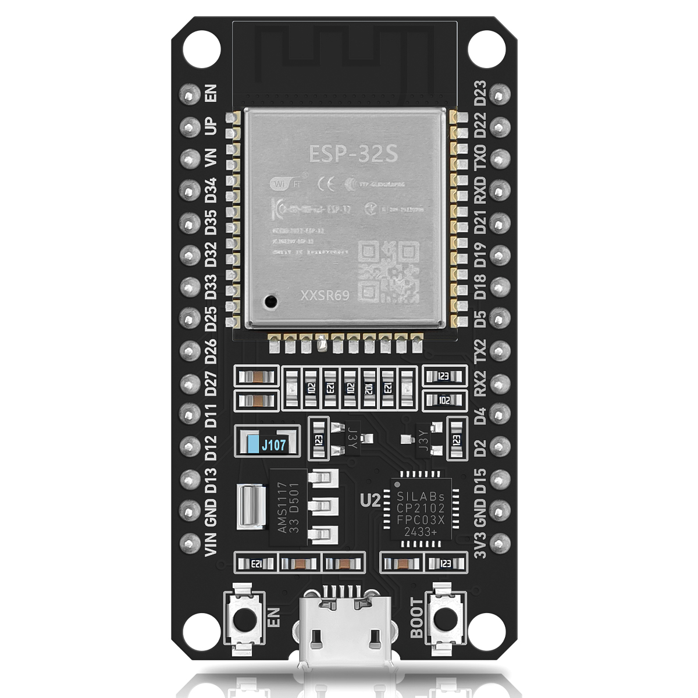

# ESP32 Tutorial - Project Overview

> A comprehensive collection of embedded development learning resources and example code for the Espressif ESP32, ESP32-S3, ESP32-S3 Camera chip.
> Includes standard examples across three platforms (IDF, MicroPython, Arduino), plus advanced projects featuring LVGL GUI, camera, USB, speech recognition, and more.
> Also includes an ESP32-AI-Agent (esp-rag) retrieval-augmented generation (RAG) skill for AI-powered semantic search over the ESP32 documentation knowledge base.

<table>
  <tr>
    <td align="center"></td>
    <td align="center"></td>
    <td align="center"></td>
    <td align="center"></td>
    <td align="center"></td>
  </tr>
</table>


## Table of Contents

- [01. Software Code/](#01-software-code)
- [02. Hardware Reource/](#02-hardware-reource)
- [03. ESP32-Tutorials/](#03-esp32-tutorials)
- [04. ESP32 Series Reference Resource/](#04-esp32-series-reference-resource)
- [05. Common Tools/](#05-common-tools)
- [06. ESP32-S3 Camera Reference Resource/](#06esp32-s3-camera-reference-resource)
- [07. Breadboard Power Supply Board/](#07breadboard-power-supply-board)
- [08. ESP32-AI-Agent-RAG/](#08-esp32-ai-agent-rag)

## 01. Software Code/

### 1. Standard Example - IDF/ (36 projects)

Standard examples based on the ESP-IDF framework. Each project includes a complete CMake project structure (`.vscode/`, `CMakeLists.txt`, `components/BSP/`, `main/main.c`, `partitions-16MiB.csv`, `sdkconfig`).

| No. | Project | Description |
|-----|---------|-------------|
| 00 | basic | Project template |
| 01 | led | LED control |
| 02 | key | Button input |
| 03 | exit | External interrupt |
| 04 | uart | UART serial communication |
| 05 | esp_timer | ESP timer |
| 06 | gp_timer | General-purpose timer |
| 07 | wdt | Watchdog timer |
| 08-1 | sw_pwm | Software PWM |
| 08-2 | hw_pwm | Hardware PWM |
| 09 | iic_exio | IIC I/O expander (XL9555) |
| 10 | iic_eeprom | IIC EEPROM read/write |
| 11 | oled | OLED display (SSD1306) |
| 12 | spilcd | SPI LCD display |
| 13 | rtc | RTC real-time clock |
| 14 | adc | ADC conversion |
| 15 | ap3216c | Ambient light & proximity sensor AP3216C |
| 16 | infrared_reception | Infrared reception |
| 17 | infrared_transmission | Infrared transmission |
| 18 | internal_Temperature | Internal temperature sensor |
| 19 | ds18b20 | DS18B20 temperature sensor |
| 20 | dht11 | DHT11 temperature & humidity sensor |
| 21 | rng | Random number generator |
| 22 | qma6100p | QMA6100P accelerometer |
| 23 | rgb | RGB LED (WS2812) |
| 24 | touch | Touch sensor |
| 25_1 | camera | Camera basics (OV2640/OV5640, includes esp32-camera library) |
| 25_2 | camera_photograph | Camera photograph capture |
| 26 | sd | SD card read/write |
| 27 | spiffs | SPIFFS file system |
| 28 | chinese_display | Chinese character display |
| 29 | pitures | Image display |
| 30 | music | Audio playback |
| 31 | recoding | Audio recording |
| 32 | videoplayer | Video playback |
| 33 | usb_uart | USB to UART |
| 34 | usb_flash_u | USB flash drive (MSC device) |
| 35 | usb_sd_u | USB SD card reader |
| 36 | bootloader | Bootloader customization |

---

### 2. Standard Example - MicroPython/ (23 projects)

Concise MicroPython examples, each project contains a single `main.py` file.

| No. | Project | Description |
|-----|---------|-------------|
| 00 | basic | Basic syntax example |
| 01 | led | LED control |
| 02 | key | Button input |
| 03 | exit | External interrupt |
| 04 | uart | UART communication |
| 05 | timer_it | Timer interrupt |
| 05 | wdt | Watchdog |
| 06 | led_pwm | LED PWM dimming |
| 07 | iic_exio | IIC I/O expander |
| 08 | oled | OLED display |
| 09 | spilcd | SPI LCD display |
| 10 | iic_eeprom | IIC EEPROM |
| 11 | rtc | RTC clock |
| 12 | adc | ADC acquisition |
| 13 | ap3216c | AP3216C sensor |
| 14 | Infrared_reception | Infrared reception |
| 15 | Infrared_transmission | Infrared transmission |
| 16 | Internal_temperature | Internal temperature |
| 17 | dht11 | DHT11 sensor |
| 18 | ds18b20 | DS18B20 sensor |
| 19 | camera | Camera |
| 20 | qma6100p | Accelerometer |
| 21 | sd | SD card |
| 22 | rgb | RGB LED |
| 23 | touch | Touch |

---

### 3. Standard Example - Arduino/ (21 projects)

Arduino framework examples. Each project contains an `.ino` file with corresponding `.cpp`/`.h` driver files.

| No. | Project | Description |
|-----|---------|-------------|
| 01 | led | LED control |
| 02 | key | Button input |
| 03 | exti | External interrupt |
| 04 | uart | UART communication |
| 05 | timer_it | Timer interrupt |
| 06 | watch_dog | Watchdog |
| 07 | led_pwm | PWM dimming |
| 08 | iic_eeprom | IIC EEPROM |
| 09 | iic_exio | IIC I/O expander |
| 10 | iic_oled | IIC OLED |
| 11 | spi_lcd | SPI LCD |
| 12 | rtc | RTC clock |
| 13 | adc | ADC acquisition |
| 14 | iic_ap3216c | AP3216C sensor |
| 15 | infrared_reception | Infrared reception |
| 16 | infrared_transmission | Infrared transmission |
| 17 | ds18b20 | DS18B20 temperature sensor |
| 18 | dht11 | DHT11 temperature & humidity sensor |
| 19 | iic_qma6100p | QMA6100P accelerometer |
| 20 | camera | Camera (includes camera/font/led/spilcd/uart/xl9555 drivers) |
| 21 | spi_sdcard | SPI SD card |

---

### 4. Advanced Development Example/

Comprehensive advanced projects combining LVGL graphics, camera, speech recognition, USB devices, file systems, and more.

| No. | Project | Key Technologies |
|-----|---------|-----------------|
| 1 | hello_world | Project template (includes example_test.py) |
| 2 | lvgl_v7 | LVGL v7 GUI (lv_examples, lv_lib_gif/png/split_jpg, lvgl_esp32_drivers) |
| 3 | lvgl_v8 | LVGL v8 GUI |
| 3 | lvgl_v9 | LVGL v9 GUI (supports FT6XX/XPT2046 touch) |
| 4 | webserver_camera | Web server + camera live stream |
| 5 | lcd_camera_no_lvgl | LCD + camera (no LVGL) |
| 6 | lcd_camera_lvgl_v7 | LCD + camera (LVGL v7) |
| 7 | ws2812 | WS2812 RGB LED control |
| 8 | new_speech_rec | Offline speech recognition (ESP-SR, wake word, command recognition, file manager, WAV player) |
| 9 | fft | FFT spectrum analysis |
| 10 | adc_button_test | ADC button detection |
| 11 | spectrum | Audio spectrum display (LVGL) |
| 12 | fast_qrcode_lvgl | QR code generation + LVGL display |
| 13 | sdmmc | SDMMC interface SD card read/write |
| 14 | avi_player | AVI video player (LVGL) |
| 15 | MPU6050_lvgl | MPU6050 motion sensor + LVGL display |
| 16 | Test | Comprehensive test (camera, speech, LED, WiFi, file manager, MPU6050, IR, etc.) |
| 17 | avi_recorder | AVI video recorder |
| 18 | usb_cdc | USB CDC virtual serial port |
| 19 | usb_host_cdc | USB Host CDC (external USB serial device) |
| 20 | usb_msc | USB MSC mass storage device |
| 21 | usb_msc_wireless_disk | USB MSC wireless disk |
| 25 | face_reg | Face recognition (ESP-DL deep learning, esp-code-scanner, camera) |
| 27 | jpg_download_display | JPG image download & display |
| 29 | lvgl_wificonfig | LVGL WiFi configuration UI (Chinese/English docs) |
| 32 | usb_4g_module | USB 4G module communication |
| 33 | usb_camera_lcd_display | USB camera LCD display |
| 34 | usb_webcam | USB webcam (UVC device) |
| 35 | usb_camera_lcd_display | USB camera LCD display (SPIFFS image) |
| s3_lvgl_v7_xpt2046_0226 | S3 all-in-one firmware | Camera, face recognition, speech, WiFi, FFT, MPU6050, IR, audio |
| SP_V2_openmv firmware | OpenMV firmware | bootloader.bin + micropython.bin + partition-table.bin |

---

## 02. Hardware Reource/

### 1. Development board and module component package library/

Component footprint libraries for EDA tools like Altium Designer.

- **99 package library/** — 99 SE format libraries
  - ATK-4342 4.3" RGB screen module (PCB.lib + SCH.lib)
  - ATK-OV2640 camera module
  - ATK-OV5640 camera module
  - DNESP32S3 dev board (SCH.lib + PCB.lib)
  - OLED module
- **AD9 package library/** — Altium Designer 9 format libraries
  - Corresponding `.IntLib`, `.PcbLib`, `.SCHLIB` files

### 2. Chip information/ (19 datasheets)

| Chip | Type |
|------|------|
| QMA6100P | Accelerometer |
| AP3216C | Ambient light + proximity sensor |
| XL9555 | I/O expander |
| DS18B20 | Temperature sensor |
| ES8388 | Audio codec |
| MP2144 / MP2359 / MP3302 | Power management ICs |
| nRF24L01P | 2.4G wireless module |
| OTT2001A | Touch controller |
| OV2640 / OV5640 / OV7670 | Camera sensors |
| SH3001 | Sensor hub |
| ST7789VW | LCD driver IC |

### 3. LCD material/

- **0.96-inch OLED-SSD1306/** — SSD1306 OLED driver docs, UG-2864HSWEG01 specification
- **4.3-inch screen-RGB4342-RGB4384/** — 4.3" 480x272 / 800x480 screen docs (ST7282/ST7262 driver IC), touchscreen app notes, MP3302/RT9193 backlight power IC docs

### 4. OV5640 information/ (6 documents)

SCCB bus specification, auto-focus app notes, hardware/software development guides, datasheet

### 5. SD card information/

- MMC card specification (v3.31), Secure MMC standard
- SD card V1.0/V2.0 protocol (physical layer, partitioning)
- SDIO card specification
- TF card introduction & applications

### 6. OV2640 information/ (4 documents)

SCCB bus specification, hardware/software development guides, datasheet

---

## 03. ESP32-Tutorials/

### 1. ESP32-Tutorials-MD-EN/

English Markdown tutorial series (`index.md` + `assets/images/`).

| Directory | Contents |
|-----------|----------|
| ESP32-Arduino-Tutorials/ | Arduino IDE setup, basics, digital/analog I/O, PWM, UART/I2C/SPI, WiFi, web server, BLE, LVGL, and 6 fun projects (20 docs) |
| ESP32-ESP-IDF-Tutorials/ | IDF installation, project creation, components, partition table, FreeRTOS, clock tree, debug, Wi-Fi, BLE, peripherals (13 docs) |
| ESP32-ESPHome-Tutorials/ | Home Assistant setup/installation, ESPHome add-on, first device, extending config, RLCD voice example (6 docs) |
| ESP32-MicroPython-Tutorials/ | Getting started, basics, digital/analog I/O, PWM, UART/I2C/SPI, WiFi, web server, BLE, and 6 fun projects (19 docs) |
| ESP32-Peripheral-Tutorials/ | Display topics — AMOLED, LCD, OLED, E-Paper, RLCD, LED Matrix, Touch, GUI, display basics (10 docs) |
| ESP32-Tutorials/ | Getting to know ESP32 |

### 2. Arduino software package/

| File | Description |
|------|-------------|
| ESP32Time-main.zip | ESP32 time library |
| esp8266-oled-ssd1306-master.zip | OLED SSD1306 library |
| IRremoteESP8266-master.zip | IR remote control library |

### 3. FreeRTOS Learning Resources/

| Document | Description |
|----------|-------------|
| Mastering_the_FreeRTOS_Real_Time_Kernel - A Hands-On Tutorial Guide | FreeRTOS hands-on tutorial |
| FreeRTOS_Reference_Manual_V10.0.0 | FreeRTOS reference manual |
| Mastering-the-FreeRTOS-Real-Time-Kernel.v1.1.0 | Advanced kernel guide |
| Using_the_FreeRTOS_Real_Time_Kernel_A_Practical_Guide_for_M3 | M3 practical guide |

### 4. LVGL Learning Resources/

| File | Description |
|------|-------------|
| LVGL Manual.pdf | LVGL manual |
| lvgl-release-v8.3.rar | LVGL v8.3 source code |
| lv_gui_builder-master.zip | LVGL GUI Builder tool |
| LvglFontTool_V0.3/V0.4/V0.5 | LVGL font tool |
| LvglImgTool_V0.2 | LVGL image converter |
| ALiHanYiZhiNengHeiTi.zip | Ali Hanyi smart bold font |
| WuBinCPP-MCU_Font_Release-master.zip | MCU font tool |

### 5. FAT & FATFS/ (9 documents)

FAT file system principles and design (FAT12/FAT16/FAT32), file system organization and management

### 6. lwIP Learning/

| File | Description |
|------|-------------|
| lwip-2.1.3.zip | lwIP source code |
| contrib-2.1.0.zip | lwIP contributed code |
| Design and Implementation of LwIP Protocol Stack | Stack design & implementation |
| LwIP-Detailed explanation of LwIP protocol stack source code | Source code analysis |
| LAN8720A / RTL8201BL / SR8201F / YT8512C | PHY chip datasheets |
| Network testing tools/ | Network test tools (jperf) |

### 7. BLE Learning/

| Document | Description |
|----------|-------------|
| Bluetooth Low Energy - A Technical Primer | BLE technology introduction |
| bluetooth-Core-v50.pdf | Bluetooth 5.0 core specification |
| TI-Software Developers Guide | TI BLE developer guide |
| Performance Evaluation BT Low Energy | BLE performance evaluation |
| REN_BT Low Energy Protocol Stack Introduction | BLE protocol stack introduction |

---

## 04. ESP32 Series Reference Resource/

| PDF File | Description |
|----------|-------------|
| esp32_datasheet_en.pdf | ESP32 datasheet |
| esp32-wroom-32_datasheet_en.pdf | ESP32-WROOM-32 module datasheet |
| esp32-s3_datasheet_en.pdf | ESP32-S3 datasheet |
| esp32-s3_technical_reference_manual.pdf | ESP32-S3 Technical Reference Manual (TRM) |
| esp32-s3_hardware_design_guidelines_en.pdf | ESP32-S3 hardware design guidelines |
| esp32-s3-wroom-1_wroom-1u_datasheet.pdf | WROOM-1/WROOM-1U module datasheet |
| esp-hardware-design-guidelines-en-master-esp32.pdf | ESP32 hardware design guidelines |
| esp-chip-errata-en-master-esp32s3.pdf | ESP32-S3 chip errata |
| esp-dev-kits-en-master-esp32.pdf | ESP development kits guide |
| esp-matter-en-master-esp32.pdf | ESP-Matter SDK documentation |
| esp-test-tools-en-master-esp32.pdf | ESP test tools documentation |
| ESP-IDF-VSCode-Extension-Docs.pdf | ESP-IDF VS Code extension docs |
| ESP32-S3-inch.pdf / ESP32-S3-Metric.pdf | Package dimensions (inch/metric) |
| espressif_chip_packaging_information.pdf | Chip packaging info |
| isa-summary.pdf | ISA instruction set summary |
| the-complete-esp32-projects-guide-ebook.pdf | ESP32 projects guide (ebook) |
| YD-ESP32-S3-SCH-V1.4.pdf | YD-ESP32-S3 dev board schematic V1.4 |

---

## 05. Common Tools/

| Directory | Contents |
|-----------|----------|
| 1. Serial terminal tool/ | CH340 USB serial driver (includes Win7/Win8 compatibility fixes) |
| 2. Firmware Update Tool/ | flash_download_tool_3.9.5_0 — Espressif official firmware flasher |
| 3. Other software/ | Axialis IconWorkshop (icon editor), Bus Hound 6.0.1 (USB analyzer), Image2Lcd 2.9 (image to LCD array converter), ColorPix (screen color picker), WinHex (hex editor with FAT/NTFS/Ext templates) |
| 4. Network testing tools/ | jperf — network bandwidth test tool (Java GUI) |

---

## 06. ESP32-S3 Camera Reference Resource/

### C/ — C language tutorials and examples

- **C_Tutorial.pdf** — C language tutorial
- **Libraries/** — Arduino libraries
  - DHT_sensor_library_for_ESPx, ESP32-audioI2S, ESP8266Audio
  - Freenove_WS2812_Lib, IRremoteESP8266, Keypad, LiquidCrystal_I2C
  - MPU6050_tockn, UltrasonicSensor
- **Sketches/** — 8 Arduino example projects
  - Blink, Serial, BLE UART, SDMMC, WiFi Station/AP/AP+Station
  - WiFi Client/Server, CameraWebServer (HTTP camera), Camera + SD card, Camera TCP Server

### CH343/ — USB-to-serial driver (CH343 chip)

- Windows (CH343SER.EXE), Linux, macOS drivers

### Datasheet/ — Component datasheets

- ESP32-S3 series (datasheet, TRM, module manual)
- 74HC595, L293D, LCD1602, MPU-6050, PCF8574, PCF8591
- OV2640 camera full documentation (SCCB spec, hardware/software dev guides, datasheet)

### Python/ — Python tutorials and code

- **Python_Codes/** — MicroPython examples (HelloWorld, Boot, Blink, BLE, WiFi, TCP)
- **Python_Firmware/** — MicroPython firmware (GENERIC_S3 v1.19.1) + esptool flashing toolchain
- **Python_Libraries/** — MicroPython driver libraries (dht, hcsr04, I2C_LCD, irrecvdata, keypad, mpu6050, neopixel, pwm, stepmotor, etc.)
- **Python_Software/** — Thonny IDE (4.0.1, Windows + macOS)
- **Python_Tutorial.pdf** — Python tutorial

### Other

- **ESP32S3_Pinout.png** — Pin function diagram
- **Start Here.pdf** — Quick start guide

---

## 07. Breadboard Power Supply Board/

| File | Description |
|------|-------------|
| Breadboard Power Supply Module User Manual.md | User manual |
| mb102-breadboard-power-supply-module-3-3v-5v.pdf | MB102 specification |
| breadboard_power.jpg | Product photo |
| PowerSupply_Board.jpg | PCB photo |

---

## 08. ESP32-AI-Agent-RAG/

### esp-rag/ — ESP32 RAG Skill (Index Building and Retrieval Engine)

A retrieval-augmented generation (RAG) system for an ESP32 documentation knowledge base. It lets an AI assistant (opencode and other AI environments) perform semantic search and question answering across ESP32 datasheets, technical reference manuals (TRMs), hardware design guidelines, chip errata, and other technical documents — strictly following the source documents and citing sources, with no AI speculation.

> **Note**: AI retrieval is sourced from the `ESP32` materials folder (excluding `01. Software Code`).
>
> **IMPORTANT**: Because the RAG data is very large, download `esp-rag.7z.00*` from the [ESP32-AI-Agent-RAG release](https://github.com/yezeganghelei/ESP32/releases/tag/ESP32-AI-Agent-RAG). After extracting, import `SKILL.md` into opencode or another AI environment and it can be used directly.

#### Skill directory structure

```
<skill_dir>/
├── SKILL.md                                       # Skill definition (including Workflow instructions)
├── config.yaml                                    # Document classification, weights, models, SoC→Datasheet mapping, etc.
├── requirements.txt                               # Python dependency list
├── scripts/
│   ├── main.py                                    # ChromaDB RAG engine (core implementation)
│   ├── agent.py                                   # One-shot query entry point (single Bash call)
│   ├── build/
│   │   └── run.py                                 # Index build entry script (supports the --model parameter)
│   └── __init__.py
├── models/                                        # Self-contained model files (usable offline)
│   ├── dense/                                     # Embedding models (bge-base-en-v1.5 default, all-MiniLM-L6-v2, gte-base-en-v1.5, embeddinggemma-300m-npu)
│   └── cross-encoder/                             # Reranking model (cross-encoder-ms-marco-MiniLM-L6-v2)
├── source/                                        # Raw source documents (PDF, ZIP, XLSX, DOCX, MD)
└── .chroma_esp32_all/                             # ChromaDB persisted vector database (+ _bm25_cache.pkl)
```

#### Retrieval architecture

Three-stage retrieval path of **ChromaDB dense vector retrieval + BM25 hybrid fusion + cross-encoder reranking**:

1. **Document extraction** — read raw PDF/ZIP/XLSX/DOCX/Markdown source files
2. **Format conversion** — PDF→Markdown (PyMuPDF), HTML→Markdown, XLSX→Markdown (openpyxl), DOCX→Markdown, native Markdown
3. **Text cleaning** — remove footer noise, page numbers, "CONFIDENTIAL" markers, orphan fragments
4. **Semantic chunking** — heading-hierarchy-based chunking with table integrity protection
5. **Vectorization** — 768-dim embeddings using `bge-base-en-v1.5` (switchable via config.yaml or `--model`)
6. **Index storage** — persisted in ChromaDB with cosine similarity search

#### Querying

```bash
cd <skill_dir>/scripts
python3 agent.py "<query>" [--top N] [--type <doc_type>] [--raw]

# Structured spec lookup
python3 agent.py --spec "<SoC name>"          # e.g. "esp32-s3"

# Chip comparison
python3 agent.py --compare "<SoC_A>,<SoC_B>"  # e.g. "esp32-s3,esp32"
```

Parameters: `--top N` (default 10), `--type <doc_type>` (datasheet, trm, guide, api, safety, release_notes, specification, docs), `--raw` (JSON lines).

#### Building / updating the index

```bash
# Incremental build (only added/changed/deleted docs)
python -m scripts.build.run

# Specify embedding model
python -m scripts.build.run --model gte-base-en-v1.5
```

- **Incremental**: compares MD5 content hash against the existing index
- **Streaming**: processes one document at a time to avoid OOM
- **Full rebuild**: delete the entire `.chroma_esp32_all/` directory first, then run the build

#### Registering as an opencode Skill

The repository itself is a standard skill directory layout (`SKILL.md` at the repository root). opencode's skill loader recursively scans `**/SKILL.md` in the global skills directory (`~/.config/opencode/skills/`), the project skills directory (`.opencode/skills/`), and any path listed under `skills.paths` in `opencode.json`. Once registered, opencode loads the skill automatically and uses `scripts/agent.py` to query the knowledge base.

---

> This repository is a full-stack ESP32, ESP32-S3，ESP32-S3 Camera development resource collection, covering everything from basic peripheral drivers to advanced applications (LVGL GUI, camera, speech recognition, USB, networking, face recognition) with complete example code and supporting hardware documentation. It also provides an ESP32-AI-Agent (esp-rag) RAG skill for AI-powered semantic search and question answering over the documentation knowledge base.

---

## Disclaimer

Some content is sourced from the Internet. If there is any infringement, please contact us for removal at: wocreamservice@gmail.com
